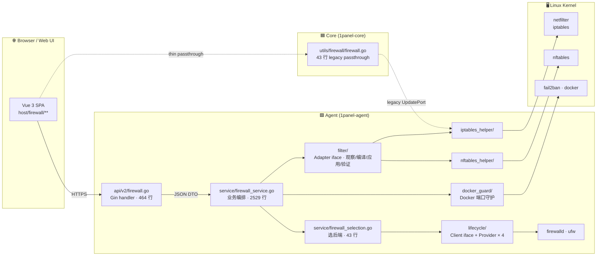
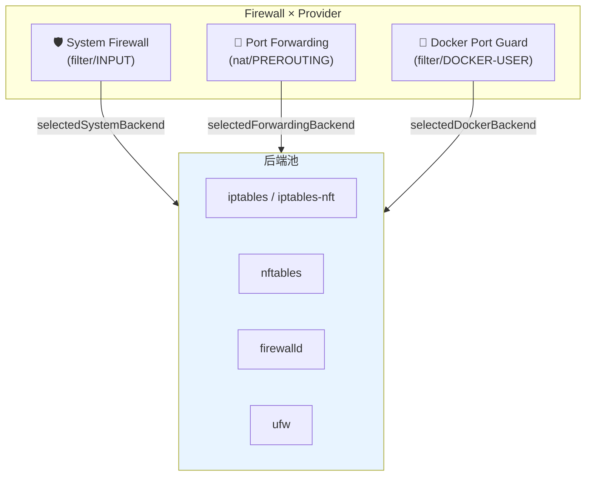

# 1Panel Firewall v2 — 架构与 Observe→Apply 详解

> 来源：1Panel `dev-v2` 分支 HEAD `7915230` (PR #13628)
> 用途：给团队讲架构 + 给 Sirius Cloud L2 Deployment 抄骨架的参考

---

## 一、整体调用链（Mermaid）

### 1.1 物理拓扑



> 关键事实：Core 只剩 **43 行 legacy** 的 `UpdatePort`（firewalld/ufw 端口重绑），v2 全部 firewall 业务都在 Agent。Core 是个 **薄代理**。

### 1.2 三大子系统 × 四种后端的二维矩阵



**每个子系统各自挑后端** —— 持久化在 setting 表里（`FirewallSystemBackendKey` / `FirewallForwardingBackendKey` / `FirewallDockerBackendKey`）。

### 1.3 规则变更四阶段（核心）

```mermaid
flowchart LR
    subgraph Snap["1️⃣ Observe 观察"]
        O1[执行 iptables -S / iptables-save]
        O2[逐行解析为 ObservedRule]
        O3[生成 Snapshot + Revision hash]
        O1 --> O2 --> O3
    end

    subgraph Plan["2️⃣ Compile 编译"]
        C1[Normalize 归一化]
        C2[RuleKey / InstanceKey 比对]
        C3[生成 Change Create/Update/Delete]
        C4[每条 Change 自带 Rollback 列表]
        C1 --> C2 --> C3 --> C4
    end

    subgraph Do["3️⃣ Apply 执行"]
        A1[持写锁 firewallRuleMutationMu]
        A2[按 Change 顺序执行 Forward]
        A3{任一失败?}
        A4[按逆序回滚已应用 Change]
        A5[标记成功]
        A1 --> A2 --> A3
        A3 -->|"否"| A5
        A3 -->|"是"| A4
    end

    subgraph Check["4️⃣ Verify 验证"]
        V1[重新 Observe]
        V2[比对 Revision]
        V3[matched=true / false]
        V1 --> V2 --> V3
    end

    O3 -->|Snapshot| C1
    C4 -->|BackendPlan| A1
    A5 --> V1
```



---

## 二、Observe→Apply 四阶段详解

### 2.1 Observe —— 把内核规则读出来

1Panel 的 Observe 有**两条实现路径**：

| 路径 | 触发场景 | 输入 | 输出 |
|---|---|---|---|
| **legacy** | 旧 UI / 老数据迁移 | `iptables -t filter -nL <chain>` | 解析 `FilterRules` 结构体 |
| **v2（新）** | 新规则管理 | `iptables-save` / `nft list ruleset` | `Snapshot{ObservedRule[]}` |

**legacy 解析要点**（`iptables_helper/inspect.go::ReadFilterRulesByChain`）：

```
$ iptables -t filter -nL INPUT -v
Chain INPUT (policy ACCEPT 0 packets, 0 bytes)
num   pkts bytes target   prot opt in  out  source       destination
1     0    0    ACCEPT   tcp  --  *  *   0.0.0.0/0    0.0.0.0/0    tcp dpt:22 /* SSH */
2     0    0    DROP     all  --  *  *   0.0.0.0/0    0.0.0.0/0    /* block */
```

逐行 `strings.Fields` 切分：
- `[0]` = `target`（ACCEPT / DROP / REJECT），非这三个跳过
- `[1]` = `prot`（数字 0/1/6/17）→ `loadProtocol` 转 `all/icmp/tcp/udp`
- `[3]` = `source` IP / `[4]` = `destination` IP；如果是 `0.0.0.0/0` 或 `anywhere` → 空串
- `[6]` = 端口字段；含 `spt:` → 源端口；含 `dpt:` → 目的端口；含 `spts:` / `dpts:` → 端口范围（冒号转 `-`）

**v2 解析要点**（`filter/inventory.go` + 各 provider 包）：

用 `iptables-save` 拿到的是**结构化的 iptables 脚本**（带 `-A`/`-I`/`-N` 等命令），按行解析：
- `-N <chain>` → 链定义
- `-A <chain> -p tcp --dport 22 -j ACCEPT -m comment --comment "<uuid>"` → 规则
- `comment` 里塞的是 1Panel 给每条规则分配的 **UUID**，用作 marker
- 解析时同时记录 `Locator{NativeID, Position, Canonical, ScopeKey, Provider}`

> 1Panel 的关键技巧：**用 comment 里塞 UUID 当 marker**。这样：
> - 自己的规则：marker = UUID → 唯一识别 → 知道哪些是自己创建的
> - 别人的规则：marker 空或别的字符串 → 当成 "外部规则"，不删
> - 比对：按 marker 匹配，0 误伤

### 2.2 Identity —— 怎么判断"是不是同一条规则"

1Panel 设计了**三层 hash**（`filter/identity.go`）：

| 名称 | 输入 | 用途 | 关系 |
|---|---|---|---|
| `RuleKey(rule)` | 归一化后的 `FirewallRule` | **语义相等** — 不关心位置、注释 | 两条规则只要"想表达同一个事"就同 key |
| `InstanceKey(rule)` | RuleKey + Marker + Persistence + NativeID + Position | **实例相等** — 区分"两条同义规则"和"同一条规则的多个位置" | 1Panel 容许多条同 key 规则（不同位置） |
| `SnapshotRevision(scope, rules)` | 排序后所有 InstanceKey 的 sha256 | **快照指纹** — 整体是否变化 | 一次 Apply 后用它确认"真的应用上了" |

```go
// 简化版的 RuleKey（实际 1Panel 用 sha256(json.Marshal(identity)))
type ruleIdentity struct {
    Scope              string    // "iptables/ipv4/filter/INPUT/in"
    Family             Family    // ipv4 | ipv6
    NativeKind         NativeKind // rule | zone_port | ...
    Protocol           string
    SourceAddress      string
    SourcePort         string
    DestinationAddress string
    DestinationPort    string
    Interface          string
    ConnectionStates   []string
    Action             Action
    Priority           *int
    OrderBucket        string
}
// → hashJSON(identity) → "sha256:abc123..."
```

**实际使用**：
- `MergeInventory(desired, observed)` 用 3 个索引：`byRuleKey` / `byInstanceKey` / `byMarker`
- 1Panel 优先按 **marker** 匹配（最精确），退路是 instanceKey，再退路是 ruleKey
- 匹配结果分 5 种：`none / exact / changed / missing / ambiguous / opaque`

### 2.3 Compile —— 把"想要的"和"现在的"对齐

输入：`Snapshot`（observed）+ `[]DesiredRule`（数据库里存的）
输出：`[]Change{Kind, Desired, Existing, Forward, Rollback}`

**Diff 流程**（伪代码）：

```go
byMarker := map[string]*ObservedRule{}  // 现有规则按 marker 索引
for _, o := range snap.Rules { byMarker[o.Marker] = o }

seen := map[string]bool{}
for _, d := range desired {
    seen[d.UUID] = true
    if existing, ok := byMarker[d.UUID]; ok {
        if rulesEqual(existing.Rule, d) { continue }  // 已是最新
        changes = append(changes, mkUpdate(existing, d))  // 替换
    } else {
        changes = append(changes, mkCreate(d))  // 新建
    }
}
for marker, existing := range byMarker {
    if seen[marker] { continue }
    if isProtected(existing) { continue }  // 端口白名单 / 基础链
    changes = append(changes, mkDelete(existing))  // 用户已删 → 删掉
}
```

**Change 结构**（`filter/adapter.go::DesiredChange`）：

```go
type Change struct {
    Kind     ChangeKind     // create | adopt | update | delete | reorder
    Desired  *Rule          // 想要的最终态
    Existing *ObservedRule  // 现在的状态
    Forward  []Command      // 应用时执行
    Rollback []Command      // 失败时回滚（互逆）
}
```

### 2.4 Apply —— 带回滚的执行

**前置条件**（`firewall_service.go`）：

```go
var firewallRuleMutationMu sync.Mutex  // 进程级写锁
// 每次 Create/Update/Delete/Reorder 都必须持锁
```

**Apply 主循环**：

```go
for i, change := range plan {
    for _, cmd := range change.Forward {
        if err := exec(cmd); err != nil {
            // 逆序回滚已应用 change
            for j := i - 1; j >= 0; j-- {
                for _, rb := range plan[j].Rollback {
                    _ = exec(rb)  // 尽力回滚，错误不掩盖原始错误
                }
            }
            return fmt.Errorf("change %d failed: %w, rolled back", i, err)
        }
    }
}
```

**回滚命令怎么生成**：

| Change | Forward | Rollback |
|---|---|---|
| `Create` | `iptables -A <chain> <args>` | `iptables -D <chain> <args>` |
| `Update` | `iptables -D <old>` + `iptables -I <chain> <pos> <new>` | `iptables -D <new>` + `iptables -I <chain> <pos> <old>` |
| `Delete` | `iptables -D <chain> <args>` | `iptables -I <chain> <pos> <args>` |

注意 **位置 (position)** 也要保存，否则 Delete 后 Insert 会跑到链尾。

### 2.5 Verify —— 怎么知道"真改对了"

```go
// 1. 再 Observe 一遍
post, _ := adapter.Observe(ctx, scope)

// 2. 算 Revision
postRev, _ := SnapshotRevision(scope, post.Rules)

// 3. 跟 Apply 前的期望 Revision 比
if postRev == expectedRev { matched = true }
```

1Panel 还做了一件聪明事：把"用户改的东西"和"内核的实际状态"做**三方合并**：
- `state`：`managed | adopted | external | drifted | protected`
  - `managed` = 我们建的，且当前在位
  - `adopted` = 接管别人的（标记为 adopted origin）
  - `external` = 别人建的，不归我们管
  - `drifted` = 我们建的但内核里变了/没了
  - `protected` = 端口白名单里的，禁止操作

---

## 三、对 Sirius Cloud L2 的具体建议

| 1Panel 组件 | 抄 / 改 / 不抄 | Sirius Cloud 取舍 |
|---|---|---|
| 4 后端 + 选择器 | **改** | 只要 `iptables` 和 `nftables` 两种；firewalld/ufw 不要 |
| Observe→Compile→Apply→Verify | **抄** | 直接照搬骨架 |
| `RuleKey` / `InstanceKey` 双层 | **改** | 单层 RuleKey 足够；不维护 adopted 概念 |
| `Persistence` 双层 | **改** | 真实环境只有 `runtime_only`（iptables 临时）和 `converged`（iptables-persistent 落地），二态够 |
| 5 种 ChangeOp | **改** | 4 种：create / update / delete / reorder，不要 adopt |
| marker = UUID comment | **抄** | 关键设计，必须保留 |
| `firewallRuleMutationMu` 写锁 | **抄** | 必须保留 |
| `Port Whitelist` | **抄** | 22 / 9999 强制保留 |
| Docker Port Guard | **不抄** | 不用 Docker |
| 端口转发子系统 | **改** | 简化版即可 |
| 前端 1258 行 rule/index.vue | **不抄** | L2 部署后台不需要这么复杂 |

---

## 四、最小可借鉴骨架

见 `skeleton/` 目录，约 300 行 Go，自带 demo。

```
skeleton/
├── fwkit.go      # Adapter interface + Rule / Snapshot / Change + Port Whitelist
├── iptables.go   # IPTables 后端实现（Observe / Compile / Apply）
├── main.go       # CLI demo：dump → add → dump → rollback
└── README.md     # 用法说明
```
