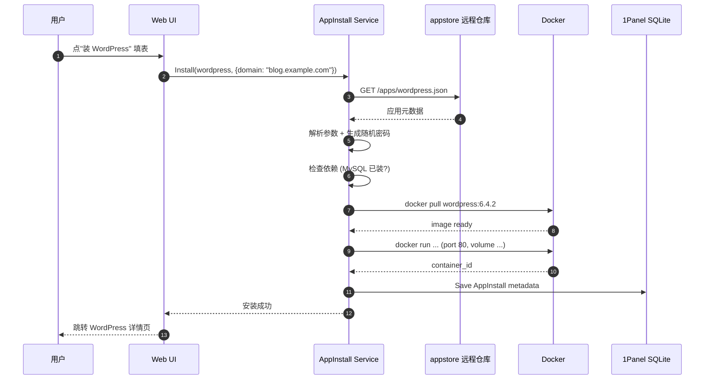

# 1Panel App Store 模块 — 人话版

> 30 分钟搞懂 1Panel 怎么"一键装 WordPress / MySQL / Redis"。
> 详细代码注解在同目录 `README.md`（51 行 stub + 8 文件清单 / ~5900 行 Go）。
> 这份文档是入口 —— 先看这个，再决定要不要啃那份。
>
> 🎨 **可视化版**：同目录 `visual-atlas.html`（浏览器里看，4 张 Mermaid 真实图 + 5 个应用生命周期阶段 + 3 个反模式卡片）
> 📋 **研究 commit**：`7915230`（dev-v2）
> ⚠️ **状态**：stub + 人话版，详细注解待做

---

## 0. 这份文档回答 5 个问题

1. **"一键装 WordPress"在 1Panel 内部是怎么跑的？**
2. **应用商店的"应用列表 JSON"从哪来？**
3. **安装流程的参数怎么模板化？环境变量怎么生成？**
4. **升级怎么保证"用户的自定义配置"不丢？**
5. **对 Sirius Cloud L2 应用部署有什么借鉴价值？**

---

## 1. 一句话总结

**1Panel 把"一键装应用"做成"从远程 appstore 仓库拉应用元数据 → 模板化渲染参数 → Docker 拉镜像起容器"三步流水线。**

藏了 **3 个必抄的设计**（重点是参数化 + 模板渲染） + **3 个反模式**（重点是拼写错误遗留 + 强依赖外部仓库），下面一一拆。

---

## 2. 1Panel 凭什么能"一键装"

### 2.1 先想象"一键装 WordPress"涉及什么

```
用户点"装 WordPress" → 需要做：
1. 拉 WordPress Docker 镜像
2. 拉 MySQL Docker 镜像（WordPress 依赖）
3. 配网络（两个容器互通）
4. 配持久化（/var/www/html 映射到宿主机）
5. 生成 MySQL 随机 root 密码
6. 把密码写进 WordPress 的 .env
7. 起两个容器
8. 写 metadata 到 1Panel SQLite
9. 返回"已装好"
```

**9 步 × 几百种应用 = 几千万行模板**。1Panel 怎么压成 5900 行 Go？

### 2.2 1Panel 的解法：**应用元数据 + 参数化模板**

**应用元数据**（在远程 `1Panel-dev/appstore` 仓库，JSON 格式）：

```json
{
  "key": "wordpress",
  "name": "WordPress",
  "version": "6.4.2",
  "description": "开源博客系统",
  "image": "wordpress:6.4.2-php8.3-apache",
  "ports": [{"container": 80, "host": 8080}],
  "volumes": [
    {"container": "/var/www/html", "host": "/opt/1panel/apps/wordpress/data"}
  ],
  "env": [
    {"key": "WORDPRESS_DB_HOST", "value": "mysql:3306"},
    {"key": "WORDPRESS_DB_USER", "value": "root"},
    {"key": "WORDPRESS_DB_PASSWORD", "type": "random_password", "length": 16}
  ],
  "dependencies": [
    {"key": "mysql", "version": ">=8.0"}
  ],
  "post_install": "echo 'WordPress installed at http://localhost:8080'"
}
```

**1Panel 做的**（伪代码）：

```go
func (s *AppInstallService) Install(appKey string, userParams map[string]string) error {
    // 1. 拉应用元数据
    meta := s.fetchAppMeta(appKey)  // 从 1Panel-dev/appstore
    // 2. 检查依赖
    if !s.checkDependencies(meta.Dependencies) {
        return errDepNotMet
    }
    // 3. 渲染参数（用户填的 + 随机生成）
    env := renderEnv(meta.Env, userParams, s.randomPassword)
    // 4. 拉镜像
    s.dockerPull(meta.Image)
    // 5. 起容器
    container := s.dockerRun(meta, env)
    // 6. 写 metadata
    s.db.Save(&AppInstall{...})
    return nil
}
```

### 2.3 类比：**像外卖点单**

```
普通做法：自己买菜、洗菜、切菜、炒菜   ❌
外卖点单：选商家 → 选菜 → 填地址 → 送达  ✅

1Panel 普通：用户自己写 docker-compose ❌
1Panel 点单：选应用 → 填参数 → 自动起容器  ✅
```

---

## 3. 一个真实场景：用户装 WordPress

### 3.1 流程图



**关键 5 步**：
1. 拉元数据（~1 秒，HTTP GET）
2. 渲染参数（~10 ms）
3. 拉镜像（10-60 秒，看网络）
4. 起容器（~1 秒）
5. 写 metadata（~10 ms）

用户感知：10-60 秒。

---

## 4. 5 个文件职能

| 文件 | 行 | 职责 |
|---|---:|---|
| `app.go` | 976 | 已装应用 CRUD（list/get/search） |
| `app_install.go` | 949 | 安装流程（参数化 + 模板） |
| `app_upgrade.go` | 872 | 升级（保留用户配置） |
| `app_sync_task.go` | 530 | 定时从 appstore 拉新版本 |
| `app_utils.go` | 2119 | 元数据 / 依赖 / 工具大杂烩 |

**2119 行的 `app_utils.go` 是 hot path**。估计是"任何 install/upgrade 都要调"的工具集。

---

## 5. 3 个必抄的设计

### 5.1 ⭐⭐⭐⭐⭐ **应用元数据 + 参数化模板**

**为什么必抄**：1Panel 这套"远程 JSON 元数据 + 客户端渲染"模式让你<strong>不用改客户端代码就能加新应用</strong>。新加个应用？只需要在 appstore 仓库加个 JSON。

```json
// 你的 Sirius Cloud 应用模板示例
{
  "key": "redis-7",
  "name": "Redis 7",
  "image": "redis:7.2-alpine",
  "ports": [{"container": 6379, "host_random": true}],
  "env": [
    {"key": "REDIS_PASSWORD", "type": "random_password", "length": 24}
  ]
}
```

### 5.2 ⭐⭐⭐⭐ **升级时保留用户配置**

`app_upgrade.go` 872 行核心逻辑：

```go
// 伪代码
func Upgrade(appID uint) error {
    // 1. 读老 metadata（包括用户改过的环境变量）
    old := db.GetApp(appID)
    // 2. 拉新元数据
    newMeta := fetchAppMeta(old.Key)
    // 3. 合并：用户改的 env 覆盖新元数据的 default
    merged := mergeEnv(old.UserEnv, newMeta.Env)
    // 4. 停老容器
    docker.Stop(old.ContainerID)
    // 5. 删老容器（保留 volume）
    docker.Rm(old.ContainerID)
    // 6. 拉新镜像
    docker.Pull(newMeta.Image)
    // 7. 用 merged env 起新容器
    docker.Run(newMeta, merged)
    // 8. 更新 metadata
    db.Update(appID, ...)
}
```

**关键**：**volume 不删**（用户的 /var/www/html 数据保留），只换镜像。

### 5.3 ⭐⭐⭐⭐ **定时同步 + ignore 机制**

- `app_sync_task.go` 530 行：每天跑一次，从 appstore 仓库拉所有应用的最新版本号，写到本地缓存
- 用户在 Web UI 上勾选"忽略这个应用的更新" → 写 `ignore_upgrade` 表 → 升级时跳过

**避坑**：ignore 用单独表 + 软删，不用删主表记录。

---

## 6. 3 个反模式

### 6.1 ❌ **文件名拼写错误遗留**：`app_ingore_upgrade.go`（少了个 n）

1Panel 自己都留着了没改。**抄的时候改名**成 `app_ignore_upgrade.go`。

### 6.2 ⚠️ **强依赖远程 `1Panel-dev/appstore` 仓库**

整套应用商店逻辑假设 appstore 仓库在线。仓库挂了？整个安装流程挂。

**避坑**：本地缓存 appstore JSON（`app_sync_task.go` 做的）+ 多镜像源 fallback。

### 6.3 ❌ **`app_utils.go` 2119 行 = 大杂烩**

任何 install/upgrade 都要调它。改一个 helper 可能影响 N 个流程。

**避坑**：拆成 `app_meta.go` / `app_deps.go` / `app_render.go` / `app_helpers.go` 4 个文件。

---

## 7. 跟 Sirius Cloud 的对位

| Sirius Cloud 需求 | 1Panel App Store 对应 | 推荐度 |
|---|---|---|
| **L2 一键部署 Redis / MySQL** | app_install.go + 元数据 | ⭐⭐⭐⭐⭐ |
| **L2 应用市场**（你做 SaaS） | 整套 | ⭐⭐⭐⭐ |
| **L2 应用升级** | app_upgrade.go | ⭐⭐⭐⭐ |
| **L2 模板市场** | 应用元数据 JSON | ⭐⭐⭐ |

### 7.1 必抄清单

1. **应用元数据 + 参数化模板**（远程 JSON 模式）
2. **升级保留用户配置**（volume 不删 + env merge）
3. **定时同步 + ignore 机制**

### 7.2 抄的时候要改

1. **不要拼写错误**（别学 `ingore`）
2. **元数据放自己 Git 仓库**（不依赖 1Panel-dev）
3. **支持私有应用市场**（企业版场景）

---

## 8. 接下来怎么读

### 8.1 30 分钟通道

1. 看完本文档
2. 看 `01-app-store/README.md` §1（8 文件清单）
3. 直接看 `app_install.go` 的 `Install` 函数

### 8.2 2 小时通道

1. 上面 30 分钟
2. `app_upgrade.go` 的 `Upgrade` 函数（看 volume/env 保留策略）
3. `app_sync_task.go` 的 `Sync` 函数（看怎么拉远程仓库）
4. `app_utils.go` 头 200 行（看 hot path）

### 8.3 1 天写代码通道

1. 上面所有
2. 设计你自己的应用元数据 schema
3. Python + Jinja2 渲染 + Docker SDK 起容器
4. 写 5 个应用模板（redis / mysql / postgres / nginx / minio）
5. 跑通完整安装流程

---

## 9. 写作说明

- **本文档定位**：30 分钟读完的"故事版"
- **`01-app-store/README.md` 定位**：8 文件清单 + stub（详细注解待做）
- **`firewall-architecture.md` 定位**：v2 防火墙深度注解
- **`00-landscape.md` 定位**：13 个模块的全景图

---

**研究 commit**：`7915230`（dev-v2）· **更新**：2026-08-24 · **作者**：1Panel v2 研究员
