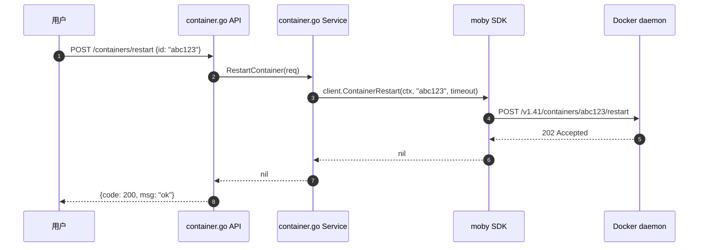

# 1Panel Container 模块 — 人话版

> 30 分钟搞懂 1Panel 怎么给 Docker Engine API 套个 Web UI。
> 详细代码注解在同目录 `README.md`（57 行 stub + 12 文件清单 / ~5400 行 Go）。
> 这份文档是入口 —— 先看这个，再决定要不要啃那份。
>
> 🎨 **可视化版**：同目录 `visual-atlas.html`（浏览器里看，4 张 Mermaid 真实图 + 4 个 Docker API 抽象层 + 2 个反模式卡片）
> 📋 **研究 commit**：`7915230`（dev-v2）
> ⚠️ **状态**：stub + 人话版，详细注解待做
> 🚫 **Sirius Cloud 不抄整体架构**（你不用 Docker），只学"CRUD 抽象模式"

---

## 0. 这份文档回答 5 个问题

1. **1Panel 怎么"管 Docker 容器"？底层调什么？**
2. **为什么不调 Docker CLI 命令行，而用 moby SDK？**
3. **容器 CRUD 跟 compose 怎么协调？**
4. **更新容器 / 拉镜像的策略是什么？**
5. **对 Sirius Cloud L2 有什么借鉴价值？（提示：<strong>不抄整体</strong>，只学模式）**

---

## 1. 一句话总结

**1Panel 把 Docker Engine API 1:1 包装成 Web UI，~5400 行 Go + 底层用 [moby/moby/client](https://pkg.go.dev/github.com/docker/docker/client) Go SDK 直接调 unix socket。**

跟其他模块（database / website）的"自己实现核心逻辑"不同，**Container 模块基本是 Docker API 的薄代理**。

藏了 **1 个核心抽象**（Docker SDK 隔离） + **2 个反模式**（强依赖 Docker + 1:1 映射），下面拆。

---

## 2. 1Panel 凭什么"能管 Docker"

### 2.1 Docker 提供的 4 类能力

| 能力 | 1Panel 怎么调 | 核心 SDK |
|---|---|---|
| **容器 CRUD** | `client.ContainerList/Create/Start/Stop/Remove` | `moby/client` |
| **镜像管理** | `client.ImagePull/Remove/Tag` | `moby/client` |
| **网络管理** | `client.NetworkCreate/Remove/Connect` | `moby/client` |
| **卷管理** | `client.VolumeCreate/Remove/List` | `moby/client` |
| **compose** | `client.StackDeploy` 或调 `docker-compose` 二进制 | 两种都支持 |

**所有操作都通过 `/var/run/docker.sock` 这个 unix socket 调**。1Panel Agent 跟 Docker daemon 跑在同一台机器上。

### 2.2 1Panel 架构：薄代理

```mermaid
flowchart LR
    UI[Web UI] --> API[container.go API 层<br/>891 行]
    API --> SVC[container.go Service 层<br/>1961 行]
    SVC --> SDK[moby/moby/client<br/>Go SDK]
    SDK --> Socket[/var/run/docker.sock<br/>unix socket]
    Socket --> Docker[Docker daemon]
    Docker --> Containers[真实容器]
    style SVC fill:#2f6f5e,color:#fff
    style SDK fill:#c97b3f,color:#fff
```

**1961 行的 container.go ≈ Docker Engine API 1:1 翻译**：
- `ContainerList()` → 调 SDK 的 `ContainerList()`
- `ContainerStart(id)` → 调 SDK 的 `ContainerStart()`
- `ContainerCreate(req)` → 调 SDK 的 `ContainerCreate()` + 翻译参数

### 2.3 类比：**像电视机遥控器**

```
普通做法：直接操作电视内部电路    ❌
遥控器：   翻译按钮为电路指令      ✅

1Panel 普通：让用户用 docker 命令 ❌
1Panel 遥控器：UI 按钮 → 调 SDK → Docker daemon ✅
```

---

## 3. 一个真实场景：用户重启容器

### 3.1 流程图



**整个 3 步**：API → Service → SDK → Docker。<strong>没有"1Panel 自己的逻辑"</strong>，就是转发。

---

## 4. 4 大子模块

| 文件 | 行 | 核心能力 |
|---|---:|---|
| `container.go` | 1961 | 容器 CRUD + 重建 + inspect |
| `container_compose.go` | 720 | docker compose up/down |
| `container_update.go` | 657 | 容器重建（拉新镜像 + 替换） |
| `container_network.go` + `container_volume.go` | 305 | 自定义网络 + 卷管理 |

**`container.go` 1961 行**是单一热文件，**几乎所有容器操作都过它**。

### 4.1 容器更新（`container_update.go` 657 行）

最复杂的功能：用户点"更新容器" → 1Panel 拉新镜像 → 停老容器 → 用新镜像起新容器。

```go
// 伪代码
func (s *ContainerService) UpdateContainer(id string) error {
    // 1. inspect 老容器（拿 env / volume / port / network 配置）
    old, _ := s.client.ContainerInspect(ctx, id)
    // 2. 拉新镜像
    s.client.ImagePull(ctx, old.Config.Image, types.ImagePullOptions{})
    // 3. 停老容器
    s.client.ContainerStop(ctx, id, timeout)
    // 4. 删老容器（保留 volume / network）
    s.client.ContainerRemove(ctx, id, types.ContainerRemoveOptions{})
    // 5. 用老配置 + 新镜像起新容器
    newID, _ := s.client.ContainerCreate(ctx, old.Config, old.HostConfig, old.NetworkConfig, old.Name)
    s.client.ContainerStart(ctx, newID, types.ContainerStartOptions{})
    // 6. 写 metadata
    return nil
}
```

### 4.2 compose 管理（`container_compose.go` 720 行）

两种实现路径：
- **路径 A**：调 SDK 的 `StackDeploy`（Swarm 模式）
- **路径 B**：拼 `docker-compose` 命令行执行（standalone 模式）

1Panel 主要用路径 B，因为单机用户为主。

```bash
docker compose -f /path/to/docker-compose.yml up -d
docker compose -f /path/to/docker-compose.yml down
```

---

## 5. 1 个核心抽象 + 1 个借鉴模式

### 5.1 ⭐⭐⭐⭐ **Docker SDK 隔离层**（核心）

不要直接调 Docker CLI（shell exec），用官方 Go SDK。

**好处**：
- 性能更好（不走 shell）
- 错误处理更结构化（不是 exit code + stderr 字符串）
- 类型安全（编译时检查参数）

```go
// 反例：调 shell
out, err := exec.Command("docker", "restart", id).CombinedOutput()
if err != nil { return err }

// 正例：调 SDK
err := client.ContainerRestart(ctx, id, timeout)
if err != nil { return err }
```

### 5.2 ⭐⭐⭐ **CRUD 抽象模式**

不管底层是 Docker / K8s / Podman / MySQL，UI 层都只要 5 个操作：
- `List` / `Get` / `Create` / `Update` / `Delete`

**Sirius Cloud 借鉴**：你 L2 管的"MySQL 实例 / Redis 实例 / PostgreSQL 实例"都遵循这 5 个操作，UI 层不用关心底层实现。

```python
# 你的 Python 抽象
class ResourceService(ABC):
    @abstractmethod
    def list(self) -> List[Resource]: ...
    @abstractmethod
    def get(self, id: str) -> Resource: ...
    @abstractmethod
    def create(self, req: CreateReq) -> Resource: ...
    @abstractmethod
    def update(self, id: str, req: UpdateReq) -> Resource: ...
    @abstractmethod
    def delete(self, id: str) -> None: ...
```

---

## 6. 2 个反模式（必避）

### 6.1 ❌ **强依赖 Docker daemon**

整套 Container 模块假设 `/var/run/docker.sock` 存在。

**Sirius Cloud 硬约束**：你**不用 Docker**。所以这个模块<strong>整体不引入</strong>。

### 6.2 ❌ **`container.go` 1961 行 = 1:1 映射**

几乎所有函数都是"调 SDK 一个方法 + 翻译参数"。手写价值不大，不如直接调 SDK。

**避坑**：不要自己手写"容器 CRUD 抽象层"，让前端直接调 Docker API（如果你的场景就是 Docker）或 K8s API。

---

## 7. 跟 Sirius Cloud 的对位

| Sirius Cloud 需求 | 1Panel Container 对应 | 推荐度 |
|---|---|---|
| **L2 资源 CRUD 抽象** | 整套 CRUD 模式 | ⭐⭐⭐⭐ |
| **L2 容器管理** | 整套 | ❌ 不用 Docker，不抄 |
| **L2 K8s 集群管理** | 类似模式但用 K8s API | ⭐⭐⭐ |
| **新功能：MySQL 实例 CRUD** | 借鉴 List/Get/Create/Update/Delete | ⭐⭐⭐⭐ |

### 7.1 必抄清单

1. **CRUD 抽象模式**（5 个操作覆盖所有资源）

### 7.2 不抄的

1. **整个 Container 模块**（你不用 Docker，抄了也没用）

### 7.3 抄的时候要改

1. **不要绑死 Docker**（你的场景是 K8s / 直接调 MySQL 客户端）
2. **不要 1:1 映射 API**（直接调 K8s client-go / MySQL driver）

---

## 8. 接下来怎么读

### 8.1 30 分钟通道

1. 看完本文档
2. 看 `02-container/README.md` §1（12 文件清单）
3. 直接看 `container.go` 的 `ListContainer` 函数

### 8.2 2 小时通道（如果以后用到 Docker）

1. 上面 30 分钟
2. `container_update.go` 的 `UpdateContainer` 函数（看 volume 保留策略）
3. `container_compose.go` 的 compose up/down 实现

### 8.3 不建议深读

**Sirius Cloud 不用 Docker，整个模块<strong>只看模式</strong>，不读实现**。

---

## 9. 写作说明

- **本文档定位**：30 分钟读完的"故事版"
- **`02-container/README.md` 定位**：12 文件清单 + stub（详细注解待做）
- **`firewall-architecture.md` 定位**：v2 防火墙深度注解
- **`00-landscape.md` 定位**：13 个模块的全景图

---

**研究 commit**：`7915230`（dev-v2）· **更新**：2026-08-24 · **作者**：1Panel v2 研究员
