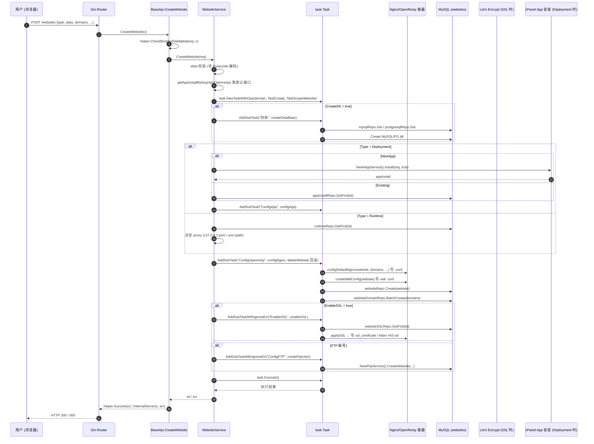
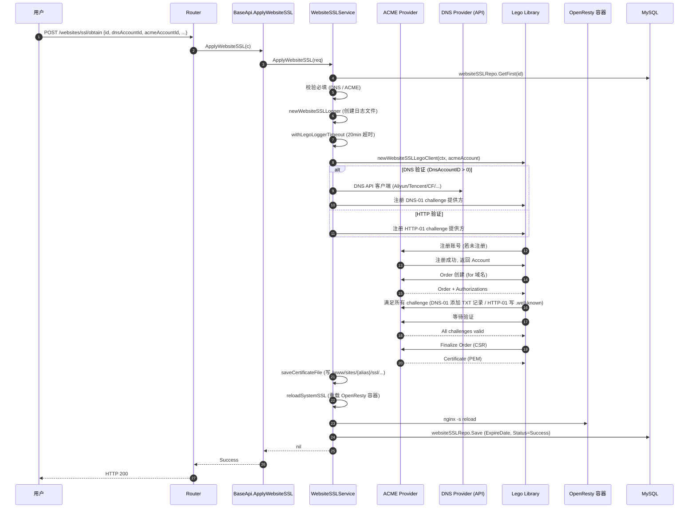
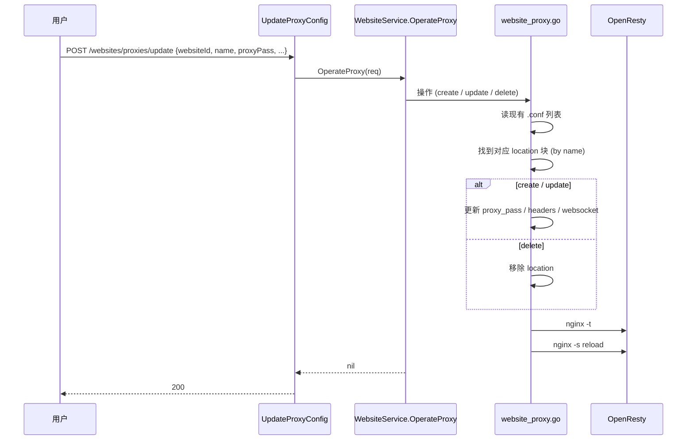
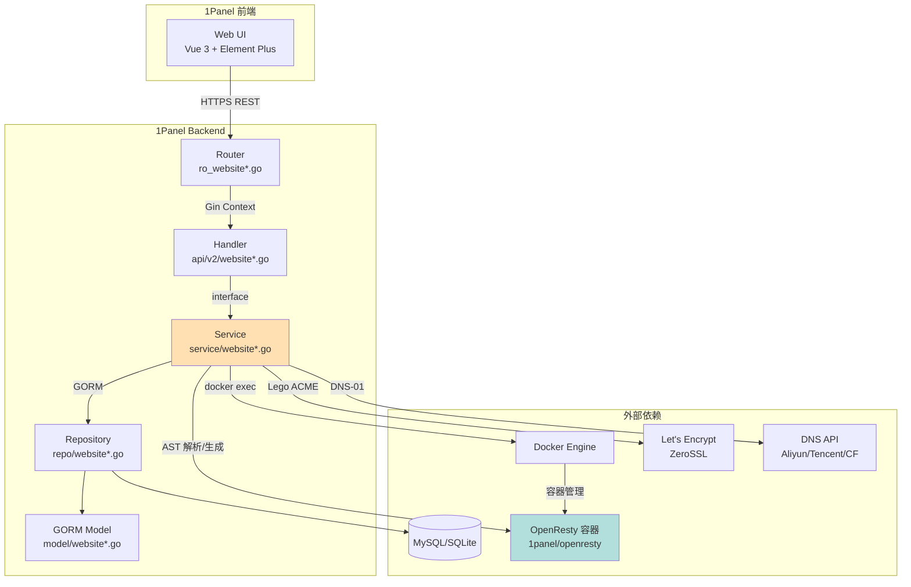
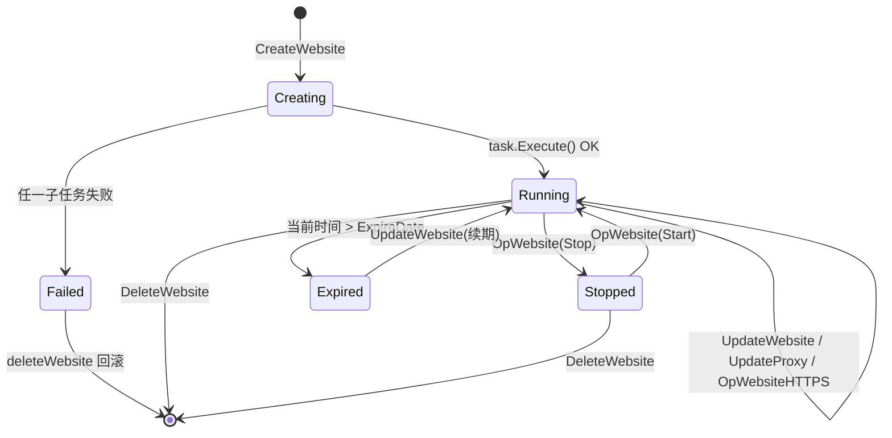

# 1Panel Website 模块 v3 — 源码解读 (Human-Readable)

> 模块编号: 03-website
> 优先级: P3
> 源码版本: 1Panel core / agent
> 行数: ~4072 行 (8 源文件) + 周边 ~15000 行 (utils / ssl / proxy / lb / op)
> 文档生成: 2026-08-25

---

## 1. 一句话作用 (普通读者视角)

**1Panel Website 模块 = 自带门卫 + 装修队的网店托管系统**: 给一个域名, 它帮你"开"出可访问的网站 (静态/动态/PHP/反代/数据库), 自动写好 OpenResty (Nginx) 配置、自动申请 Let's Encrypt 证书、自动做 HTTPS 跳转、限流、防盗链、跨目录, 还能在 1Panel 面板里让你像用 cPanel 一样点点鼠标维护。

### 1.1 生活类比 — "24h 自动开门 + 物业一体的网店管家"

| 现实生活 | 1Panel Website | 类比说明 |
|---|---|---|
| 开一家实体店, 需要店面、招牌、营业执照、门卫 | 创建网站, 生成站点目录 + OpenResty server 块 + 网站元数据 | 一次性配齐所有"开业资料" |
| 招牌"营业执照"(对外显示) | 主域名 (PrimaryDomain) | 顾客记住的就是这个 |
| 多块招牌 / 副招牌 (二级域名) | WebsiteDomain 表多条记录 | 一个站可绑多域名, 不同端口 |
| 门口保安检查来访者 | Nginx 反向代理 / WAF / 防 CC | 流量先到 OpenResty, 按规则过滤再转给后端 |
| 店内商品 (静态 HTML / PHP 动态 / 第三方接口) | Website.Type ∈ {Static, Runtime(PHP/Node/Java/Go/Python/.NET), Deployment(1Panel App), Stream(UDP/TCP 转发), Subsite(子站)} | 同一个店面, 5 种业态 |
| 营业时间 | Status (Running / Stopped) + ExpireDate | 到期后自动停业 |
| 工商执照 (SSL 证书) | WebsiteSSL 表 + OpenResty ssl_certificate | 锁了 https 才能让浏览器信任 |
| 门卫排班表 | Nginx `upstream` + 负载均衡算法 | 多后端轮询 |
| 后厨账本 (MySQL/PG) | website.DbID / website.DbType | 1Panel 创建网站时, 可一并开 DB |
| 装修队 (O&M 工人) | task.Task 子任务 (configNginx / enableSSL / createFtpUser) | 异步编排, 失败回滚 |
| 物业报修 / 后台日志 | AccessLog / ErrorLog 开关 + 日志查询 | 流量回放 / 排错 |
| 业主群通知 | x-panel-log 审计日志 | 面板里能看到谁在何时创建/删除/修改了哪个站 |

**一句话**: 1Panel Website = **cPanel + OpenResty + Let's Encrypt + 1Panel 应用商店 + WAF** 的"高度自动化合体"。

---

## 2. 模块职责 (6 大块)

1. **站点全生命周期**: 创建 (Create) / 启动 (Start) / 停止 (Stop) / 删除 (Delete) / 搜索 (Page) / 详情 (Get) / 修改 (Update) / 默认 server 切换 / 分组迁移 / 批量操作 — `service/website.go` 里 `CreateWebsite / DeleteWebsite / OpWebsite / UpdateWebsite / ChangeDefaultServer / ChangeGroup / BatchOpWebsite` 等。
2. **Nginx/OpenResty 配置生成**: 通过自研 AST 库 (`utils/nginx/components` + `utils/nginx/parser`) 增删改 listen / server_name / location / ssl_protocols / add_header / access_log / error_log / valid_referers / rewrite / if / upstream / set_real_ip_from, 落盘后调用 `nginx -t` + `nginx -s reload` — `service/website_utils.go` 里 `configDefaultNginx / delNginxConfig / updateNginxConfig / deleteNginxConfig / applySSL / setListen / removeSSLListen / applyLocationProxyPass / createWafConfig` 等。
3. **SSL/TLS 全套**: 一键申请 Let's Encrypt / 自传证书 / 自签 CA / 手动粘贴 PEM / 主从节点推送 / 自动续签 / HSTS / HTTP3 (QUIC) / Alt-Svc — `service/website_ssl.go` + `service/website.go::OpWebsiteHTTPS`。
4. **5 种业态分别处理**:
   - **Static** (纯 HTML) → 直接 serve 目录
   - **Runtime** (PHP/Node/Java/Go/Python/.NET) → 反代到 127.0.0.1:port (或 unix socket)
   - **Deployment** (1Panel 应用商店安装的 App) → 反代到 App 容器的 exposed port
   - **Stream** (TCP/UDP 转发) → `stream { ... }` 块
   - **Subsite** (父站子目录) → root 路径调整
5. **Web 防护与性能**: 反向代理配置 (`proxies`) / 负载均衡 (`lbs`) / 缓存 (`proxy/config`) / 防盗链 (`leech`) / 跨域 CORS (`cors`) / 防跨站 (`crosssite` / open_basedir) / BasicAuth (`auths`) / 路径鉴权 (`auths/path`) / 默认 404 (`default/html`) / 真实 IP (`realip/config`) / PHP 版本切换 (`php/version`) / 重写规则 (`rewrite`) / 重定向 (`redirect`) / Composer 命令执行 (`exec/composer`)。
6. **周边资源**: DNS API 账号 (`websites/dns` 阿里云/腾讯云/Cloudflare…)、ACME 账号 (`websites/acme` Let's Encrypt / ZeroSSL)、自签 CA (`websites/ca`)、网站模板 (`websites/templates`, `outputs`)、WAF、日志 (access + error)、FTP 账号创建联动、数据库联动。

---

## 3. 目录结构 (源文件清单 + 行数)

```
agent/
├── router/                         # Gin 路由注册 (6 个文件)
│   ├── ro_website.go              (103 行) — 核心网站 60+ endpoint
│   ├── ro_website_ssl.go          ( 31 行) — SSL 证书 14 endpoint
│   ├── ro_website_ca.go           ( 24 行) — 自签 CA 7 endpoint
│   ├── ro_website_dns_account.go  ( 21 行) — DNS API 4 endpoint
│   ├── ro_website_acme_account.go ( 21 行) — ACME 账号 4 endpoint
│   └── ro_website_template.go     ( 28 行) — 网站模板 11 endpoint
│
├── app/api/v2/
│   ├── website.go                 (1342 行) — 主站 handler 64 个 func
│   ├── website_ssl.go             (~300 行) — SSL handler
│   ├── website_acme_account.go
│   ├── website_ca.go
│   ├── website_dns_account.go
│   ├── website_domain.go
│   └── website_template.go
│
├── app/service/                    # 业务核心 (12 个文件)
│   ├── website.go                 (2502 行) — 主站 service 41 个方法
│   ├── website_utils.go           (~1500 行) — 工具: Nginx 解析/生成/WAF
│   ├── website_ssl.go             (~1100 行) — ACME 申请/续签/推送
│   ├── website_proxy.go           — 反向代理增删改查
│   ├── website_lb.go              — 负载均衡 upstream
│   ├── website_op.go              — 批量操作 (BatchOp/SetGroup/SetHttps)
│   ├── website_rewrite.go         — 伪静态 rewrite
│   ├── website_auth_basic.go      — BasicAuth + 路径鉴权
│   ├── website_domain.go          — 多域名管理
│   ├── website_acme_account.go
│   ├── website_ca.go
│   ├── website_dns_account.go
│   └── website_template.go
│
├── app/dto/                        # 数据传输对象
│   ├── nginx.go                   — NginxParam/Upstream 等通用
│   └── request/website*.go        — 入参 (request.WebsiteCreate 等)
│
├── app/repo/                       # 仓储层 (8 个文件)
│   ├── website.go
│   ├── website_ssl.go
│   ├── website_dns_account.go
│   ├── website_acme_account.go
│   ├── website_ca.go
│   ├── website_domain.go
│   └── website_template.go
│
├── app/model/                      # GORM 模型 (7 个文件)
│   ├── website.go
│   ├── website_ssl.go
│   ├── website_dns_account.go
│   ├── website_acme_account.go
│   ├── website_ca.go
│   ├── website_template.go
│   └── website_domain.go
│
├── utils/
│   ├── nginx/
│   │   ├── parser/                — 手写 Nginx 配置 AST 解析
│   │   └── components/            — Config/Server/Location/Upstream AST 节点
│   ├── docker/                    — Docker Client (OpenResty 容器交互)
│   ├── files/                     — 文件操作 + 权限
│   └── cmd/                       — chown / docker exec 封装
│
└── cmd/server/nginx_conf/          — 编译期嵌入的 OpenResty 配置模板
```

---

## 4. 调用链 (Router → Handler → Service → Repository → Model)

```
[浏览器 / curl] → Gin Router (group("websites"))
                    ↓
              (b *BaseApi)  ← site/api/v2/website.go   # 64 个 handler
                    ↓
       websiteService (IWebsiteService)               # interface in website.go:72
                    ↓
        func (w WebsiteService) Method()              # service/website.go 等
                    ↓
       websiteRepo / websiteSSLRepo / websiteDomainRepo
       appInstallRepo / runtimeRepo / databaseRepo   # repo/*.go (GORM CRUD)
                    ↓
       MySQL / SQLite (websites, website_ssls, website_domains, website_acme_accounts, website_dns_accounts, website_cas, website_templates, website_template_outputs)
                    ↓
       utils/nginx/parser + components                # AST 解析 / 生成
                    ↓
       OpenResty 容器 (1panel/openresty 镜像)
       + Let's Encrypt 服务
       + Docker API (镜像 / 容器操作)
```

### 4.1 中间件链 (统一走 router/enter.go 注册的 SessionAuth + Casbin + ReqLog)

```go
// 1Panel 全局中间件 (简化):
//   SessionAuth      — 校验 JWT / Cookie
//   Casbin rbac       — casbin 策略 (rbac_model.conf) 决定 endpoint 权限
//   ReqLog            — x-panel-log 审计日志
//   ApiKeyAuth        — Swagger 文档用
//   Timestamp         — 防重放
```

`BaseApi` 是所有 handler 的"宿主", 嵌入了 `*gin.Context`, 通过 `helper.CheckBindAndValidate(&req, c)` 统一做入参绑定 + binding tag 校验。

### 4.2 Service 接口契约 (IWebsiteService, 摘自 service/website.go:72-157)

```go
type IWebsiteService interface {
    // 基础 CRUD
    PageWebsite(req) (int64, []WebsiteRes, error)
    GetWebsites() ([]WebsiteDTO, error)
    CreateWebsite(create) error
    OpWebsite(req) error
    UpdateWebsite(req) error
    DeleteWebsite(req) error
    GetWebsite(id) (WebsiteDTO, error)
    GetWebsiteOptions(req) ([]WebsiteOption, error)

    // 运维
    ChangePHPVersion(req) error
    ChangeGroup(group, newGroup uint) error
    ChangeDefaultServer(id uint) error
    OpWebsiteLog(req) error
    UpdateStream(req) error
    OperateCrossSiteAccess(req) error
    ExecComposer(req) error
    PreInstallCheck(req) ([]WebsitePreInstallCheck, error)

    // Nginx 配置
    GetNginxConfigByScope(req) (*WebsiteNginxConfig, error)
    UpdateNginxConfigByScope(req) error
    GetWebsiteNginxConfig(id, type) (*FileInfo, error)
    UpdateNginxConfigFile(req) error
    GetWebsiteHTTPS(id) (WebsiteHTTPS, error)
    OpWebsiteHTTPS(ctx, req) (*WebsiteHTTPS, error)

    // 目录 / 权限
    LoadWebsiteDirConfig(req) (*WebsiteDirConfig, error)
    UpdateSiteDir(req) error
    UpdateSitePermission(req) error

    // 反代 / 负载均衡
    OperateProxy(req) error
    GetProxies(id) ([]WebsiteProxyConfig, error)
    UpdateProxyFile(req) error
    UpdateProxyCache(req) error
    GetProxyCache(id) (NginxProxyCache, error)
    ClearProxyCache(req) error
    DeleteProxy(req) error
    UpdateProxyStatus(req) error
    GetLoadBalances(id) ([]NginxUpstream, error)
    CreateLoadBalance(req) error
    DeleteLoadBalance(req) error
    UpdateLoadBalance(req) error
    UpdateLoadBalanceFile(req) error

    // 域名
    CreateWebsiteDomain(create) ([]WebsiteDomain, error)
    GetWebsiteDomain(websiteId) ([]WebsiteDomain, error)
    DeleteWebsiteDomain(domainId) error
    UpdateWebsiteDomain(req) error

    // rewrite / auth / 防护
    GetRewriteConfig(req) (*NginxRewriteRes, error)
    UpdateRewriteConfig(req) error
    OperateCustomRewrite(req) error
    ListCustomRewrite() ([]string, error)
    GetAuthBasics(req) (NginxAuthRes, error)
    UpdateAuthBasic(req) error
    GetPathAuthBasics(req) ([]NginxPathAuthRes, error)
    UpdatePathAuthBasic(req) error
    UpdateCors(req) error
    GetCors(id) (*CorsConfig, error)
    GetAntiLeech(id) (*NginxAntiLeechRes, error)
    UpdateAntiLeech(req) error
    OperateRedirect(req) error
    GetRedirect(id) ([]NginxRedirectConfig, error)
    UpdateRedirectFile(req) error
    UpdateDefaultHtml(req) error
    GetDefaultHtml(type) (*WebsiteHtmlRes, error)
    SetRealIPConfig(req) error
    GetRealIPConfig(id) (*WebsiteRealIP, error)

    // 资源
    GetWebsiteResource(id) ([]Resource, error)
    ListDatabases() ([]Database, error)
    ChangeDatabase(req) error

    // 批量
    BatchOpWebsite(req) error
    BatchSetGroup(req) error
    BatchSetHttps(ctx, req) error
}
```

---

## 5. 数据库表 (GORM 模型)

### 5.1 `websites` (主表) — model/website.go

| 字段 | 类型 | 说明 |
|---|---|---|
| ID | uint (BaseModel) | 主键 |
| Protocol | string | `HTTP` / `HTTPS` / `Stream` |
| PrimaryDomain | string | 主域名 (如 `example.com`) |
| Type | string | `Static` / `Runtime` / `Deployment` / `Stream` / `Subsite` |
| Alias | string | 别名 (Punycode 编码后) |
| Remark | string | 备注 |
| Status | string | `Running` / `Stopped` |
| HttpConfig | string | HTTP→HTTPS 跳转策略 (`HTTPToHTTPS` 等) |
| ExpireDate | time.Time | 到期时间 |
| Proxy | string | 反代目标 (如 `127.0.0.1:9000`) |
| ProxyType | string | `Tcp` / `Unix` |
| SiteDir | string | 子目录 (相对路径) |
| ErrorLog / AccessLog | bool | 错误 / 访问日志开关 |
| DefaultServer | bool | 是否为 OpenResty 默认 server |
| IPV6 | bool | 是否监听 IPv6 |
| Rewrite | string | 选中的 rewrite 模板 |
| WebsiteGroupID | uint | 所属网站分组 |
| WebsiteSSLID | uint | 绑定的 SSL 证书 ID |
| RuntimeID | uint | 绑定的运行时 (PHP/Node/...) |
| AppInstallID | uint | 绑定的 1Panel 应用安装 |
| FtpID | uint | 关联的 FTP 账号 |
| ParentWebsiteID | uint | 父站 ID (Subsite 用) |
| User / Group | string | 文件系统所有者 (UID:GID) |
| DbType / DbID | string / uint | 关联的数据库 |
| Favorite | bool | 收藏 |
| StreamPorts | string | 逗号分隔的 TCP/UDP 端口 (Stream 用) |

### 5.2 `website_ssls` — model/website_ssl.go

| 字段 | 说明 |
|---|---|
| PrimaryDomain | 主域名 |
| PrivateKey / Pem | 私钥 / 证书 (加密存储) |
| Domains | 域名列表 (逗号分隔) |
| Type | `existed` / `manual` / `acme` / `ca` |
| Provider | Let's Encrypt / ZeroSSL / 自定义 |
| DnsAccountID | DNS API 账号 (DNS-01 验证用) |
| AcmeAccountID | ACME 账号 |
| CaID | 自签 CA 引用 |
| AutoRenew | 自动续签 |
| ExpireDate / StartDate | 证书有效期 |
| KeyType | `RSA2048` / `RSA4096` / `EC256` / `EC384` |
| PushDir / Dir | 推送到节点 (多节点) |
| SkipDNS / Nameserver1/2 | 自定义 DNS |
| DisableCNAME | 禁用 CNAME 跟随 |
| ExecShell / Shell | 申请成功后执行的脚本 |
| MasterSSLID | 主节点 SSL ID |
| Nodes / PushNode | 推送节点配置 |
| PrivateKeyPath / CertPath | 实际文件路径 (OpenResty 读取) |
| IsIp | 是否为 IP 证书 |

### 5.3 `website_dns_accounts` — model/website_dns_account.go

| 字段 | 说明 |
|---|---|
| Name | 账号备注名 (如 "我的阿里云 DNS") |
| Type | 厂商: `AliYun` / `Tencent` / `Cloudflare` / `Huawei` 等 |
| Authorization | API token (加密存储, json:"-" 不返回) |

### 5.4 `website_acme_accounts` — model/website_acme_account.go

| 字段 | 说明 |
|---|---|
| Email | ACME 注册邮箱 |
| URL | ACME 服务 URL (默认 Let's Encrypt) |
| PrivateKey | 账号私钥 (加密) |
| Type | `letsencrypt` (默认) / `zerossl` / `buypass` / `google` |
| EabKid / EabHmacKey | EAB (External Account Binding) 凭证 (ZeroSSL 等用) |
| KeyType | `RSA2048` / `RSA4096` / `EC256` / `EC384` |
| UseProxy / CaDirURL / UseEAB | 代理 / 自定义 CA 目录 / 是否用 EAB |

### 5.5 `website_cas` — model/website_ca.go

| 字段 | 说明 |
|---|---|
| CSR | 证书签发请求 |
| Name | CA 名称 |
| PrivateKey | CA 私钥 |
| KeyType | 密钥类型 |

### 5.6 `website_templates` / `website_template_outputs` — model/website_template.go

| 表 | 字段 | 说明 |
|---|---|---|
| website_templates | Name / Type / Content / FilePath / Variables / Remark | 模板 (single / multi) |
| website_template_outputs | Name / TemplateID / TemplateType / VariableValues / OutputPath | 模板输出实例 |

### 5.7 `website_domains` — model/website_domain.go

| 字段 | 说明 |
|---|---|
| WebsiteID | 关联的 website ID |
| Domain | 域名 |
| SSL | 是否启用 SSL |
| Port | 监听端口 (默认 80 / 443) |

---

## 6. 关键函数 4 段讲解 (8 个)

### 6.1 `CreateWebsite` (service/website.go:268-601)

**Purpose**: 创建网站的"总入口", 编排所有子任务 (OpenResty 配置 + SSL + FTP + DB + 反代), 是 1Panel Website 模块"最复杂的函数"。

**Params**:
- `create request.WebsiteCreate` — 前端入参, 必含: `Type`, `Alias`, `Domains[]`, `WebsiteGroupID`, `Proxy`, `IPV6`, `CreateDb` (可选), `EnableSSL` (可选), `FtpUser/FtpPassword` (可选), `TaskID` (用于进度上报)

**Flow** (简化):
1. **校验 alias**: 拒绝 "default" / 中文 Punycode 编码 / 重名校验 (line 269-281)
2. **base64 解密 FTP 密码** (line 282-288)
3. **获取 OpenResty 容器配置** (默认 HTTP/HTTPS 端口) — `getAppInstallByKey(constant.AppOpenresty)` (line 290-294)
4. **构建 website 对象** (Status=Running, SiteDir="/", AccessLog/ErrorLog=true) (line 297-309)
5. **分支处理**:
   - **Stream 类型** (line 317-330): 解析 StreamPorts, 检查端口冲突
   - **普通类型** (line 331-342): 解析多域名, 默认 HTTP 端口
6. **创建 task 编排** (line 344-347): `task.NewTaskWithOps(primaryDomain, TaskCreate, TaskScopeWebsite, create.TaskID, 0)`
7. **可选子任务**:
   - `createDataBase` (line 349-399): 若 CreateDb=true, 调用 MySQL/PG service 创库
   - **Deployment 类型** (line 401-450): 若是 NewApp → 调 `NewIAppService().Install()`; 若选已有 → 查 `appInstallRepo`
   - **Runtime 类型** (line 451-482): 查 `runtimeRepo`, PHP 用 unix socket, 其它用 TCP
   - **Subsite 类型** (line 483-490): 查父站, 设置 `ParentWebsiteID + SiteDir`
8. **核心 configNginx 子任务** (line 492-543):
   - 调 `configDefaultNginx(website, domains, appInstall, runtime, create.StreamConfig)` 写 OpenResty 配置
   - 若 Static + TemplateOutputID, 复制模板输出到 site 根目录
   - 非 Stream 时: `createWafConfig` (生成 WAF conf) + `createOpenBasedirConfig` (PHP 安全)
   - **DB 事务**: `websiteRepo.Create` + `websiteDomainRepo.BatchCreate` → 提交
9. **deleteWebsite 回滚 hook** (line 545-549): 失败时自动删目录
10. **可选子任务**:
    - `enableSSL` (line 551-579): 选已有证书 + 调 `applySSL` 写 ssl_certificate 块
    - `createFtpUser` (line 581-592): 调 `NewIFtpService().CreateWebsite` 创建 FTP 账号
11. **task.Execute()** (line 594-596): 串行/并行执行子任务
12. **绑定到 Agent** (line 597-599): 多节点场景, 通过 `bindDeploymentWebsiteToAgentByAppInstall` 同步到子节点

**Callees**:
- `task.NewTaskWithOps / AddSubTask / Execute` (agent/app/task)
- `getAppInstallByKey` (utils)
- `getWebsiteDomains / configDefaultNginx / createWafConfig / createOpenBasedirConfig / applySSL` (website_utils.go)
- `NewIAppService().Install` (app/service/app.go)
- `NewIMysqlService().Create / NewIPostgresqlService().Create` (database 服务)
- `NewIFtpService().CreateWebsite` (ftp service)
- `bindDeploymentWebsiteToAgentByAppInstall` (agent 同步)
- Repo: `websiteRepo`, `websiteDomainRepo`, `appInstallRepo`, `runtimeRepo`, `appDetailRepo`, `appRepo`, `databaseRepo`, `websiteSSLRepo`, `websiteTemplateOutputRepo`, `mysqlRepo`, `postgresqlRepo`

### 6.2 `DeleteWebsite` (service/website.go:715-815)

**Purpose**: 删除网站, 含子站保护、DB 联动、App 联动、文件清理, 全部走 DB 事务。

**Params**:
- `req request.WebsiteDelete` — 含 `ID`, `DeleteDB` (是否联删数据库), `DeleteApp` (是否联删 1Panel App), `DeleteBackup` (是否删备份), `ForceDelete` (是否强制)

**Flow**:
1. **查 website** (line 716-719)
2. **子站保护**: 若有子站, 直接返回错误 `ErrParentWebsite` (line 720-729)
3. **联删 DB** (line 731-765): 仅 Runtime + DeleteDB=true, 按 `DbType` 走 MySQL 或 PG 删库逻辑, 强错误用 `ForceDelete` 标志
4. **删 Nginx 配置**: `delNginxConfig(website, force)` (line 767-769)
5. **删 WAF 配置**: 非 Stream 调 `delWafConfig` (line 771-775)
6. **联删 App**: `checkIsLinkApp(website) && DeleteApp` 走 `deleteAppInstall` (line 777-790)
7. **DB 事务** (line 792-808):
   - `agentRepo.ClearWebsiteIDByWebsiteIDWithCtx` (清 agent 关联)
   - `websiteRepo.DeleteBy` (删主表)
   - `websiteDomainRepo.DeleteBy` (删多域名)
   - `tx.Commit()`
8. **异步删备份**: `go NewIBackupRecordService().DeleteRecordByName(...)` (line 795-797)
9. **清理上传目录**: `os.RemoveAll(dataDir/uploads/website/{alias})` (line 810-813)

**Callees**:
- `delNginxConfig / delWafConfig / checkIsLinkApp` (website_utils.go)
- `deleteMysqlDatabaseForResourceOwner / NewIPostgresqlService().Delete` (db service)
- `deleteAppInstall` (app service)
- `NewIBackupRecordService().DeleteRecordByName` (backup)
- Repo: `websiteRepo`, `websiteDomainRepo`, `agentRepo`, `mysqlRepo`, `postgresqlRepo`, `appInstallRepo`

### 6.3 `OpWebsiteHTTPS` (service/website.go:976-1088)

**Purpose**: 切换一个网站的 HTTPS 状态 (开启 / 关闭 / 更换证书), 写入 OpenResty 的 `ssl_certificate` / `ssl_certificate_key` 等指令, 含 HSTS/HTTP3 高级选项。

**Params**:
- `ctx context.Context` — DB 事务 context
- `req request.WebsiteHTTPSOp` — 含 `WebsiteID`, `Enable`, `WebsiteSSLID`, `Type` (`existed` / `manual`), `HttpConfig`, `SSLProtocol []string`, `Algorithm`, `Hsts`, `HstsIncludeSubDomains`, `Http3`

**Flow**:
1. **查 website** (line 977-980)
2. **HSTS / HTTP3 切换**: 调 `ChangeHSTSConfig(req.Hsts, req.HstsIncludeSubDomains, req.Http3, website)` (line 985-987)
3. **填充 res 返回值** (line 988-991)
4. **关闭 HTTPS 分支** (line 992-1050):
   - 协议改 `HTTP`, 清 `WebsiteSSLID`
   - 遍历所有域名的端口, 调 `removeSSLListen` 移除 ssl listen
   - 清理 HttpsPort 占位 listen
   - 从 static file 模板拿 SSL 相关 nginx param (`ssl_certificate` / `ssl_protocols` / `http2` / HSTS), 调 `deleteNginxConfig` 全删
   - `websiteRepo.Save` 落库
5. **开启 HTTPS 分支** (line 1052+):
   - `Type == SSLExisted`: 查 `websiteSSLRepo`, 校验 `Pem != ""`, 写到 `res.SSL`
   - `Type == SSLManual`: 调 `getManualWebsiteSSL(req)` 生成 SSL 对象
6. **调 `applySSL`**: 写 `ssl_certificate` / `ssl_certificate_key` / `ssl_protocols` / `ssl_ciphers` / `add_header Strict-Transport-Security` / `listen 443 ssl http2` (line 1072-1075)
7. **`websiteSSL.ID == 0`**: 新证书 → `websiteSSLRepo.Create` (line 1078-1083)
8. **`websiteRepo.Save`** 持久化 (line 1084-1086)

**Callees**:
- `ChangeHSTSConfig` (website_utils.go)
- `removeSSLListen / deleteListenAndServerName / setListen / applySSL / deleteNginxConfig` (website_utils.go)
- `getAppInstallByKey` (utils)
- `getManualWebsiteSSL` (website_utils.go)
- `getNginxParamsFromStaticFile(dto.SSL, nil)` (dto.SSL 模板)
- Repo: `websiteRepo`, `websiteDomainRepo`, `websiteSSLRepo`

### 6.4 `GetNginxConfigByScope` (service/website.go:849-868)

**Purpose**: 按"作用域" (Scope) 读 OpenResty 配置里的参数列表, 用于面板做"开关 + 表格"形式的高级配置 UI。

**Params**:
- `req request.NginxScopeReq` — 含 `Scope` (如 `cors` / `auth_basic` / `leech` / `realip`), `WebsiteID`

**Flow**:
1. **scope → keys 映射**: 查 `dto.ScopeKeyMap[req.Scope]`, 若不存在或空 → 返回 nil (line 850-853)
2. **查 website** (line 854-858)
3. **按 keys 解析**: 调 `getNginxParamsByKeys(constant.NginxScopeServer, keys, &website)` 走 AST 解析, 返回该 server 块下指定 name 的 directive 列表 (line 859-863)
4. **判断 enable**: 第一个 param 列表非空 → enable=true (line 864-865)

**Callees**:
- `dto.ScopeKeyMap` (dto/nginx.go 静态映射)
- `getNginxParamsByKeys` (website_utils.go)
- `utils/nginx/parser` 解析器

### 6.5 `UpdateAntiLeech` (service/website.go:1477-1602)

**Purpose**: 生成"防盗链 + 缓存"组合 location 块, 写到 server 内的 `include` 之前。

**Params**:
- `req request.NginxAntiLeechUpdate` — 含 `WebsiteID`, `Enable`, `Cache`, `CacheTime/CacheUint`, `Extends` (后缀列表, 逗号分隔), `ServerNames`, `NoneRef`, `Blocked`, `Return`, `LogEnable`

**Flow**:
1. **查 website + 读完整 Nginx 配置** (line 1478-1490)
2. **遍历 server.location**, 删除已有的防盗链 location (`location ~ .*\\.(...)$`) (line 1491-1501)
3. **若 Enable 或 Cache=true** (line 1502+):
   - 解析 exts, 拼出正则 `.*\.(ext1|ext2|ext3)$`
   - 构建新 location block:
     - 若 `Cache`: 加 `expires {CacheTime}{CacheUint}`
     - 若 `!LogEnable`: 加 `access_log off; log_not_found off;`
     - 若 `Enable`: 加 `valid_referers none blocked server_names...`, 加 `if ($invalid_referer) { return {Return}; }`
     - 若 Type=Deployment: 加 `getRootProxyDirectives(website.Proxy)` (反代块)
4. **插入到 include 之前** (line 1580-1591)
5. **写回 + reload**: `nginx.WriteConfig` → `updateNginxConfig` → 若失败回滚文件 (line 1594-1601)

**Callees**:
- `getNginxFull` (读 server 配置)
- `nginx.WriteConfig` (AST → 文本)
- `updateNginxConfig` (落盘 + reload)
- `components.Directive / Block / IDirective` (AST 节点)

### 6.6 `PreInstallCheck` (service/website.go:1090-1134)

**Purpose**: 创建网站前, 校验依赖 (OpenResty 容器必须 Running, 其它 Install 列表也都健康)。

**Params**:
- `req request.WebsiteInstallCheckReq` — `InstallIds []uint` (额外要校验的 app install ID)

**Flow**:
1. **查 OpenResty App** (line 1097-1100)
2. **查 appInstall** (line 1101-1112):
   - 空 → 加错误 `ErrNotInstall` 项, showErr=true
   - 存在 → 拼到 checkIds
3. **遍历 installList** (line 1113-1129):
   - 调 `syncAppInstallStatus(&install, false)` 强制同步状态
   - 任一非 Running → showErr=true
4. **showErr=true** → 返回 res; **否则返回 nil** (line 1130-1133)

**Callees**:
- `appRepo / appInstallRepo.GetFirst / ListBy`
- `syncAppInstallStatus` (utils/docker)
- `buserr.WithDetail` (错误码)

### 6.7 `ChangePHPVersion` (service/website.go:1303-1384)

**Purpose**: 切换 PHP 网站的 PHP 版本 (Runtime 切换), 写 `proxy_pass` 和默认首页 (index.php)。

**Params**:
- `req request.WebsitePHPVersionReq` — `WebsiteID`, `RuntimeID` (0 表示回到 Static)

**Flow**:
1. **校验 PHP Runtime** (line 1304-1324):
   - `Resource == ResourceLocal` → 报错 `ErrPHPResource` (本地 PHP 不支持切换)
   - 检查 image 是否存在
2. **读 server 配置** + 解析 (line 1325-1338)
3. **分两支**:
   - **`req.RuntimeID > 0`** (切到 PHP) (line 1342-1360):
     - `server.UpdateDirective("index", [...])` 设置 index 顺序
     - 移除旧的 `location ~ .php` 块
     - 查新 runtime, 写 `proxy_pass 127.0.0.1:{port}`
     - 若无 `index.php`, 写入 `nginx_conf.IndexPHP` 模板
   - **`req.RuntimeID == 0`** (回 Static) (line 1361-1370):
     - `proxy = ""`
     - 移除 `location ~ .php` 块
     - 写 `index.html` 模板
4. **`nginx.WriteConfig`** 落盘 + `nginxCheckAndReload` reload (line 1372-1382)
5. **`websiteRepo.Save`** 持久化 (line 1383)

**Callees**:
- `parser.NewStringParser` (AST 解析)
- `nginx.WriteConfig` (生成)
- `nginxCheckAndReload` (test + reload)
- `docker.NewDockerClient` (校验 image)
- `cmd/server/nginx_conf.IndexPHP / Index` (内置模板)

### 6.8 `UpdateStream` (service/website.go:2443-2501)

**Purpose**: Stream 类型网站改 stream ports / UDP 开关 / 负载算法 / upstream 节点, 重写 stream 块。

**Params**:
- `req request.StreamUpdate` — `WebsiteID`, `StreamConfig.StreamPorts`, `UDP`, `Algorithm`, `Servers []NginxUpstreamServer`

**Flow**:
1. **校验** (line 2444-2446): `StreamPorts` 必填
2. **查 website + 读 stream 配置** (line 2447-2453)
3. **检查端口冲突** (line 2455-2462): 遍历每个 port, 调 `checkWebsitePort`
4. **重写 listen** (line 2464-2480): 清空所有 listen, 按 UDP 决定参数, IPv6 补 `[::]:port`
5. **构建 / 更新 upstream** (line 2481-2491):
   - 默认 `Algorithm="default"` 不写 directive, 其它 (`ip_hash` / `least_conn` / `random`) 写
   - `parseUpstreamServers(req.Servers)` 转 AST 节点
   - 替换同 alias 的 upstream 块
6. **写盘 + reload** (line 2493-2498)
7. **持久化** (line 2500-2501)

**Callees**:
- `getNginxFull` / `parser.NewParser`
- `checkWebsitePort` (website_utils.go)
- `parseUpstreamServers / getNginxUpstreamServers` (website_utils.go)
- `nginx.WriteConfig / nginxCheckAndReload`

---

## 7. 其他函数 1 句话列表 (service/website.go 其他 30+)

| 函数 | 作用 |
|---|---|
| `PageWebsite` | 搜索网站列表, 支持按 Name / Group / Type / Order 过滤 |
| `GetWebsites` | 全量列表 (按主域名升序) |
| `GetWebsiteOptions` | 给前端下拉框用 (types 过滤) |
| `UpdateWebsite` | 改主域名 / 备注 / 分组 / IPV6 / 收藏 / 过期时间 |
| `GetWebsite` | 详情: 含日志路径、Runtime 信息 (PHP open_basedir)、Stream 配置 |
| `UpdateWebsiteDomain` | 改多域名的 SSL 标志, 同步 listen |
| `UpdateNginxConfigByScope` | 按 scope 增/删 OpenResty 指令 |
| `GetWebsiteNginxConfig` | 读 OpenResty 站点配置文件 (整文件) |
| `GetWebsiteHTTPS` | 查 HTTPS 配置 (端口 / 协议 / 算法 / HSTS) |
| `UpdateNginxConfigFile` | 整文件覆盖写 OpenResty conf |
| `GetWebsiteLog` | 读 access / error 日志 (分页) |
| `OpWebsiteLog` | 启用 / 禁用 / 清空日志 |
| `ChangeDefaultServer` | 设置 / 取消默认 server (Nginx `default_server` 标志) |
| `UpdateSiteDir` | 改网站根目录 (root 指令) |
| `UpdateSitePermission` | chown 网站目录 (Linux) |
| `UpdateCors` | 改 CORS (Access-Control-Allow-*) |
| `GetCors` | 读 CORS 配置 |
| `GetAntiLeech` | 反向解析 `valid_referers` 指令 |
| `OperateRedirect` | 增 / 改 / 删 / 启 / 停 redirect conf 文件 |
| `GetRedirect` | 列出所有 redirect conf (.conf + .bak) |
| `UpdateRedirectFile` | 改 redirect conf 内容 (含回滚) |
| `LoadWebsiteDirConfig` | 列出网站目录 (3 层深) + 权限校验 |
| `GetDefaultHtml` | 读内置默认 HTML (404 / index / php / domain404 / stop) |
| `UpdateDefaultHtml` | 改默认 HTML (404 可批量同步) |
| `ChangeGroup` | 改网站分组 (group / newGroup) |
| `SetRealIPConfig` | 配置 `set_real_ip_from` + `real_ip_header` (CDN 场景) |
| `GetRealIPConfig` | 反向解析 RealIP 配置 |
| `GetWebsiteResource` | 列关联资源 (Runtime / App / DB) |
| `ListDatabases` | 列所有 MySQL/PG 库 (供前端关联) |
| `ChangeDatabase` | 切换网站绑定的 DB |
| `OperateCrossSiteAccess` | 启用 / 禁用 PHP `open_basedir` (跨站防护) |
| `ExecComposer` | 在 PHP 容器里跑 Composer (异步) |
| `BatchOpWebsite` | 批量启停 (在 service/website_op.go) |
| `BatchSetGroup` | 批量改分组 |
| `BatchSetHttps` | 批量设 HTTPS |
| `UpdateStream` | (上面 6.8 详解) |

---

## 8. 结构体 (Struct) 字段说明

### 8.1 `Website` (model/website.go:5)

主表实体, 已于 5.1 详述。核心要点:
- `BaseModel`: 内嵌 ID/CreatedAt/UpdatedAt (gorm 默认)
- 关系字段 `Domains []WebsiteDomain` 和 `WebsiteSSL WebsiteSSL` 都打了 `gorm:"-:migration"`, 不建外键约束, 仅供 JSON 返回时关联展示
- `TableName() = "websites"`

### 8.2 `WebsiteSSL` (model/website_ssl.go:11)

最"重"的一行 (`website_ssls` 表), 字段 25+。要点:
- `PrivateKey/Pem` 加密存储 (utils/encrypt 包裹)
- `DnsAccountID/AcmeAccountID/CaID/MasterSSLID` 是外键 (但 db 不强约束)
- `GetLogPath()` 方法返回 ACME 申请日志路径: `{SSLLogDir}/{primaryDomain}-ssl-{id}.log`
- 含 ACME 的所有"边界条件": `SkipDNS / Nameserver1/2 / DisableCNAME / ExecShell / Shell / PushNode / Nodes / PushDir / Dir`
- 含备用字段: `IsIp` (IP 证书), `CertURL` (Let's Encrypt 返回的证书 URL)

### 8.3 `IWebsiteService` (service/website.go:72)

接口 (69 个方法), 上面 4.2 全列。设计动机:
- **解耦 Handler 与 Service**: 方便单测时 mock
- **拆分实现**: 主 service.go + 4 个内嵌小文件 (op/proxy/lb) 通过同 struct 提供, 避免单文件过大
- `NewIWebsiteService()` 工厂返回 `&WebsiteService{}`

### 8.4 `NginxParam` / `NginxUpstream` (dto/nginx.go)

配置操作的核心 DTO:
```go
type NginxParam struct {
    Name   string   `json:"name"`
    Params []string `json:"params"`
}

type NginxUpstream struct {
    Name     string                `json:"name"`
    Servers  []NginxUpstreamServer `json:"servers"`
    Algorithm string               `json:"algorithm"`
}
```

### 8.5 `WebsiteHTTPS` (response)

返回给前端的 HTTPS 详情, 含:
- `Enable bool`
- `HttpsPort string` (逗号分隔)
- `HttpConfig string` (`HTTPToHTTPS` / `HTTPSOnly` / `HTTP`)
- `SSL WebsiteSSL` (完整证书)
- `SSLProtocol []string` (`TLSv1.2` / `TLSv1.3` ...)
- `Algorithm string` (OpenSSL 密码套件字符串)
- `Hsts / HstsIncludeSubDomains / Http3 bool`

---

## 9. Mermaid 时序图

### 9.1 创建网站 (CreateWebsite 全流程)



### 9.2 申请 SSL (ObtainSSL 流程)



### 9.3 反向代理配置 (OperateProxy 流程)



### 9.4 模块整体架构图



### 9.5 网站状态机



---

## 10. Docker / OpenResty / 外部依赖

### 10.1 OpenResty 容器 (核心)

- **镜像**: `1panel/openresty` (1Panel 维护的定制版, 集成 WAF / Lua 脚本)
- **端口**: 容器对外暴露 80 / 443 (可自定义), 由 `appInstall.HttpPort/HttpsPort` 决定
- **配置文件位置** (容器内): `/www/server/openresty/conf/vhost/{alias}.conf` + `/www/server/openresty/conf/vhost/{alias}.include/*.conf`
- **WAF**: `/www/server/openresty/conf/waf/{alias}.conf` (由 `createWafConfig` 生成)
- **数据持久化**: `/www/sites/{alias}/` (HTML / 日志 / SSL / 上传) — 宿主机挂载

### 10.2 Let's Encrypt (SSL)

- 客户端: **Lego** (`github.com/go-acme/lego/v4`), 由 `service/website_ssl.go` 包装
- 验证方式:
  - **HTTP-01** (默认): 写 `.well-known/acme-challenge/{token}` 到 site 根目录
  - **DNS-01**: 通过 `WebsiteDnsAccount` 调用厂商 API 加 TXT 记录 (用于泛域名)
- 支持 ACME CA: Let's Encrypt / ZeroSSL / BuyPass / Google (通过 `WebsiteAcmeAccount.URL`)
- 自动续签: 定时任务 (cron) 调 `AutoRenewSSL(id)`, 提前 30 天续

### 10.3 Docker 依赖 (utils/docker)

`utils/docker.NewDockerClient()` 拿 Docker SDK client, 用于:
- 校验 runtime 镜像是否存在 (`checkImageLike`)
- Composer exec (`docker exec -u {user} {container} composer ...`)
- 启停 1Panel App / Runtime 容器
- 重载 OpenResty (exec `nginx -s reload` / `nginx -t`)

### 10.4 数据库 (MySQL / PostgreSQL)

- Website 创建时, 若 `CreateDb=true`, 调 `NewIMysqlService().Create` 或 `NewIPostgresqlService().Create`
- 关联存到 `website.DbID/DbType`
- 详情查 `GetWebsiteResource` 把 DB 信息附到返回

### 10.5 第三方库

| 库 | 用途 | 引入位置 |
|---|---|---|
| `github.com/gin-gonic/gin` | HTTP 框架 | router/handler |
| `github.com/jinzhu/copier` | struct → DTO 转换 | service |
| `github.com/spf13/afero` | 文件系统抽象 | service (LoadWebsiteDirConfig) |
| `github.com/go-acme/lego/v4` | ACME 客户端 | service/website_ssl.go |
| 1Panel 自研 `utils/nginx/parser` + `components` | Nginx conf AST | 全站 |

---

## 11. 关键文件清单 + 行号索引 (Step 1 提取的 20+ file:line)

| file:line | 元素 | 说明 |
|---|---|---|
| `agent/router/ro_website.go:16` | `POST /websites/search` | 搜索网站 |
| `agent/router/ro_website.go:17` | `GET /websites/list` | 全量列表 |
| `agent/router/ro_website.go:18` | `POST /websites` | 创建 |
| `agent/router/ro_website.go:19` | `POST /websites/operate` | 启停 |
| `agent/router/ro_website.go:25` | `GET /websites/:id` | 详情 |
| `agent/router/ro_website.go:39` | `GET /websites/:id/config/:type` | 读 conf 文件 |
| `agent/router/ro_website.go:45` | `POST /websites/:id/https` | 改 HTTPS |
| `agent/router/ro_website.go:71` | `POST /websites/cors/update` | 改 CORS |
| `agent/router/ro_website.go:89` | `POST /websites/php/version` | 切 PHP 版本 |
| `agent/router/ro_website.go:96` | `POST /websites/databases` | 改 DB 关联 |
| `agent/router/ro_website_ssl.go:18` | `POST /websites/ssl` | 创建证书 |
| `agent/router/ro_website_ssl.go:26` | `POST /websites/ssl/obtain` | 申请证书 |
| `agent/router/ro_website_ssl.go:28` | `POST /websites/ssl/import` | 导入主节点证书 |
| `agent/router/ro_website_ca.go:19` | `POST /websites/ca/obtain` | 申请 CA 证书 |
| `agent/router/ro_website_dns_account.go:17` | `POST /websites/dns` | 创 DNS API 账号 |
| `agent/router/ro_website_acme_account.go:17` | `POST /websites/acme` | 创 ACME 账号 |
| `agent/router/ro_website_template.go:21` | `POST /websites/templates/upload` | 上传模板 zip |
| `agent/api/v2/website.go:77` | `func (b *BaseApi) CreateWebsite` | handler 入口 |
| `agent/api/v2/website.go:121` | `func (b *BaseApi) DeleteWebsite` | handler 入口 |
| `agent/api/v2/website.go:276` | `func (b *BaseApi) UpdateHTTPSConfig` | handler 入口 |
| `agent/app/service/website.go:47` | `type WebsiteService struct{}` | service 主结构 |
| `agent/app/service/website.go:72` | `type IWebsiteService interface` | service 接口 (69 方法) |
| `agent/app/service/website.go:159` | `func NewIWebsiteService()` | 工厂 |
| `agent/app/service/website.go:268` | `func CreateWebsite` | 创建入口 |
| `agent/app/service/website.go:492` | `configNginx 子任务` | Nginx 配置子任务 |
| `agent/app/service/website.go:551` | `enableSSL 子任务` | SSL 子任务 |
| `agent/app/service/website.go:603` | `func OpWebsite` | 启停 / 删 |
| `agent/app/service/website.go:715` | `func DeleteWebsite` | 删除 |
| `agent/app/service/website.go:849` | `func GetNginxConfigByScope` | 读 scope 配置 |
| `agent/app/service/website.go:917` | `func GetWebsiteHTTPS` | 读 HTTPS |
| `agent/app/service/website.go:976` | `func OpWebsiteHTTPS` | 切 HTTPS |
| `agent/app/service/website.go:1090` | `func PreInstallCheck` | 依赖校验 |
| `agent/app/service/website.go:1303` | `func ChangePHPVersion` | 切 PHP |
| `agent/app/service/website.go:1477` | `func UpdateAntiLeech` | 防盗链 |
| `agent/app/service/website.go:2443` | `func UpdateStream` | Stream 配置 |
| `agent/app/model/website.go:5` | `type Website struct` | 主表 GORM |
| `agent/app/model/website.go:46` | `func TableName() "websites"` | 表名 |
| `agent/app/model/website_ssl.go:11` | `type WebsiteSSL struct` | 证书表 |
| `agent/app/model/website_dns_account.go:3` | `type WebsiteDnsAccount struct` | DNS API 表 |
| `agent/app/model/website_acme_account.go:3` | `type WebsiteAcmeAccount struct` | ACME 表 |
| `agent/app/model/website_ca.go:3` | `type WebsiteCA struct` | CA 表 |
| `agent/app/model/website_template.go:3` | `type WebsiteTemplate struct` | 模板表 |

---

## 12. 5 大设计点 (从源码看 1Panel 思路)

### 12.1 异步任务编排 (Task Pipeline)

**现象**: `CreateWebsite` 一次创站可能有 5+ 子任务 (ConfigOpenresty / EnableSSL / ConfigFTP / ConfigApp / CreateDatabase), 串行 + 失败回滚。

**实现**: `agent/app/task` 包提供 `Task` + `SubTask`, 串行/并行调度, 子任务可注册回滚函数 (`AddSubTask(name, fn, rollback)`)。进度通过 `task_id` 上报, 前端轮询 `websites/search` 或订阅 WebSocket。

**好处**: 创站"长流程"不阻塞 API 响应, 失败可回滚, 进度可视化。

### 12.2 OpenResty 配置 AST 解析 (而非字符串拼接)

**现象**: 1Panel 自己实现了 `utils/nginx/parser` + `utils/nginx/components`, 能 `Parse` 现有 conf, `FindServers` / `FindDirectives("listen")` / `UpdateDirective(...)` / `WriteConfig` 重新生成。

**实现**: 词法 + 语法分析器 (类似 mini-nginx-conf), 把每条 directive 抽象成 `Name + Parameters + (Block | nil)`, location 块用 `Block` 嵌套。

**好处**:
- 改 `ssl_protocols` 不破坏其他指令
- 反盗链 / CORS / RealIP 等"插入式"操作, 不需要重写整个 conf
- 自动 `include` 嵌套 include 文件 (`*.include/*.conf`)

### 12.3 5 种业态统一抽象 (`Website.Type`)

**现象**: 1Panel 把 PHP / Node / Java / Go / 1Panel App / Static / TCP-UDP 转发 / 子站都抽象成"一个 Website", 通过 `Type` 字段区分。

**好处**:
- 前端 UI 统一一套 (列表 / 详情 / 删除)
- 后端 service 统一一套 (CRUD + 启停)
- 仅在创建 + Nginx 配置生成时分发到不同逻辑 (`switch website.Type`)

### 12.4 多节点推送 (`MasterSSLID` / `Nodes` / `PushNode`)

**现象**: 集群场景下, 1Panel 节点的 SSL 证书可"主从同步", 通过 `MasterSSLID` + `PushNode` + `Nodes` 字段, 调 `pushSSLToNode` HTTP API 推送到子节点。

**好处**: 一个 1Panel 集群的证书/配置/网站, 全部统一管理, 子节点无需重复申请。

### 12.5 审计日志与操作可追溯 (x-panel-log)

**现象**: 几乎所有"会改数据"的 handler 上方都有 `@x-panel-log` 注释, 含 `bodyKeys` / `BeforeFunctions` / `formatZH` / `formatEN` 4 个字段。

**效果**:
- 面板的"操作日志"页能直接展示: "2026-08-25 10:23 皮卡丘 创建网站 [example.com]"
- `BeforeFunctions` 让日志能在 `id → primary_domain` 这样的"用户友好"转换, 而不是冰冷的数字
- 失败 / 成功都记录, 出问题能复盘

---

## 13. 调用方依赖 (谁会调 Website 模块)

| 调用方 | 场景 | 调用点 |
|---|---|---|
| **前端 (Vue)** | 用户在面板点点 | 所有 router |
| **App Store (1Panel App 安装流程)** | 安装 WordPress / Ghost 等"带站点的 App" | `bindDeploymentWebsiteToAgentByAppInstall` |
| **多节点同步 (Agent)** | 主节点 push 证书 / 配置 | `PushWebsiteSSLToNode` |
| **定时任务 (Cron)** | SSL 自动续签 / 过期清理 | `AutoRenewSSL` / 定期清理日志 |
| **WAF / Firewall 模块** | 联动创建 WAF conf | `createWafConfig` |
| **FTP 模块** | 创建网站时联动开 FTP | `NewIFtpService().CreateWebsite` |
| **Database 模块** | 创建网站时联动创 MySQL/PG | `NewIMysqlService().Create` |
| **Backup 模块** | 删站时删备份 | `NewIBackupRecordService().DeleteRecordByName` |

---

## 14. 已知陷阱 / 注意点 (从源码看)

1. **`alias = "default"` 是保留字** (CreateWebsite:270): 1Panel 自身用 `default` 作为兜底, 用户不能用
2. **中文 alias 需 Punycode** (CreateWebsite:273): `common.PunycodeEncode`
3. **PHP Runtime 必须是 Appstore 镜像** (CreateWebsite:460): 本地 PHP 不支持 OpenResty 联动
4. **OpenResty 必须先安装**: PreInstallCheck 第一关就是 `AppOpenresty` (CreateWebsite:290 也会拿不到端口)
5. **Stream 类型不能创 WAF** (CreateWebsite:511): WAF 只对 HTTP 有意义
6. **Subsite 有子站时不能删** (DeleteWebsite:720-729): 保护
7. **证书是 IP 时 `IsIp=true`** (website_ssl.go): 影响 `valid_referers` 等
8. **WAF 失败不回滚** (`createWafConfig` 内部 `os.WriteFile` 错误只 log): 偶发小问题, 站能跑
9. **`PageWebsite` 缺 Name 时** 会先查 `websiteDomainRepo.GetBy(WithDomainLike)` (line 175-181), 命中后再用 `WithSearchKeyword` 关联, 性能: 数据多时 N+1
10. **Composer 必须先有 `composer.json`** (ExecComposer:2385): 严格校验

---

## 15. 与其他模块的对比 / 边界

- **vs App Store (1Panel 应用商店)**: App 是"独立容器" (WordPress 装在容器里), Website 是"挂在 OpenResty 后面的站点", App 可以"挂"在 Website (Deployment type) 也可不挂。
- **vs Firewall**: Firewall 控端口, Website 控站点, 二者通过 OpenResty 的 listen 端口重叠。
- **vs Database**: Database 是独立服务, Website 只"引用" DbID/DbType, 不存库结构。
- **vs Backup**: Backup 备份文件, Website 删除时联动删备份。

---

## 16. 总结 (Take-away)

1Panel Website 模块 ≈ **cPanel + OpenResty + Let's Encrypt + 1Panel App + WAF** 的高度自动化合体, 6 个 router 文件 + 1342 行 handler + 2502 行 service + 7 个 GORM 表 + 8 个子文件 (utils / ssl / proxy / lb / op / domain / auth_basic / template), 通过自研 Nginx AST 解析器 + 任务编排 + 5 种业态统一抽象, 实现了"一站式开网店"。

**核心入口**: `service/website.go::CreateWebsite` (line 268), 一处编排 5+ 子任务, 失败自动回滚。

**读源码建议顺序**:
1. `model/website.go` (5.1 表结构) — 先看数据
2. `service/website.go:72-157` (IWebsiteService 接口) — 看能力清单
3. `service/website.go:268-601` (CreateWebsite) — 看主流程
4. `utils/nginx/parser` — 看怎么解析 conf
5. `service/website_utils.go` — 看所有 helper
6. `service/website_ssl.go` — 看 ACME / 续签

— 完 —
