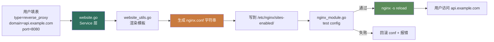
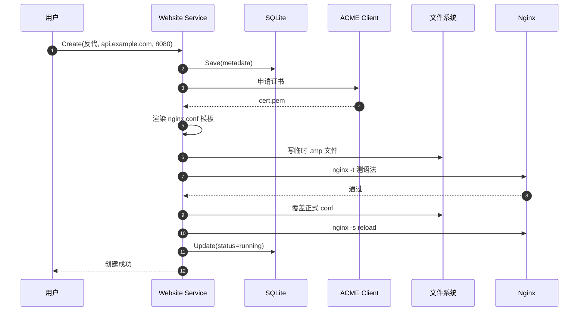

# 1Panel Website 模块 — 人话版

> 30 分钟搞懂 1Panel 怎么替你管 Nginx 网站。
> 详细代码注解在同目录 `README.md`（63 行 stub + 16 文件清单 / ~11000 行 Go）。
> 这份文档是入口 —— 先看这个，再决定要不要啃那份。
>
> 🎨 **可视化版**：同目录 `visual-atlas.html`（浏览器里看，4 张 Mermaid 真实图 + 3×3 状态机矩阵 + 5 个反模式卡片）
> 📋 **研究 commit**：`7915230`（dev-v2）
> ⚠️ **状态**：stub + 人话版，详细注解待做（重点是 `website_utils.go` 配置生成）

---

## 0. 这份文档回答 5 个问题

1. **1Panel 怎么"加个网站"？它怎么生成 nginx.conf？**
2. **为什么不是直接 `nginx -s reload`，而要把整个 conf 写盘再 reload？**
3. **3 种网站类型（默认 / 反代 / 静态）怎么用同一套配置生成？**
4. **Let's Encrypt 证书怎么自动续期？DNS-01 验证怎么搞？**
5. **对 Sirius Cloud L2 部署 / 网站管理有什么借鉴价值？**

---

## 1. 一句话总结

**1Panel 把"加个网站"做成"3 步：选类型 → 填参数 → 点确定"，背后是 ~11000 行 Go + 完整 Nginx 配置模板引擎 + ACME 协议客户端。**

藏了 **3 个必抄的设计**（重点是配置生成 + reload 策略） + **5 个反模式**（重点是状态机太复杂），下面一一拆。

---

## 2. 1Panel 凭什么能管网站

### 2.1 先想象 3 种网站

| 类型 | 例子 | nginx.conf 长啥样 |
|---|---|---|
| **A. 默认站点** | 用户放 HTML 到 `/var/www/`，80 端口直接服务 | `root /var/www/; try_files $uri $uri/ /index.html;` |
| **B. 反向代理** | 域名 `api.example.com` → 内部 8080 端口 | `location / { proxy_pass http://127.0.0.1:8080; }` |
| **C. 静态站点** | 域名 `blog.example.com` → 某个目录 | `root /var/www/blog; location / { try_files $uri $uri/ =404; }` |

**3 种类型 × 3 种 SSL（自签 / Let's Encrypt / 上传） × 多种 Auth（无 / Basic） × 多种 LB（单点 / upstream）= 50+ 组合。** 你要写 50+ 套 nginx.conf 模板吗？

### 2.2 1Panel 的解法：**配置模板 + 渲染 + 写盘 + reload**



**为什么不是 `nginx -s reload` 直接 reload？** 因为 Nginx 在 reload 时如果 conf 有语法错误，会导致<strong>整个 Nginx 进程退出</strong>，所有网站都挂。所以 1Panel 的策略是：

1. 把新 conf 写到一个临时文件
2. `nginx -t` 测试语法
3. 测试通过才覆盖正式 conf
4. 再 `nginx -s reload`

### 2.3 类比：**像装修验收**

```
普通做法：边拆边装，装完才发现有问题    ❌
装修验收：先在临时空间装好，验收通过再覆盖     ✅

1Panel 普通：直接 reload，新 conf 有错就炸 ❌
1Panel 验收：先 -t 测试，通过再覆盖正式 conf ✅
```

---

## 3. 一个真实场景走查：用户加个反向代理网站

想象你在 1Panel Web UI 上点"添加网站"：

```
┌──────────────────────────────────────────┐
│ 添加网站                                    │
├──────────────────────────────────────────┤
│ 类型:      [反代 ▼]                       │
│ 主域名:    [api.example.com    ]          │
│ 代理地址:  [http://127.0.0.1   ]          │
│ 代理端口:  [8080              ]           │
│ 启用 SSL:  [✓]                            │
│ 证书类型:  [Let's Encrypt ▼]             │
│  [确定]                                    │
└──────────────────────────────────────────┘
```

### 3.1 点"确定"后 1Panel 内部 8 步

**1. Service 层校验**（`website.go` Create）

```go
// 伪代码
func (s *WebsiteService) Create(req CreateWebsiteReq) error {
    // 1. 校验域名格式
    if !isValidDomain(req.Domain) { return errInvalidDomain }
    // 2. 校验端口范围
    if req.Port < 1 || req.Port > 65535 { return errInvalidPort }
    // 3. 查重
    if s.existsByDomain(req.Domain) { return errDomainExists }
    // ...
}
```

**2. 写 metadata 到 SQLite**

```go
website := &Website{
    Type:    "reverse_proxy",
    Domain:  req.Domain,
    Port:    req.Port,
    SSL:     true,
    SSLType: "letsencrypt",
    Status:  "creating",
}
s.db.Save(website)
```

**3. 申请 SSL 证书**（如果 SSL=Let's Encrypt）

```go
// website_ssl.go + acme 库
cert, err := acmeClient.ObtainCertificate(req.Domain)
if err != nil { return err }  // DNS-01 验证失败等
```

**4. 渲染 nginx.conf**（`website_utils.go`）

```go
// 根据 type + SSL + 其他参数渲染模板
conf := renderTemplate(websiteTypeReverseProxy, website, cert)
// 输出：
//   server {
//     listen 443 ssl;
//     server_name api.example.com;
//     ssl_certificate /etc/nginx/ssl/api.example.com.pem;
//     ssl_certificate_key /etc/nginx/ssl/api.example.com.key;
//     location / {
//       proxy_pass http://127.0.0.1:8080;
//       proxy_set_header Host $host;
//       proxy_set_header X-Real-IP $remote_addr;
//     }
//   }
```

**5. 写临时 conf + 测语法**

```go
tmpFile := "/etc/nginx/sites-enabled/.tmp-api.example.com"
os.WriteFile(tmpFile, []byte(conf), 0644)
out, err := exec.Command("nginx", "-t", "-c", "/etc/nginx/nginx.conf").CombinedOutput()
if err != nil {
    os.Remove(tmpFile)
    return fmt.Errorf("nginx config invalid: %s", out)
}
```

**6. 覆盖正式 conf**

```go
os.Rename(tmpFile, "/etc/nginx/sites-enabled/api.example.com")
```

**7. reload nginx**

```go
exec.Command("nginx", "-s", "reload").Run()
```

**8. 更新 metadata + 返回成功**

```go
website.Status = "running"
s.db.Save(website)
return nil
```

整个 8 步大概 5-30 秒（主要卡在 SSL 申请），用户在 UI 上看到"创建成功"。

### 3.2 全程时序



---

## 4. 3 个值得抄的设计 + 1 个核心

### 4.1 ⭐⭐⭐⭐⭐ **配置生成 + 安全 reload 策略**（核心）

**核心模式**：永不直接 reload，先 `-t` 测试。

```go
// 通用安全 reload 函数
func safeReloadNginx(tmpConf string) error {
    // 1. 写到临时文件
    tmpFile := ".tmp-" + uuid.NewString()
    os.WriteFile(tmpFile, []byte(tmpConf), 0644)
    // 2. 测试语法
    if out, err := exec.Command("nginx", "-t", "-c", tmpFile).CombinedOutput(); err != nil {
        os.Remove(tmpFile)
        return fmt.Errorf("invalid config: %s", out)
    }
    // 3. 覆盖正式文件
    finalPath := strings.TrimPrefix(tmpFile, ".tmp-")
    os.Rename(tmpFile, finalPath)
    // 4. reload
    return exec.Command("nginx", "-s", "reload").Run()
}
```

**为什么必抄**：所有"管配置文件"的场景（不只是 Nginx）都用得上 —— PostgreSQL pg_hba.conf、Redis redis.conf、HAProxy haproxy.cfg。Sirius Cloud 必用。

### 4.2 ⭐⭐⭐⭐⭐ **配置模板引擎**

1Panel 的 `website_utils.go` 1783 行，核心是 1 套模板：

```go
// 伪代码
const tmplReverseProxy = `
server {
    listen {{.SSLPort}} ssl http2;
    server_name {{.Domain}};
    {{if .SSL}}
    ssl_certificate {{.CertPath}};
    ssl_certificate_key {{.KeyPath}};
    {{end}}
    {{if .BasicAuth}}
    auth_basic "Restricted";
    auth_basic_user_file {{.HtpasswdPath}};
    {{end}}
    location / {
        proxy_pass {{.ProxyURL}};
        proxy_set_header Host $host;
        proxy_set_header X-Real-IP $remote_addr;
        proxy_set_header X-Forwarded-For $proxy_add_x_forwarded_for;
    }
    {{range .ExtraLocations}}
    location {{.Path}} {
        {{.Config}}
    }
    {{end}}
}
`

func renderWebsite(website Website) string {
    t := template.Must(template.New("website").Parse(tmplReverseProxy))
    var buf bytes.Buffer
    t.Execute(&buf, website)
    return buf.String()
}
```

**怎么抄**：用 Go template（如果你用 Go）或 Jinja2（如果你用 Python）。模板只关心"渲染"，业务逻辑只关心"准备数据"。

### 4.3 ⭐⭐⭐⭐ **Let's Encrypt 自动化**

`website_ssl.go` 1024 行实现了完整 ACME 客户端：

- 支持 HTTP-01 验证（需要 80 端口可用）
- 支持 DNS-01 验证（需要 DNS 提供商 API token，存 `website_dns_account.go`）
- 自动续期（cron 每天检查，证书 < 30 天过期就重申请）

**怎么抄**：直接用现成 ACME 库（Go: `golang.org/x/crypto/acme`，Python: `certbot` 或 `acme`），别自己实现协议。

### 4.4 ⭐⭐⭐⭐ **Upstream 负载均衡配置**

```nginx
upstream backend {
    server 127.0.0.1:8080 weight=3;
    server 127.0.0.1:8081 weight=2;
    server 127.0.0.1:8082 backup;
}

server {
    listen 80;
    location / {
        proxy_pass http://backend;
    }
}
```

1Panel 的 `website_lb.go` 236 行生成这种配置。Sirius Cloud 部署多个 instance 时直接抄。

---

## 5. 5 个反模式 / 避坑

### 5.1 ❌ **`website.go` 2370 行**

单文件超过 2000 行，包含 3 种网站类型的 CRUD + 各种组合。**不要照抄架构**。

**避坑**：拆成 `website_default.go` / `website_proxy.go` / `website_static.go` 三个文件，每个 500-800 行。

### 5.2 ⚠️ **`website_utils.go` 1783 行 = 状态机地狱**

3 类型 × 3 SSL × 3 Auth × 3 LB = 81 种配置组合。代码里到处是 `if-else` 拼接。

**避坑**：先<strong>画状态机</strong>，用 1 套模板引擎 + 数据驱动，不要堆 if-else。

### 5.3 ⚠️ **强依赖 Nginx 二进制**

整套假设 `nginx` 命令在 `$PATH` 里。

**避坑**：抽象成 `NginxManager` interface（`Reload() / TestConfig() / GetVersion()`），方便换 Caddy / Traefik。

### 5.4 ⚠️ **ACME 账号管理不直观**

`website_acme_account.go` 89 行 + `website_dns_account.go` 81 行，DNS 提供商账号和 ACME 账号是分开存的。

**避坑**：合并成 1 个 `CertificateProvider` 模型，2 个子表（账号 + 证书）。

### 5.5 ⚠️ **操作日志（`website_op.go`）跟主表混一起**

每改一次网站配置写一条 op log，3 个月后 SQLite 几 GB。

**避坑**：op log 单独表 + 定期归档（30 天前的移到冷库）。

---

## 6. 跟 Sirius Cloud 的对位

| Sirius Cloud 需求 | 1Panel Website 对应 | 推荐度 |
|---|---|---|
| **L2 网站管理**（用户加网站） | website.go 整套 | ⭐⭐⭐⭐⭐ |
| **L2 反向代理**（域名 → 内网服务） | website_proxy.go + website_utils.go | ⭐⭐⭐⭐⭐ |
| **L2 SSL 自动签发** | website_ssl.go + ACME | ⭐⭐⭐⭐ |
| **L2 负载均衡** | website_lb.go + upstream 模板 | ⭐⭐⭐⭐ |
| **L3 配置变更审计** | website_op.go | ⭐⭐⭐ |

### 6.1 必抄清单

1. **安全 reload 模式**（`safeReloadNginx`）—— 10 行代码，价值连城
2. **配置模板 + 数据驱动**（避免 if-else 拼接）
3. **ACME 自动化 + DNS-01 支持**

### 6.2 抄的时候要改

1. **不用 Nginx**（你的 Sirius Cloud 部署用 Kubernetes Ingress / Traefik）—— 抄设计模式，<strong>不抄实现</strong>
2. **配置管理用 GitOps**（conf 文件存 Git，不存数据库）—— 1Panel 把 conf 存 DB 是为 web UI 方便，但你用 ArgoCD / Flux 更现代
3. **多租户隔离** —— 1Panel 假设单机单用户，Sirius Cloud 要按用户隔离网站

---

## 7. 接下来怎么读

### 7.1 30 分钟通道

1. 看完本文档
2. 看 `03-website/README.md` §5（借鉴价值 3 行 + 避坑 2 条）
3. 直接看 `website_utils.go` 的 `renderTemplate` 函数

### 7.2 2 小时通道

1. 上面 30 分钟
2. `website.go` Create 函数（看完整 8 步流程）
3. `nginx_module.go` 的 `safeReloadNginx` 实现
4. `website_ssl.go` 的 ACME 客户端（看 HTTP-01 和 DNS-01 两种验证）

### 7.3 1 天写代码通道

1. 上面所有
2. Python 写一个 `SafeConfigReloader` 类（30 行，封装"写临时 + 测 + 覆盖 + reload"）
3. 用 Jinja2 写 3 个网站配置模板（default / proxy / static）
4. 集成 certbot 做自动 SSL 签发 + 续期
5. 写自己的 `SiriusWebsiteService`

---

## 8. 写作说明

- **本文档定位**：30 分钟读完的"故事版"
- **`03-website/README.md` 定位**：16 文件清单 + stub（详细注解待做）
- **`firewall-architecture.md` 定位**：v2 防火墙深度注解（另一个模块的样板）
- **`00-landscape.md` 定位**：13 个模块的全景图

---

**研究 commit**：`7915230`（dev-v2）· **更新**：2026-08-24 · **作者**：1Panel v2 研究员
