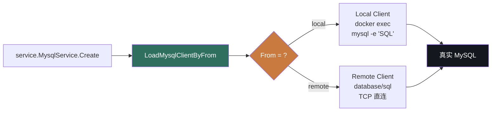
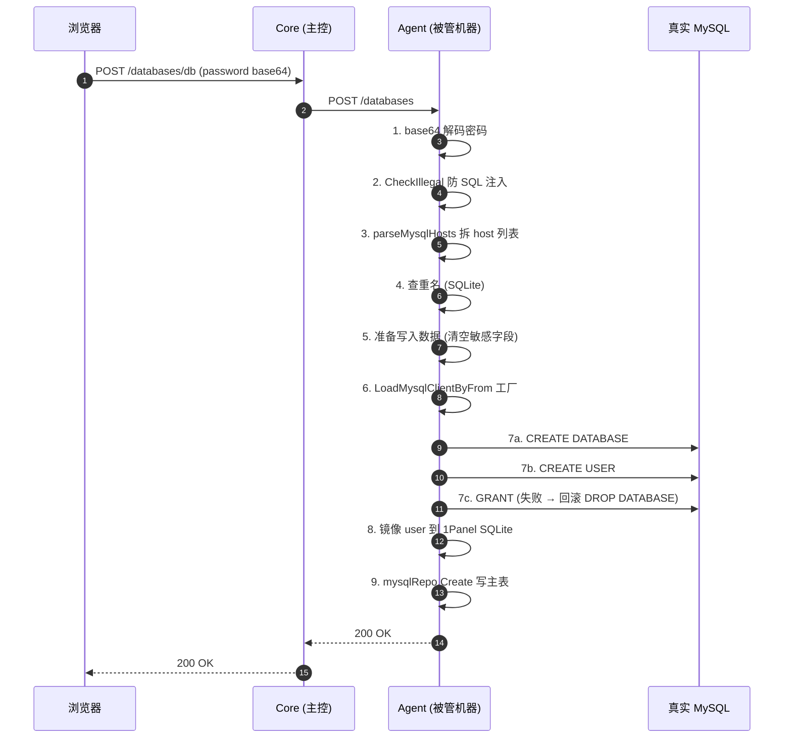

# 1Panel Database 模块 — 人话版

> 30 分钟搞懂 1Panel 怎么管 4 种数据库。**详细代码注解在同目录 `README.md`（99 KB / 2192 行）**。
> 这份文档是入口 —— 先看这个，再决定要不要啃那份。
>
> 🎨 **可视化版**：同目录 `visual-atlas.html`（浏览器里看，4 张 Mermaid 真实图 + 5 个反模式卡片 + 9 步时序）
> 📋 **审查报告**：`REVIEW.md`（本目录，2026-08-24 校对）

---

## 0. 这份文档回答 5 个问题

1. **1Panel 怎么"远程接入"一台已经存在的 MySQL？**
2. **为什么"本地"和"远端"用完全不同的代码？**
3. **怎么保证"UI 显示的 DB 列表"跟"真实 MySQL 里的 DB 列表"不脱节？**
4. **为什么备份用 Docker 容器跑 mysqldump？**
5. **哪些设计值得抄，哪些必须避开？**

---

## 1. 一句话总结

**1Panel 把"DB 接入 / DB 操作 / DB 备份 / DB 配置 / DB 同步"五件事，全部抽象成 4 张表 + 1 个 Adapter interface，在 Agent 进程里跑，用户在 Core Web UI 上点鼠标。**

仅此而已。但这套抽象做了 ~4800 行 Go + 4 张 SQLite 表（`database` / `database_mysql` / `database_postgresql` / `database_mongodb`）+ 1 张 user 镜像表（`database_user` + `database_user_grant`）+ 1 个 Adapter interface，藏了 **7 个值得抄的设计** + **5 个反模式**，下面一一拆。

---

## 2. 1Panel 凭什么能管 4 种数据库

### 2.1 先想象 4 种场景

用户用 1Panel 管理数据库时，会面对这 4 种情况：

| 场景 | 例子 |
|---|---|
| **A. 装一个全新的** | 1Panel 在这台机器上起个 MySQL 8.0 容器，用户在 UI 上点"装" |
| **B. 接入已有的远端** | 公司机房有台老 MySQL 5.7，1Panel Agent 装在新机器上，要远程管理老 MySQL |
| **C. 接入同机已有的** | 机器上跑着裸 MySQL，没用 Docker，1Panel Agent 装上去后想接管 |
| **D. 多个类型混用** | 同时管 MySQL 8.0、PostgreSQL 15、Redis 7、MongoDB 6 |

**4 种场景 × 5 种 DB 类型（MySQL / MariaDB / PostgreSQL / Redis / MongoDB）= 20 种组合。** 你要写 20 套代码吗？

### 2.2 1Panel 的解法：**`From` 字段二分**

只分两类 —— **"local"** 和 **"remote"**，其他都是细节。

```go
// agent/app/model/database.go
type Database struct {
    Name     string
    Type     string   // mysql / mariadb / postgresql / redis / mongodb
    From     string   // "local" 或 "remote"   ← 整个抽象就靠这一字段
    Address  string   // 远端是 IP；本地是容器名
    Port     uint
    Username string
    Password string
    // ...
}
```

**`From` 决定接下来走哪条路**（Mermaid 渲染）：



调用方（`MysqlService.Create` / `RedisService.UpdateConf` 等）只调 `LoadMysqlClientByFrom(name)`，拿到一个 `MysqlClient` interface，**不知道也不关心是 local 还是 remote**。

### 2.3 类比：**像万能钥匙**

```
普通钥匙匠：每个品牌的锁要配不同的钥匙     ❌
万能钥匙匠：只看"齿形规格"，不挑品牌        ✅

1Panel 普通：每个 DB 类型写一套 service    ❌
1Panel 万能：用 Adapter interface + 2 套实现 ✅
```

**`MysqlClient` interface**（`agent/utils/mysql/client.go`）：
```go
type MysqlClient interface {
    Create(info CreateInfo) error
    CreateUser(info CreateInfo, withDeleteDB bool) error
    DeleteDatabase(info DeleteInfo) error
    ListUsers(timeout uint) ([]UserInfo, error)
    Backup(info BackupInfo) error
    // ... 20+ 方法
}
```

两个实现（`Local` / `Remote`）都实现这个 interface，service 层只跟 interface 打交道。

---

## 3. 一个真实场景走查：用户点"创建 MySQL DB"

想象你登录 1Panel Core Web UI，点"添加数据库"，填表：

```
┌──────────────────────────────────────────────┐
│ 添加远程 MySQL 数据库                            │
├──────────────────────────────────────────────┤
│ 实例名:  [my-company-db          ]              │
│ 类型:    [MySQL 8.0 ▼]                         │
│ 地址:    [10.10.10.100            ]              │
│ 端口:    [3306                  ]              │
│ 用户名:  [root                  ]              │
│ 密码:    [********              ]  ← base64 编码 │
│   ☐ 启用 SSL                                │
│ [测试连接]  [确定]                              │
└──────────────────────────────────────────────┘
```

### 3.1 点"确定"后 1Panel 内部 9 步

**1. 前端 base64 解码密码**（`api/v2/database_mysql.go:27-34`）

```go
if len(req.Password) != 0 {
    password, err := base64.StdEncoding.DecodeString(req.Password)
    // 防止 JSON 传输 / 日志泄露
}
```

**2. service 层校验合法性**（`service/database_mysql.go:436-441`）

```go
if cmd.CheckIllegal(req.Name, req.Username, req.Password, ...) {
    return buserr.New("ErrCmdIllegal")  // 黑名单防 SQL 注入
}
```

**3. 解析 host 列表**（`user@host1,host2` 拆开）

```go
permissionHosts, _ := parseMysqlHosts(req.Permission, true)
// 内部: "%,192.168.1.%" → ["%", "192.168.1.%"]
```

**4. 查重名**

```go
mysql, _ := mysqlRepo.Get(...)  // 在 1Panel 自己的 SQLite 查
if mysql.ID != 0 { return buserr.New("ErrRecordExist") }
```

**5. 准备写入数据** —— 敏感字段清空

```go
var createItem model.DatabaseMysql
copier.Copy(&createItem, &req)
createItem.Username = ""   // 不存到 1Panel 自己的 SQLite
createItem.Password = ""   // 真实 MySQL 上有，1Panel 镜像里没有
createItem.Permission = "" // 同上
```

> **为什么清空？** 1Panel 不接管用户没授权的 user，**最小权限原则**。

**6. 拿到 MySQL client**（**关键一步**）

```go
cli, version, err := LoadMysqlClientByFrom(req.Database)
//                  ↑ 注意：只看 From 字段，不知道是 local/remote
```

**`LoadMysqlClientByFrom` 内部**（`database_mysql.go:1533-1576`）：

```go
if dbInfo.From != "local" {
    // 远端：用 databaseItem 的 IP/Port/User/Password
    dbInfo.Address = databaseItem.Address
    // ...
} else {
    // 本地：从 app_install 表拿容器名 + root 凭据
    dbInfo.Address = app.ContainerName  // 容器名当 "Address"！
    dbInfo.Username = "root"
    dbInfo.Password = app.Password
}
```

**7. 在真实 MySQL 上建库 + 建 user + 授权**

```go
// Remote 走 database/sql + prepared statement
if err := cli.Create(CreateInfo{
    Name: req.Name, Format: "utf8mb4", Collation: "utf8mb4_general_ci",
    Username: req.Username, Password: req.Password,
    Permission: req.Permission, Version: version, Timeout: 300,
}); err != nil {
    return err
}
```

**`Remote.Create` 内部**（`utils/mysql/client/remote.go:46-59`）：

```go
// 第 1 步：CREATE DATABASE
if err := r.CreateDatabase(info); err != nil { return err }
// 第 2 步：CREATE USER（如果指定了 username）
if len(info.Username) == 0 { return nil }
if err := r.CreateUser(info, true); err != nil {
    // ⚠️ 失败回滚：drop database
    _ = r.ExecSQL(fmt.Sprintf("drop database if exists `%s`", info.Name), info.Timeout)
    return err
}
```

**8. 镜像 user 凭据到 1Panel 自己的 SQLite**

```go
saveDatabaseUserCredentials(dbType, req.Database, req.Username, req.Permission, req.Password, "")
// 1Panel 自己的 database_user 表存一份"哪些 user 是 1Panel 管的"
```

**9. 写 1Panel SQLite 主表**

```go
if err := mysqlRepo.Create(ctx, &createItem); err != nil { return err }
return &createItem, nil
```

### 3.2 完整时序图（Mermaid 渲染）



### 3.3 关键点：所有 SQL 失败都"会回滚部分成功"

看第 7 步：

| 步骤 | 失败 | 回滚 |
|---|---|---|
| CREATE DATABASE | 失败 | 不需要（之前什么都没建）|
| CREATE USER | 失败 | **drop database**（去掉已建库）|
| GRANT | 失败 | **drop database**（再 drop user 在外层）|

**这套 partial rollback 是 1Panel 最值得抄的设计**。**不是 Saga，没有分布式事务**，但用业务逻辑兜住了"半成功"状态。

---

## 4. 7 个值得抄的设计模式

每个模式：**一句话 → 类比 → 1Panel 怎么做的 → 借鉴度**。

### 模式 1：**`From` 字段二分法**（⭐⭐⭐⭐⭐ 必抄）

**一句话**：用一个 enum 字段（`local` / `remote`）把两套实现统一在一个 interface 后。

**类比**：快递柜有"大件柜"和"小件柜"，用户只看尺寸选，不关心是几号柜子。

**1Panel 怎么做的**：
```go
type Database struct {
    From string  // "local" | "remote"  ← 就这一个字段
    // ...
}
```
然后 `LoadMysqlClientByFrom(name)` 内部 switch 选 client 实现。

**借鉴度**：⭐⭐⭐⭐⭐ — 任何"多形态对象管理"都能套（K8s Node、CI Runner、CDN Edge）。

---

### 模式 2：**UUID marker 标识自己的规则**

**一句话**：在 `iptables -m comment --comment "<UUID>"` 里塞 UUID 当 ID，避免误删别人的规则。

**类比**：共享会议室里贴便签"今天 3 点张三用"，别人不会动你的东西。

**1Panel 怎么做的**：
- 防火墙规则加 `-m comment --comment "<UUID>"`
- 改/删规则时按 UUID 找，不按位置
- 别人手动加的规则 UUID 是空，**1Panel 不会动**

**借鉴度**：⭐⭐⭐⭐ — 任何"系统级共享资源管理"都用得上（iptables / nftables / crontab / systemd timer）。

**详细位置**：`firewall-architecture.md` 4.1.1 + 4.4.5 + 4.6 节。

---

### 模式 3：**三向合并同步**（⭐⭐⭐⭐⭐ 必抄）

**一句话**：把"真实 DB 状态"同步到"控制台 SQLite"时，**不删了重建**，用 diff + 软删恢复。

**类比**：跟 git pull 一样 —— 不冲突的留下，冲突的合并，远端删了的本地打上"已删除"标记但**不真删**。

**1Panel 怎么做的**（`MysqlService.LoadFromRemote`）：

| 真实 DB | 1Panel SQLite | 行为 |
|---|---|---|
| 有 | 有 | 保留（软删则恢复为 `is_delete=false`）|
| 有 | 无 | 插入（敏感字段清空）|
| 无 | 有 | 软删除（`is_delete=true`）|
| 无 | 无 | 无操作 |

**借鉴度**：⭐⭐⭐⭐⭐ — 任何"控制台 ← 真实资源"同步场景都适用。

**注意**：1Panel 用 slice `append(deleteList[:i], deleteList[i+1:]...)` 删除，**O(n²)**，100+ 资源会卡。**你改用 map 索引**。

---

### 模式 4：**配置所有权 marker 改写**（⭐⭐⭐⭐ 抄一半）

**一句话**：改配置文件时用 comment 标记"自己的领地"，领地内的 key 才动，领地外不碰。

**类比**：合租公寓 —— 你的房间你随便改，公共区域（客厅、厨房）不动。

**1Panel 怎么做的**（`RedisService.confSet`，217-293 行）：
- 找 `# Redis configuration rewrite by 1Panel` / `# End Redis configuration rewrite by 1Panel` 区间
- 区间内的 key 改/加
- 区间外的 key 原样保留
- 改完重启容器

**借鉴度**：⭐⭐⭐⭐ — 适合 Redis / nginx / my.cnf 这种"用户也想改"的配置。

**⚠️ 1Panel 的 my.cnf 改写器（`updateMyCnf`）是另一种风格**：用 `[mysqld]` group 边界识别，**5 状态机**。两种风格看你场景。

---

### 模式 5：**多步操作 + 3 层 rollback 闭包**（⭐⭐⭐⭐⭐ 必抄）

**一句话**：复杂的多步操作（创建 user + 镜像 + 授权），每步定义一个"回滚闭包"，失败时按 LIFO 顺序撤销。

**类比**：魔术表演 —— 每个动作准备一个"撤销道具"，表演失败时按反序收场。

**1Panel 怎么做的**（`MysqlService.CreateUser`，617-740 行，120+ 行）：

```go
// 3 层 rollback 闭包定义
rollbackCreatedHosts := func() { /* 删 user */ }
rollbackSavedHosts   := func() { /* 删 SQLite 镜像 */ }
rollbackGrantedItems := func() { /* 撤销 grant */ }
rollbackAll := func() {  // master rollback，按 LIFO
    rollbackGrantedItems()
    rollbackSavedHosts()
    rollbackCreatedHosts()
}

// 步骤 5：逐 host CREATE USER
for _, host := range hosts {
    if err := cli.CreateUserOnly(...); err != nil {
        rollbackCreatedHosts()   // 失败只回滚本步
        return err
    }
    createdHosts = append(createdHosts, host)
}

// 步骤 6-7：镜像 + 授权
for ... {
    if err := ...; err != nil {
        rollbackAll()              // 失败回滚全部
        return err
    }
}
```

**借鉴度**：⭐⭐⭐⭐⭐ — 任何"多步分布式操作"（K8s apply、Cloud API 创建资源链）都需要。

---

### 模式 6：**改密自动同步到 app + 删 user 前查占用**（⭐⭐⭐⭐⭐ 必抄）

**一句话**：改 MySQL user 密码后，**所有用此 user 的 app**（WordPress 等）的环境变量 `DB_PASSWORD` 自动更新；删 user 前**先查谁在用**。

**类比**：公司换门锁 —— 同步更新所有员工的门禁卡（不能只换锁不更新卡），查谁拿了旧钥匙再决定能不能换。

**1Panel 怎么做的**：

| 操作 | 1Panel 行为 |
|---|---|
| 改 MySQL user 密码 | 1. 改 MySQL 自己的 user 表<br>2. 改 1Panel SQLite 镜像<br>3. **遍历所有 app**（通过 `app_install_resource` + `app_install.Env.PANEL_DB_USER` 反查），更新 env 里的 `DB_PASSWORD` |
| 删 MySQL user 之前 | 调 `checkMysqlUserAppUsage` 查"还有哪些 app 用这个 user"<br>如果有，**返回 `ErrMysqlUserUsedByApps`** 阻止删除 |

**借鉴度**：⭐⭐⭐⭐⭐ — DBaaS 控制台必备。

---

### 模式 7：**sidecar 容器跑 mysqldump**（⭐⭐⭐⭐⭐ 必抄）

**一句话**：备份时拉个 `mysql:8.0` 临时容器跑 `mysqldump`，**跑完即删**（`--rm`）。

**类比**：装修时雇临时工 —— 不给正式工编制，用完走人。

**1Panel 怎么做的**（`Remote.Backup`，280-336 行）：
```go
backupArgs := []string{
    "run", "--rm", "--net=host", "-i",    // 关键三连
    imageTag,                            // mysql:8.0
    "mysqldump",                         // 跑啥
    "-h", r.Address, "-P", ..., "-u", r.User, "-p", r.Password,
    info.Name,
}
cmdMgr.RunPipeToFile(targetFile,
    PipeCommand{Name: "docker", Args: backupArgs},
    PipeCommand{Name: "gzip", Args: []string{"-cf"}},   // 直接 pipe 到 gzip
)
```

**借鉴度**：⭐⭐⭐⭐⭐ — 任何需要"专用工具但又不想污染主环境"的场景。

**⚠️ 1Panel 的隐患**：
- 密码明文 `-pPASSWORD` 出现在 `ps aux` 和 `docker inspect`
- 改用 stdin / env 传

---

## 5. 5 个反模式（要避开）

### 反模式 1：**Local 路径走 `docker exec`** 🚫

1Panel 的 Local 客户端用 `docker exec mysql -uroot -p... -e "SQL"` 进容器跑 MySQL CLI。

**为什么是反模式**：
- 你的环境**没有 Docker**（Sirius Cloud 硬约束）
- 密码明文出现在进程列表
- 依赖 docker 守护进程

**你该怎么做**：直接用 `database/sql` 连 MySQL daemon（裸装或 systemd 起的）。如果客户用 MySQL 容器，**走 Remote 路径**（让客户开端口出来）。

---

### 反模式 2：**机器本地 key 加密** 🚫

1Panel 的 `encrypt.StringEncrypt` 用**机器特征**当 key（重启 / 重装系统后**解密失败**）。

**为什么是反模式**：
- SQLite 备份跨机器不可移植
- 集群部署时第一台机器死掉，全员完蛋

**你该怎么做**：用 **KMS（Key Management Service）** 或 **HashiCorp Vault**。

---

### 反模式 3：**MySQL DSN 含明文密码** 🚫

```go
connArgs := fmt.Sprintf("%s:%s@tcp(%s:%d)/?charset=utf8%s", 
    conn.Username, conn.Password, ...)  // ← password 明文
```

**为什么是反模式**：
- 如果不小心 log 出来，密码泄露
- 一些 error message 会带 DSN 内容

**你该怎么做**：密码从**环境变量 / KMS** 读，不进 struct，不进日志。

---

### 反模式 4：**自己补丁 PostgreSQL 18 路径** 🚫

1Panel 在 `UpdateConfByFile:97-99` 自己打补丁处理 PG 18 的目录变化（`data/18/docker/postgresql.conf`）。

**为什么是反模式**：
- 跟上游版本绑定太深，每次 PG 升级都要跟
- 1Panel 自己也在维护"特殊版本路径表"，**长期负担**

**你该怎么做**：用 `find` 找 postgresql.conf，不硬编码路径。

---

### 反模式 5：**MongoDB `directConnection=true` 强制单节点** 🚫

1Panel 的 `buildRemoteMongodbURI` 写死 `directConnection=true` —— **不支持 MongoDB Cluster**。

**为什么是反模式**：
- 你的客户可能用 MongoDB Replica Set（不是单节点）
- 写死 `directConnection` 等于屏蔽了 MongoDB 高可用

**你该怎么做**：用 `replicaSet=rs0&readPreference=secondaryPreferred` 替代。

---

## 6. 一个对照表：Sirius Cloud 需求 → 1Panel 对位

| 你的需求 | 1Panel 对位 | 借鉴度 |
|---|---|:---:|
| **L2 部署：远端 MySQL 接入** | `Database.From="remote"` | ⭐⭐⭐⭐⭐ |
| **L2 部署：改密自动同步** | `updateMysqlPasswordAppTargets` | ⭐⭐⭐⭐⭐ |
| **L2 部署：删 user 前查占用** | `checkMysqlUserAppUsage` | ⭐⭐⭐⭐⭐ |
| **L2 部署：多步操作 rollback** | `CreateUser` 3 层闭包 | ⭐⭐⭐⭐⭐ |
| **L2 部署：sidecar 备份** | `Remote.Backup` 跑临时容器 | ⭐⭐⭐⭐⭐ |
| **L3 监控：MySQL 状态** | `LoadStatus`（`SHOW GLOBAL STATUS`）| ⭐⭐⭐⭐ |
| **L3 备份：完整性校验** | PG `PGDMP` magic header | ⭐⭐⭐⭐⭐ |
| **L1 鉴权：密码 base64 包装** | 全部 API 走 base64 | ⭐⭐⭐⭐ |
| **核心抽象：多类型统一接口** | `IDatabaseService` interface | ⭐⭐⭐⭐⭐ |

---

## 7. 3 个未解问题（你来定）

1Panel 把"DB 接入"做成了一个标准模式，但有 3 个关键决策**它替你做了**，你需要自己定：

### Q1：Local 路径用什么？

1Panel 选了 `docker exec`。你的选项：

- **A. 走 systemd 单元**：要求 MySQL 用 systemd 管理（生产推荐）
- **B. 走裸进程 socket**：用 `/var/run/mysqld/mysqld.sock`（传统）
- **C. 完全不要 Local 路径**：1Panel 自身只为远端设计

### Q2：怎么跟 Remote 区分？

1Panel 用 `From` enum。你的选项：

- **A. 跟 1Panel 一样**：`From="local"|"remote"`（兼容理解，但需要多写一套）
- **B. 不要 Local**：所有 DB 一律远端连接，简化架构

### Q3：镜像 user 凭据到本地 SQLite 吗？

1Panel 镜像（`database_user` 表）。**坏处**：双写不一致风险。

- **A. 镜像**（跟 1Panel）：能区分"1Panel 创建的 user"vs"系统原本的 user"
- **B. 不镜像**：直接查真实 DB，**单一数据源**

**我的建议**（仅供参考）：
- Q1 → A 或 B（systemd 是主流）
- Q2 → B（远端统一，简化）
- Q3 → B（避免双写）

---

## 8. 接下来怎么读

### 8.1 30 分钟快速通道

1. 看完本文档（你现在读的）
2. 看 `04-database/README.md` 的 **§5 跟 Sirius Cloud 的对位**（30 行表格 + 5.2 必抄 10 段）
3. 选 1 段最相关的，**直接照抄**（比如 `isMysqlSystemUser` 黑名单 22 行）

### 8.2 2 小时深度通道

1. 本文档
2. `04-database/README.md` **§4.1-§4.3**（连接管理 + Create 流程 + 客户端工厂）
3. `04-database/README.md` **§4.11-§4.13**（同步 + 备份 + 改密）
4. `04-database/README.md` **§4.16**（my.cnf 状态机改写）+ **§4.17**（7 步 + 3 层 rollback 完整代码）
5. `04-database/README.md` **§4.20**（MongoDB 双实现）+ **§4.21**（Redis 工具容器）

### 8.3 1 天写代码通道

1. 上面 30 分钟 + 2 小时
2. 抄 `isMysqlSystemUser` 黑名单（22 行，5 分钟）
3. 抄 `userIdentities` 拆 host 列表（10 行，5 分钟）
4. 抄 `Remote.Create` 9 步流程（70 行，30 分钟）
5. 抄 `checkMysqlUserAppUsage` 反查逻辑（30 行，30 分钟）
6. 抄 `updateMysqlPasswordAppTargets` 改密同步（15 行，15 分钟）
7. 写你自己的 `SiriusDBAdapter` interface + Remote 实现

---

## 9. 写作说明

- **本文档定位**：30 分钟读完的"故事版"
- **`04-database/README.md` 定位**：99 KB 详细代码注解，**当参考书查**
- **`firewall-architecture.md` 定位**：v2 防火墙深度注解（另一个模块的样板）
- **`00-landscape.md` 定位**：13 个模块的全景图（决定读哪些模块）

---

**下一步**：
- 觉得本文档有错 / 漏 → 跟我说改哪里
- 想我开始下一个模块（推荐 `09-ai-agent` 或 `03-website`） → 选一个
- 想做其他事 → 跟我说

最后**你做的所有决定**都可以跟 1Panel 不一样 —— 1Panel 是参考，不是答案。
