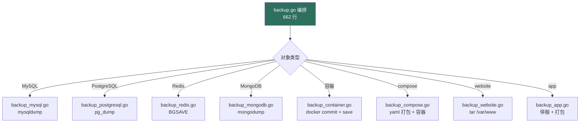
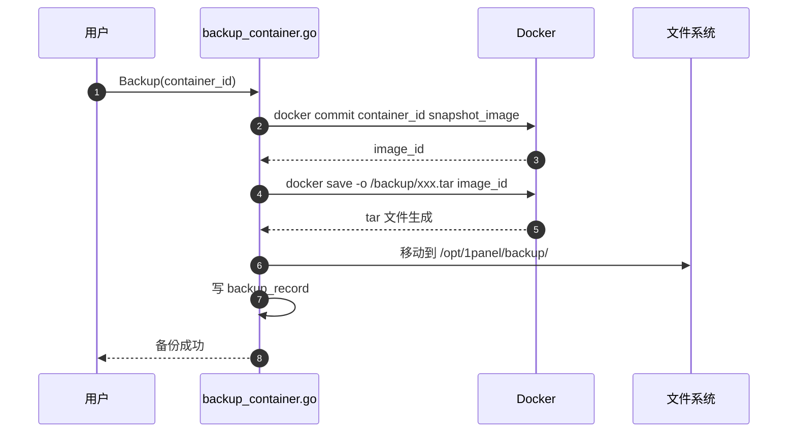

# 1Panel Backup & Snapshot 模块 — 人话版

> 30 分钟搞懂 1Panel 怎么"备份一切 + 系统级快照"。
> 详细代码注解在同目录 `README.md`（69 行 stub + 16 文件清单 / ~6000 行 Go）。
> 这份文档是入口 —— 先看这个，再决定要不要啃那份。
>
> 🎨 **可视化版**：同目录 `visual-atlas.html`（浏览器里看，4 张 Mermaid 真实图 + 5 步 backup 策略模式 + 3 步 snapshot 时序 + 3 个反模式卡片）
> 📋 **研究 commit**：`7915230`（dev-v2）
> ⚠️ **状态**：stub + 人话版，详细注解待做
> ⭐ **借鉴价值 ★★★★★**：跟你 Sirius Cloud L2 备份需求几乎 1:1

---

## 0. 这份文档回答 5 个问题

1. **"备份一切"在 1Panel 怎么落地？每种对象一种备份方式？**
2. **容器怎么备份（`docker commit` 是什么鬼）？MySQL 怎么备份？**
3. **"系统快照"和"对象备份"有什么不同？**
4. **备份任务怎么调度？失败了怎么办？**
5. **对 Sirius Cloud L2 备份 / 跨对象恢复有什么借鉴价值？**

---

## 1. 一句话总结

**1Panel 把"备份"做成两层：单对象备份（每种对象一个文件，策略模式）+ 系统快照（多对象组合的"整个系统状态"快照）。~6000 行 Go。**

藏了 **3 个必抄的设计**（重点是策略模式 + 关注点分离） + **3 个反模式**（重点是本地磁盘 + 无增量），下面拆。

---

## 2. 两层备份架构

### 2.1 区分"对象备份"和"系统快照"

| 概念 | 范围 | 用例 |
|---|---|---|
| **对象备份** | 1 个 MySQL / 1 个 WordPress / 1 个网站 | 误删了某张表，从备份恢复 |
| **系统快照** | N 个对象的组合 + 关联关系 | "上周系统的状态"，跨对象回滚 |

**用户场景**：
- 每天凌晨 3 点自动备份 MySQL（<strong>对象备份</strong>）
- 每月做一次系统快照，包含所有 app + 所有 db + 所有 website（<strong>系统快照</strong>）

### 2.2 5 种对象的备份策略（多态）



**每种对象一个文件**，公共逻辑（任务调度、备份记录）放 `backup.go` + `backup_record.go`。

---

## 3. 容器备份机制详解

### 3.1 `docker commit + docker save` 模式



**为什么不直接备份 volume？**
- 跨存储驱动不兼容（overlay2 / btrfs / zfs 备份方式不同）
- 容器配置（env / port / network）丢
- `docker commit` 把容器当前<strong>完整状态</strong>打包成 image，跨任何环境都能恢复

### 3.2 类比：**像拍快照**

```
普通做法：每次手动抄作业，抄错一行就完了      ❌
拍照：     拍下整页，一键保存                ✅

1Panel 普通：cp -r /var/lib/docker/volumes/ ❌
1Panel 拍照：docker commit → image → tar     ✅
```

---

## 4. MySQL 备份机制详解

### 4.1 `mysqldump` 调用模式

```go
// backup_mysql.go 318 行核心
func (s *MysqlBackupService) Backup(db Database, target string) error {
    // 1. 拼 mysqldump 命令
    cmd := exec.Command("mysqldump",
        "-h", db.Address,
        "-P", strconv.Itoa(int(db.Port)),
        "-u", db.Username,
        fmt.Sprintf("-p%s", db.Password),
        "--single-transaction",  // 关键：不锁表
        "--routines",             // 包含存储过程
        "--triggers",             // 包含触发器
        "--events",               // 包含事件
        db.Name,
    )
    // 2. 输出到 gzip 文件
    out, _ := cmd.Output()
    gz := gzip.NewWriter(targetFile)
    gz.Write(out)
    gz.Close()
    return nil
}
```

**关键参数**：
- `--single-transaction`：**不锁表**，InnoDB 必备
- `--routines --triggers --events`：<strong>完整</strong>备份（不只数据）
- gzip 压缩：100GB → 10-20GB

### 4.2 sidecar 模式

如果 MySQL 跑在 Docker 容器里，`mysqldump` 不在容器内，需要：

```bash
# 拉个临时 mysql 容器跑 mysqldump
docker run --rm -i \
  --network container:my-mysql-container \
  mysql:8.0 mysqldump -h127.0.0.1 -uroot -p$MYSQL_ROOT_PASSWORD \
  --single-transaction db_name | gzip > backup.sql.gz
```

**这就是 04-database 那个"sidecar 跑 mysqldump"模式**！两个模块互相印证。

---

## 5. 系统快照：多对象组合

### 5.1 快照创建流程

```mermaid
sequenceDiagram
    autonumber
    participant U as 用户
    participant SC as snapshot_create.go 576 行
    participant RC as backup_record.go
    participant M as 多对象 backup_*.go
    U->>SC: CreateSnapshot("全系统")
    SC->>SC: 遍历所有 app/db/website
    loop 每个对象
        SC->>M: Backup(obj)
        M-->>SC: backup_file
        SC->>RC: 记录 backup
    end
    SC->>SC: 打包所有 backup_file + metadata.json
    SC-->>U: 快照 ID
```



**关键**：
- 快照 = "N 个对象备份 + 元数据（关联关系）"的组合
- 恢复时按元数据反序回滚
- 跨对象（db + website + app）原子性靠"全成功才写 metadata"实现

### 5.2 快照恢复

`snapshot_recover.go` 514 行：按 metadata 逆序逐个对象调用对应的 `Recover` 函数。

---

## 6. 3 个必抄的设计

### 6.1 ⭐⭐⭐⭐⭐ **多对象备份的"策略模式"**

**为什么必抄**：跟你 Sirius Cloud L2 备份需求几乎 1:1。你要备份 MySQL / Redis / PG / MinIO / 网站... 每种对象一个文件。

```go
// 通用接口
type BackupStrategy interface {
    Backup(obj Resource, target string) error
    Recover(backupFile string, target Resource) error
}

// 每个实现
type MysqlBackup struct{}
func (m *MysqlBackup) Backup(obj Resource, target string) error { /* mysqldump */ }
func (m *MysqlBackup) Recover(file string, target Resource) error { /* mysql import */ }

type RedisBackup struct{}
func (r *RedisBackup) Backup(obj Resource, target string) error { /* BGSAVE */ }
// ...

// 工厂
var strategies = map[string]BackupStrategy{
    "mysql": &MysqlBackup{},
    "redis": &RedisBackup{},
    "website": &WebsiteBackup{},
}
```

### 6.2 ⭐⭐⭐⭐⭐ **公共逻辑 / 私有实现 关注点分离**

1Panel 的拆分：
- `backup.go`（662 行）= 公共：CRUD、调度、任务状态
- `backup_record.go`（273 行）= 公共：备份记录（成功/失败/文件路径）
- `backup_*.go`（每个对象一个）= 私有：每种对象的备份实现

**为什么必抄**：你的 Sirius Cloud 备份系统会膨胀。提前定好"公共 vs 私有"的边界，后面改起来容易。

### 6.3 ⭐⭐⭐⭐ **sidecar 容器跑备份命令**

见 §4.2。用临时容器跑 mysqldump / pg_dump / mongodump，<strong>不污染主容器</strong>，跑完即删。

**Sirius Cloud 价值**：你不用 Docker（硬约束），但模式可以借鉴 —— 单独进程跑备份，跟 MySQL 进程解耦。

---

## 7. 3 个反模式

### 7.1 ⚠️ **备份落本地磁盘**

`/opt/1panel/backup/` 存所有备份，<strong>不接 S3/MinIO/OSS</strong>。

**避坑**：Sirius Cloud 备份必须存远端（你 L2 部署到真实服务器，磁盘挂了备份也没了）。设计 `Storage` interface：

```go
type Storage interface {
    Put(key string, data io.Reader) error
    Get(key string) (io.ReadCloser, error)
    Delete(key string) error
}
// 实现：LocalStorage / S3Storage / MinIOStorage
```

### 7.2 ⚠️ **没有增量备份**

100GB 数据库 = 100GB 备份文件 × 30 天 = 3TB。即使大部分数据没变。

**避坑**：用 WAL 归档（MySQL binlog + Postgres WAL）做增量，或者用 zfs/btrfs snapshot 块级增量。

### 7.3 ❌ **`backup.go` 662 行太大**

虽然有 8 个 backup_*.go 拆分，但 `backup.go` 自己 662 行包含了所有对象的"通用流程"（创建任务、调度、状态机），也偏大。

**避坑**：拆成 `backup_crud.go` + `backup_schedule.go` + `backup_status.go` 3 个文件。

---

## 8. 跟 Sirius Cloud 的对位

| Sirius Cloud 需求 | 1Panel Backup 对应 | 推荐度 |
|---|---|---|
| **L2 多对象备份** | 整套策略模式 | ⭐⭐⭐⭐⭐ |
| **L3 跨对象系统快照** | snapshot_create + recover | ⭐⭐⭐⭐ |
| **L2 远端存储** | ❌ 改用 S3Storage / MinIOStorage | ⭐⭐⭐⭐ |
| **L3 增量备份** | ❌ 加 WAL 归档 | ⭐⭐⭐ |

### 8.1 必抄清单

1. **多对象策略模式**（每种对象一个文件）
2. **公共 vs 私有关注点分离**（backup.go vs backup_*.go）
3. **sidecar 跑备份**（解耦主进程）

### 8.2 抄的时候要改

1. **加 Storage interface**（支持 S3/MinIO，本地磁盘只作 fallback）
2. **加增量备份**（WAL 归档 / zfs snapshot）
3. **加备份加密**（1Panel 没加密，备份文件落盘可读）

---

## 9. 接下来怎么读

### 9.1 30 分钟通道

1. 看完本文档
2. 看 `05-backup-snapshot/README.md` §1（12 backup + 4 snapshot 文件）
3. 直接看 `backup.go` 的 `CreateBackupTask` 函数

### 9.2 2 小时通道

1. 上面 30 分钟
2. `backup_mysql.go` mysqldump 实现
3. `backup_container.go` docker commit + save 流程
4. `snapshot_create.go` 多对象遍历逻辑

### 9.3 1 天写代码通道

1. 上面所有
2. Python 写 `BackupStrategy` interface + 5 个实现
3. 写 `Storage` interface + S3Storage / MinIOStorage 实现
4. 写 `BackupOrchestrator`（创建任务 + 调度 + 记录）
5. 跑通"备份 MySQL → 存 MinIO → 恢复到新实例"完整流程

---

## 10. 写作说明

- **本文档定位**：30 分钟读完的"故事版"
- **`05-backup-snapshot/README.md` 定位**：16 文件清单 + stub（详细注解待做）
- **`firewall-architecture.md` 定位**：v2 防火墙深度注解
- **`00-landscape.md` 定位**：13 个模块的全景图

---

**研究 commit**：`7915230`（dev-v2）· **更新**：2026-08-24 · **作者**：1Panel v2 研究员
