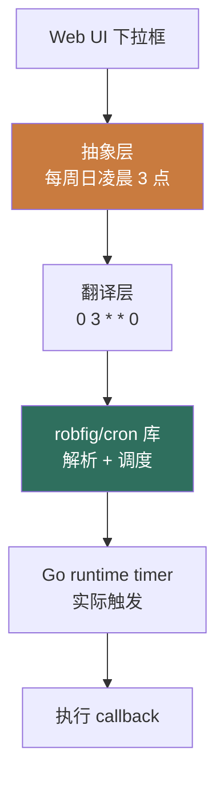

# 1Panel Cronjob 模块 — 人话版

> 30 分钟搞懂 1Panel 怎么"傻瓜式 cron"。
> 详细代码注解在同目录 `README.md`（51 行 stub + 4 文件清单 / ~2200 行 Go）。
> 这份文档是入口 —— 先看这个，再决定要不要啃那份。
>
> 🎨 **可视化版**：同目录 `visual-atlas.html`（浏览器里看，4 张 Mermaid 真实图 + 4 个 cron 抽象层级 + 3 个反模式卡片）
> 📋 **研究 commit**：`7915230`（dev-v2）
> ⚠️ **状态**：stub + 人话版，详细注解待做
> 🔔 **关联**：跟 mavis cron 调度器有相似模式（任务链 / lease / 静默）

---

## 0. 这份文档回答 5 个问题

1. **"傻瓜式 cron"是什么？怎么避免用户写 5 段 cron 表达式？**
2. **1Panel 的 cron 跟系统级 `/etc/crontab` 什么关系？**
3. **"下次执行时间"怎么算？前端怎么显示"还有 X 小时"？**
4. **任务类型怎么扩展？现在只支持 backup，能加 shell / HTTP / 容器重启吗？**
5. **对 Sirius Cloud L3 调度有什么借鉴价值？**

---

## 1. 一句话总结

**1Panel 在系统 cron 之上包一层 Web 界面：把"0 3 * * 0"翻译成"每周日凌晨 3 点"，用 [robfig/cron](https://github.com/robfig/cron) 库 + Go runtime timer 调度。~2200 行 Go。**

藏了 **2 个必抄的设计**（重点是用户友好 cron 抽象） + **3 个反模式**（重点是单进程内存调度），下面拆。

---

## 2. 1Panel 凭什么"傻瓜式 cron"

### 2.1 传统 cron 痛点

```bash
# 系统 crontab 格式
0 3 * * 0 /opt/backup.sh >> /var/log/backup.log 2>&1
# 5 段：分 时 日 月 周
# 用户要记 5 段语法 + shell 重定向 + 环境变量
```

1Panel 的解法：<strong>暴露下拉框</strong>，不暴露 5 段。

```
┌──────────────────────────────────────┐
│ 添加定时备份任务                        │
├──────────────────────────────────────┤
│ 备份对象:  [MySQL: my-company-db ▼] │
│ 频率:      [每周 ▼]                  │
│ 时间:      [星期日 ▼] [03:00 ▼]     │
│ 保留份数:  [7  ▼]                    │
│  [确定]                                │
└──────────────────────────────────────┘
```

### 2.2 内部还是 5 段 cron 表达式

```go
// cronjob_helper.go 472 行
// 把"每周日凌晨 3 点"翻译成 "0 3 * * 0"
func (h *CronHelper) BuildExpression(freq Frequency, dow time.Weekday, hour, minute int) string {
    switch freq {
    case FreqDaily:
        return fmt.Sprintf("%d %d * * *", minute, hour)
    case FreqWeekly:
        return fmt.Sprintf("%d %d * * %d", minute, hour, dow)
    case FreqMonthly:
        return fmt.Sprintf("%d %d %d * *", minute, hour, dayOfMonth)
    }
    return ""
}
```

然后用 [robfig/cron](https://github.com/robfig/cron) 库解析 + 调度。

---

## 3. 4 层抽象



**4 层职责**：
1. **UI 层**：下拉框
2. **抽象层**：把"每周日凌晨 3 点"翻译成结构化数据
3. **翻译层**：结构化数据 → cron 表达式
4. **执行层**：robfig/cron + Go timer + callback

---

## 4. 下次执行时间预计算

```go
// cronjob_helper.go
func (h *CronHelper) NextRun(expr string, from time.Time) (time.Time, error) {
    schedule, err := cron.ParseStandard(expr)
    if err != nil {
        return time.Time{}, err
    }
    return schedule.Next(from), nil
}
```

**前端展示**：
```typescript
// 前端轮询 /api/cronjob/list
for (const job of jobs) {
    const next = new Date(job.nextRun);
    const diff = next - new Date();
    job.humanReadable = `还有 ${formatDuration(diff)}`;
}
```

**用户感知**："还有 5 小时 32 分"。

---

## 5. 任务类型扩展

当前只支持 backup，但 `Type` 字段预留扩展：

```go
type CronJob struct {
    ID     uint
    Name   string
    Type   string  // "backup" / "shell" / "http" / "container_restart"
    Spec   string  // "0 3 * * 0"
    Config JSON    // 不同 Type 不同结构
}
```

扩展新类型只加 switch case：

```go
func (s *CronService) Execute(job CronJob) error {
    switch job.Type {
    case "backup":           return s.runBackup(job)
    case "shell":            return s.runShell(job)
    case "http":             return s.runHTTP(job)
    case "container_restart": return s.runContainerRestart(job)
    }
}
```

---

## 6. 2 个必抄的设计

### 6.1 ⭐⭐⭐⭐ **用户友好 cron 抽象**

**为什么必抄**：你 L3 调度不能让用户写 5 段 cron 表达式。Sirius Cloud 早期可以用简单下拉框，复杂场景才暴露表达式。

```python
# 你的 Python 抽象
class Frequency(Enum):
    HOURLY = "hourly"
    DAILY = "daily"
    WEEKLY = "weekly"
    MONTHLY = "monthly"
    CUSTOM = "custom"  # 高级用户

def build_cron_expr(freq, **kwargs) -> str:
    if freq == Frequency.HOURLY: return "0 * * * *"
    if freq == Frequency.DAILY: return f"{kwargs['minute']} {kwargs['hour']} * * *"
    if freq == Frequency.WEEKLY: return f"{kwargs['minute']} {kwargs['hour']} * * {kwargs['weekday']}"
    if freq == Frequency.CUSTOM: return kwargs['expression']
```

### 6.2 ⭐⭐⭐⭐ **下次执行时间预计算**

**为什么必抄**：前端展示"还有 X 小时"提升 UX 10 倍。

```python
from croniter import croniter
next_run = croniter("0 3 * * 0", datetime.now()).get_next(datetime)
```

---

## 7. 3 个反模式 / 避坑

### 7.1 ⚠️ **执行状态在内存里**

1Panel 的 cron 调度器在 agent 进程内，<strong>执行历史</strong>（最近 10 次执行结果）只在内存里。agent 重启就丢。

**任务定义**在 DB 里，重启后从 DB 重新加载任务定义 + 重置调度器，<strong>但执行历史丢了</strong>。

**避坑**：你的 Sirius Cloud 调度器把执行历史写 DB（<code>cronjob_history</code> 表），agent 重启也能查。

### 7.2 ⚠️ **单 agent 进程调度，多机部署会重复执行**

如果 Sirius Cloud 部署多 agent（你 L2 架构），每台 agent 都跑自己的 cron，<strong>同一任务会执行 N 次</strong>。

**避坑**：
- **方案 A**：cron 只在 leader 跑（leader 选举）
- **方案 B**：cron 任务定义带 `node_selector`，只让指定节点跑
- **方案 C**：用分布式锁（etcd / Redis）保证单实例

### 7.3 ❌ **`cronjob.go` 783 行偏大**

CRUD + 调度逻辑 + 状态机全在一个文件。

**避坑**：拆成 `cronjob_crud.go` + `cronjob_schedule.go` + `cronjob_history.go` 3 个文件。

---

## 8. 跟 Sirius Cloud 的对位

| Sirius Cloud 需求 | 1Panel Cronjob 对应 | 推荐度 |
|---|---|---|
| **L3 任务调度** | 整套 | ⭐⭐⭐⭐ |
| **L3 用户友好 cron** | 抽象 + 下拉框 | ⭐⭐⭐⭐ |
| **L3 分布式任务** | ❌ 改用 leader 选举 | ⭐⭐⭐ |
| **新功能：定时清理临时文件** | 扩展 Type="shell" | ⭐⭐⭐ |

### 8.1 必抄清单

1. **用户友好 cron 抽象**（4 层 + 下拉框）
2. **下次执行时间预计算**（前端展示"还有 X 小时"）

### 8.2 抄的时候要改

1. **加 leader 选举**（多机部署不重复执行）
2. **执行历史写 DB**（不丢历史）
3. **Type 字段扩展**（shell / http / 容器重启）

---

## 9. 接下来怎么读

### 9.1 30 分钟通道

1. 看完本文档
2. 看 `06-cronjob/README.md` §1（4 文件清单）
3. 直接看 `cronjob_helper.go` 的 `BuildExpression` 函数

### 9.2 2 小时通道

1. 上面 30 分钟
2. `cronjob_backup.go` 的"自动备份"型任务执行
3. `cronjob.go` 的调度器初始化

### 9.3 1 天写代码通道

1. 上面所有
2. Python 用 `croniter` 库 + APScheduler 写一个最小调度器
3. 加 leader 选举（etcd / Redis lock）
4. 执行历史写 SQLite

---

## 10. 写作说明

- **本文档定位**：30 分钟读完的"故事版"
- **`06-cronjob/README.md` 定位**：4 文件清单 + stub（详细注解待做）
- **`firewall-architecture.md` 定位**：v2 防火墙深度注解
- **`00-landscape.md` 定位**：13 个模块的全景图

---

**研究 commit**：`7915230`（dev-v2）· **更新**：2026-08-24 · **作者**：1Panel v2 研究员
