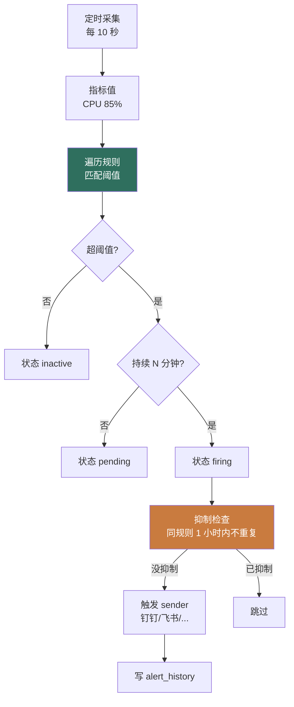

# 1Panel Alert 模块 — 人话版

> 30 分钟搞懂 1Panel 怎么"阈值告警 + 多渠道通知"。
> 详细代码注解在同目录 `README.md`（55 行 stub + 4 文件清单 / ~2400 行 Go）。
> 这份文档是入口 —— 先看这个，再决定要不要啃那份。
>
> 🎨 **可视化版**：同目录 `visual-atlas.html`（浏览器里看，4 张 Mermaid 真实图 + 5 步告警评估流程 + 4 渠道 sender 抽象 + 3 个反模式卡片）
> 📋 **研究 commit**：`7915230`（dev-v2）
> ⚠️ **状态**：stub + 人话版，详细注解待做
> ⭐ **借鉴价值 ★★★★**：跟 Sirius Cloud L3 Obs 需求对位

---

## 0. 这份文档回答 5 个问题

1. **"CPU > 80% 持续 5 分钟触发"在 1Panel 怎么实现？**
2. **怎么避免抖动误报？抑制 / 静默机制是什么？**
3. **多渠道通知（钉钉 / 飞书 / 企微 / 邮件 / Telegram）怎么统一抽象？**
4. **一个告警触发后，怎么避免短时间内重复发？**
5. **对 Sirius Cloud L3 Obs 有什么借鉴价值？**

---

## 1. 一句话总结

**1Panel 把"告警"做成两层：规则引擎（阈值 + 持续时长 + 抑制）+ 多渠道 sender（统一接口）。~2400 行 Go。**

藏了 **3 个必抄的设计**（重点是阈值持续时长 + 抑制静默 + 多渠道抽象） + **3 个反模式**（重点是同步 sender 容易丢告警），下面拆。

---

## 2. 告警评估 5 步流程



**3 种状态**：
- **inactive**：未触发
- **pending**：触发但没到持续时长
- **firing**：触发且已持续 N 分钟，<strong>真的发通知</strong>

**关键**：持续时长 + 抑制机制 = 避免抖动误报。

---

## 3. 持续时长 + 抑制静默

### 3.1 持续时长（避免抖动）

```go
// alert_helper.go 1019 行核心
func (h *AlertHelper) Evaluate(rule AlertRule, currentValue float64) {
    // 1. 检查是否超阈值
    triggered := h.checkThreshold(rule, currentValue)
    // 2. 维护状态机
    state := h.getState(rule.ID)
    if triggered {
        if state.Status == "inactive" {
            state.Status = "pending"
            state.FirstTriggeredAt = time.Now()
        } else if state.Status == "pending" {
            // 持续时长够了没？
            if time.Since(state.FirstTriggeredAt) >= rule.Duration {
                state.Status = "firing"
                h.triggerAlert(rule, currentValue)  // 真的发
            }
        } else if state.Status == "firing" {
            // 已经在 firing，看是否需要抑制
            h.checkSuppressAndSend(rule, currentValue)
        }
    } else {
        // 指标恢复到正常
        state.Status = "inactive"
    }
}
```

**示例规则**：
```json
{
  "name": "CPU 高",
  "metric": "cpu_usage",
  "operator": ">",
  "threshold": 80,
  "duration": "5m",          // 持续 5 分钟才触发
  "suppress_window": "1h"    // 触发后 1 小时内不重复发
}
```

### 3.2 抑制 / 静默

```go
// 抑制：同规则短时间内不重复发
func (h *AlertHelper) checkSuppress(rule AlertRule) bool {
    lastFired := h.getLastFiredTime(rule.ID)
    if lastFired.IsZero() { return false }
    return time.Since(lastFired) < rule.SuppressWindow
}

// 静默：用户在维护窗口设置的"全规则不发送"
func (h *AlertHelper) checkSilence(rule AlertRule) bool {
    for _, s := range h.silences {
        if s.Matches(rule) && time.Now().Within(s.Window) {
            return true
        }
    }
    return false
}
```

---

## 4. 多渠道 sender 抽象

### 4.1 统一 Sender 接口

```go
// alert_sender.go 379 行
type Sender interface {
    Name() string
    Send(ctx context.Context, alert Alert) error
}

// 多实现
type DingTalkSender struct{ Webhook string }
type FeishuSender struct{ Webhook string }
type WeChatWorkSender struct{ Webhook string }
type EmailSender struct{ SMTPHost string }
type TelegramSender struct{ BotToken string }
type WebhookSender struct{ URL string }
type SlackSender struct{ Webhook string }
```

### 4.2 工厂 + 路由

```go
// 工厂
var senders = map[string]Sender{
    "dingtalk":  &DingTalkSender{},
    "feishu":    &FeishuSender{},
    "wecom":     &WeChatWorkSender{},
    "email":     &EmailSender{},
    "telegram":  &TelegramSender{},
    "webhook":   &WebhookSender{},
    "slack":     &SlackSender{},
}

// 路由：1 个告警发到 N 个渠道
func (s *AlertSenderService) Send(alert Alert, channelIDs []string) {
    for _, cid := range channelIDs {
        sender := senders[channelTypes[cid]]
        if err := sender.Send(ctx, alert); err != nil {
            log.Errorf("send %s failed: %v", sender.Name(), err)
            // ⚠️ 反模式：同步调用，错了就丢了
        }
    }
}
```

### 4.3 类比：**像快递分单**

```
普通做法：每个快递员各自送各自的地址     ❌
快递分单：1 个包裹 → 自动选最优路径 → N 个快递员    ✅

1Panel 普通：每个渠道写 1 套通知代码    ❌
1Panel 分单：1 个告警 → Sender interface → N 渠道并行 ✅
```

---

## 5. 3 个必抄的设计

### 5.1 ⭐⭐⭐⭐⭐ **阈值 + 持续时长**（核心）

**为什么必抄**：没有持续时长，CPU 突然跳到 90% 又掉回 30% 就会误报。

```python
# 你的 Python 简化
class AlertState:
    status: str  # "inactive" / "pending" / "firing"
    first_triggered_at: datetime

def evaluate(state, rule, current_value):
    if exceeds_threshold(current_value, rule):
        if state.status == "inactive":
            state.status = "pending"
            state.first_triggered_at = datetime.now()
        elif state.status == "pending":
            if (datetime.now() - state.first_triggered_at) >= rule.duration:
                state.status = "firing"
                trigger_alert(rule, current_value)
    else:
        state.status = "inactive"
```

### 5.2 ⭐⭐⭐⭐⭐ **多渠道 Sender 抽象**

**必抄**：你 L3 Obs 通知渠道多（钉钉/飞书/企微/邮件/Telegram），<strong>1 套 interface + N 个实现</strong>。

```python
class AlertSender(ABC):
    name: str
    @abstractmethod
    def send(self, alert: Alert) -> bool: ...

class DingTalkSender(AlertSender): ...
class FeishuSender(AlertSender): ...
class EmailSender(AlertSender): ...
class TelegramSender(AlertSender): ...
class WebhookSender(AlertSender): ...  # 自定义 webhook

# 1 个告警发到 N 个渠道
def send_alert(alert, channel_ids):
    for cid in channel_ids:
        sender = sender_factory(cid)
        # 异步 + 重试（见 6.2 避坑）
        async_send_with_retry(sender, alert)
```

### 5.3 ⭐⭐⭐⭐ **抑制窗口 + 静默期**

**必抄**：避免告警风暴（同一问题发 100 次）。

```python
def check_suppress(rule_id, suppress_window):
    last_fired = last_fired_time(rule_id)
    if last_fired and (datetime.now() - last_fired) < suppress_window:
        return True  # 抑制
    return False

def check_silence(rule, silences):
    for s in silences:
        if s.matches(rule) and datetime.now() in s.window:
            return True  # 静默
    return False
```

---

## 6. 3 个反模式 / 避坑

### 6.1 ⚠️ **评估逻辑在单 agent 进程内**

`alert_helper.go` 1019 行所有评估都在 agent 进程跑。Sirius Cloud 部署多 agent，<strong>每台各自评估</strong>，可能重复触发。

**避坑**：用中央评估服务（专门 leader 节点评估）+ 分布式锁。

### 6.2 ⚠️ **同步 HTTP 发送（无重试）**

`Send()` 直接 HTTP POST，网络抖动就丢。

**避坑**：用异步队列（Redis / RabbitMQ / Celery）+ 重试 + 死信队列。

```python
# 你的 Python 改进版
def send_alert(alert, channel_ids):
    for cid in channel_ids:
        # 1. 入队
        queue.put({
            "sender_type": cid,
            "alert": alert,
            "retry_count": 0,
            "max_retries": 3
        })

# 后台 worker
def queue_worker():
    while True:
        msg = queue.get()
        try:
            sender = sender_factory(msg["sender_type"])
            sender.send(msg["alert"])
        except Exception:
            msg["retry_count"] += 1
            if msg["retry_count"] < msg["max_retries"]:
                queue.put(msg)  # 重试
            else:
                dead_letter.put(msg)  # 死信
```

### 6.3 ❌ **`alert_helper.go` 1019 行 = 评估逻辑全在这**

规则匹配 + 状态机 + 抑制 + 静默 + 触发，全堆一个文件。

**避坑**：拆成 `alert_evaluator.go`（评估）+ `alert_state.go`（状态机）+ `alert_suppress.go`（抑制）+ `alert_silence.go`（静默）4 个文件。

---

## 7. 跟 Sirius Cloud 的对位

| Sirius Cloud 需求 | 1Panel Alert 对应 | 推荐度 |
|---|---|---|
| **L3 资源告警**（CPU / 内存 / 磁盘） | alert_helper.go 评估逻辑 | ⭐⭐⭐⭐⭐ |
| **L3 多渠道通知** | alert_sender.go + Sender interface | ⭐⭐⭐⭐⭐ |
| **L3 告警抑制** | suppress / silence 机制 | ⭐⭐⭐⭐ |
| **L3 分布式评估** | ❌ 改用中央评估服务 | ⭐⭐⭐ |

### 7.1 必抄清单

1. **阈值 + 持续时长**（避免抖动误报）
2. **多渠道 Sender 抽象**（1 套 interface + N 实现）
3. **抑制窗口 + 静默期**（避免告警风暴）

### 7.2 抄的时候要改

1. **改用异步队列**（不要同步 HTTP）
2. **加分布式评估**（多 agent 不重复）
3. **加告警收敛**（同一根因合并成 1 条）

---

## 8. 接下来怎么读

### 8.1 30 分钟通道

1. 看完本文档
2. 看 `07-alert/README.md` §1（4 文件清单）
3. 直接看 `alert_helper.go` 的 `Evaluate` 函数

### 8.2 2 小时通道

1. 上面 30 分钟
2. `alert_sender.go` 的 4 个 sender 实现
3. `alert.go` 的 CRUD

### 8.3 1 天写代码通道

1. 上面所有
2. Python 写 `AlertState` 状态机 + `Evaluate` 函数
3. 写 `AlertSender` interface + 5 个实现（钉钉/飞书/企微/邮件/Telegram）
4. 接 Celery 异步队列 + 重试 + 死信
5. 跑通"CPU > 80% 持续 5 分钟 → 抑制检查 → 异步发到 4 个渠道"

---

## 9. 写作说明

- **本文档定位**：30 分钟读完的"故事版"
- **`07-alert/README.md` 定位**：4 文件清单 + stub（详细注解待做）
- **`firewall-architecture.md` 定位**：v2 防火墙深度注解
- **`00-landscape.md` 定位**：13 个模块的全景图

---

**研究 commit**：`7915230`（dev-v2）· **更新**：2026-08-24 · **作者**：1Panel v2 研究员
