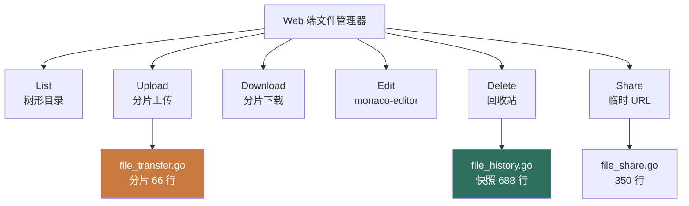
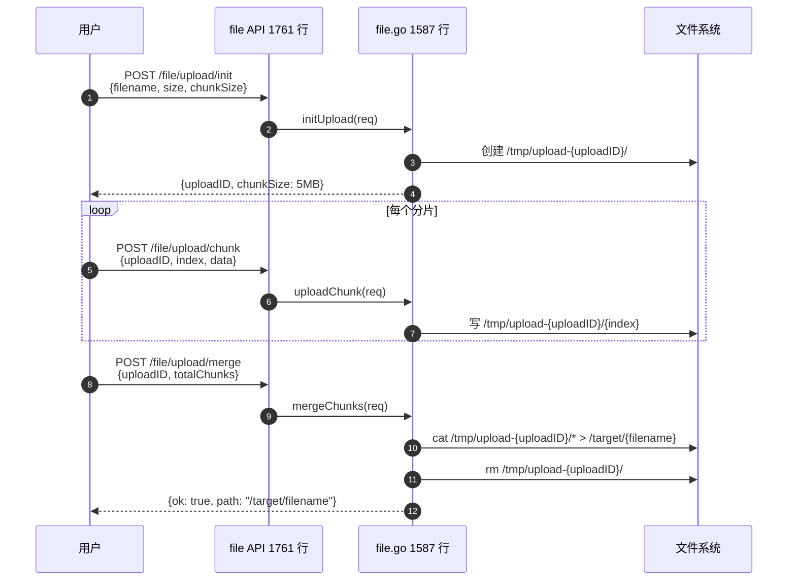

# 1Panel File 模块 — 人话版

> 30 分钟搞懂 1Panel 怎么"在浏览器里管文件"。
> 详细代码注解在同目录 `README.md`（55 行 stub + 7 文件清单 / ~4600 行 Go）。
> 这份文档是入口 —— 先看这个，再决定要不要啃那份。
>
> 🎨 **可视化版**：同目录 `visual-atlas.html`（浏览器里看，4 张 Mermaid 真实图 + 5 步分片上传流程 + 3 个反模式卡片）
> 📋 **研究 commit**：`7915230`（dev-v2）
> ⚠️ **状态**：stub + 人话版，详细注解待做
> 🔔 **对位**：跟 Sirius Cloud L1/L2 资产管理需求对位

---

## 0. 这份文档回答 5 个问题

1. **浏览器里"右键删除"在 1Panel 内部怎么落地？**
2. **"撤销刚才的修改"怎么实现？文件历史快照是什么？**
3. **大文件（10GB）怎么上传/下载？分片怎么搞？**
4. **分享链接（带过期时间）怎么生成？**
5. **对 Sirius Cloud L1/L2 资产管理有什么借鉴价值？**

---

## 1. 一句话总结

**1Panel 把"文件管理"做成 Web 端 Finder：list / upload / download / edit / delete + 撤销 + 分享。~4600 行 Go。前端用 monaco-editor 编辑代码 + vue-office 预览 docx/excel。**

藏了 **3 个必抄的设计**（重点是分片 + 历史快照 + 分享链接） + **3 个反模式**（重点是权限检查散落），下面拆。

---

## 2. 5 大核心能力



---

## 3. 分片上传 / 下载机制

### 3.1 为什么需要分片？

```
100MB 文件 = 一次 HTTP POST = 网络断了就重来       ❌
100MB 文件 = 5MB × 20 分片 = 每片独立 HTTP POST  ✅
                ↑ 断了哪片重传哪片，不全重来
```

### 3.2 分片上传 5 步



**3 阶段**：init（创建 uploadID）→ chunk（并发上传）→ merge（合并 + 清理）。

### 3.3 大文件下载（HTTP Range）

```go
// 浏览器请求 Range: bytes=0-5242879
func (s *FileService) Download(req DownloadReq) (io.ReadCloser, error) {
    f, _ := os.Open(req.Path)
    if req.Range != "" {
        // 解析 Range 头，只读指定字节范围
        start, end := parseRange(req.Range, f.Stat().Size())
        f.Seek(start, 0)
        return &LimitedReader{Reader: f, N: end - start + 1}, nil
    }
    return f, nil
}
```

**好处**：用户拖到一半不想下了，<strong>只下载了一半</strong>，不浪费带宽。

---

## 4. 文件历史快照（撤销功能）

### 4.1 全量快照（不是 diff）

```go
// file_history.go 688 行
func (s *FileHistoryService) SaveSnapshot(file string) error {
    // 1. 读当前文件内容
    content, _ := os.ReadFile(file)
    // 2. 计算 hash
    hash := sha256(content)
    // 3. 查 DB 看这个 hash 有没有
    if s.existsByHash(hash) {
        return nil  // 增量复用，不存
    }
    // 4. 存快照
    snapshot := &FileSnapshot{
        FileID:   s.getFileID(file),
        Hash:     hash,
        Content:  content,  // ⚠️ 全量存
        SavedAt:  time.Now(),
    }
    s.db.Save(snapshot)
    return nil
}
```

**关键**：
- **全量存**（不是 diff）
- 同一内容只存一份（按 hash 去重）
- 用户点"撤销" → 找上一个不同 hash 的快照恢复

### 4.2 触发时机

每次"保存文件"前自动存快照。Web UI 看到"文件历史"列表。

### 4.3 避坑：全量存盘的代价

100MB 文件改 10 次 = 10 × 100MB = 1GB 快照（即使去重后改的是 1 行）。

**Sirius Cloud 改进**：用 git 风格 diff 存（增量），或 zfs snapshot（块级）。

---

## 5. 分享链接机制

```go
// file_share.go 350 行
type FileShare struct {
    Token     string  // URL 中的随机 token
    FilePath  string
    ExpiresAt time.Time
    Password  string  // 可选密码
    MaxDownloads int  // 可选下载次数限制
}

func (s *FileShareService) CreateShare(file string, ttl time.Duration) (string, error) {
    token := randString(32)
    s.db.Save(&FileShare{
        Token:     token,
        FilePath:  file,
        ExpiresAt: time.Now().Add(ttl),
    })
    return fmt.Sprintf("https://panel.example.com/share/%s", token), nil
}

func (s *FileShareService) GetFile(token string) (string, error) {
    share := s.db.FindByToken(token)
    if time.Now().After(share.ExpiresAt) { return "", errExpired }
    return share.FilePath, nil
}
```

**用户场景**：
- 选文件 → 选"生成分享链接" → 选 7 天过期 → 复制 URL 发给同事
- 同事点 URL → 浏览器下载（<strong>不需要登录</strong>）

---

## 6. 3 个必抄的设计

### 6.1 ⭐⭐⭐⭐ **分片上传 / 下载**

**为什么必抄**：你 L1/L2 资产管理让用户上传大文件是必然。Sirius Cloud 必用。

```python
# 你的 Python 简化（FastAPI）
@app.post("/upload/init")
def init_upload(filename: str, size: int, chunk_size: int = 5_000_000):
    upload_id = str(uuid4())
    os.makedirs(f"/tmp/upload-{upload_id}", exist_ok=True)
    return {"upload_id": upload_id, "chunk_size": chunk_size}

@app.post("/upload/chunk")
async def upload_chunk(upload_id: str, index: int, data: UploadFile):
    path = f"/tmp/upload-{upload_id}/{index}"
    with open(path, "wb") as f:
        await data.read_into(f)
    return {"ok": True}

@app.post("/upload/merge")
def merge_upload(upload_id: str, total_chunks: int, target_path: str):
    # cat /tmp/upload-{upload_id}/* > target_path
    chunks = sorted(os.listdir(f"/tmp/upload-{upload_id}"), key=int)
    with open(target_path, "wb") as out:
        for chunk in chunks:
            with open(f"/tmp/upload-{upload_id}/{chunk}", "rb") as f:
                shutil.copyfileobj(f, out)
    shutil.rmtree(f"/tmp/upload-{upload_id}")
    return {"ok": True, "path": target_path}
```

### 6.2 ⭐⭐⭐⭐ **文件历史快照（防误删）**

**必抄**：用户删错文件是必然事件。

```python
# 简化版
def save_snapshot(file_id: str, content: bytes):
    h = hashlib.sha256(content).hexdigest()
    # 去重：同 hash 不重复存
    if not db.exists(FileSnapshot, hash=h):
        db.save(FileSnapshot(file_id=file_id, hash=h, content=content))
    return h

def rollback(file_id: str, target_hash: str):
    snap = db.find(FileSnapshot, file_id=file_id, hash=target_hash)
    open(get_path(file_id), "wb").write(snap.content)
```

### 6.3 ⭐⭐⭐⭐ **分享链接**

**必抄**：让用户安全分享文件给外部人。

```python
def create_share(file_id: str, ttl: int, password: str = None):
    token = secrets.token_urlsafe(32)
    db.save(Share(token=token, file_id=file_id, expires_at=now()+ttl, password=hash_password(password)))
    return f"https://your-domain/share/{token}"
```

---

## 7. 3 个反模式 / 避坑

### 7.1 ❌ **`file.go` 1587 + `file_history.go` 688 = 2275 行单点**

文件 CRUD + 编辑 + 移动 + 重命名 + 搜索 + 历史全堆一起。

**避坑**：拆成 `file_list.go` + `file_upload.go` + `file_edit.go` + `file_history.go` 4 个文件。

### 7.2 ⚠️ **全量快照（不是 diff）**

100MB 文件改 10 次 = 1GB（即使去重后改的是 1 行）。

**避坑**：用 git 风格 diff（每次存 vs 上次的 diff），或者用 ZFS/Btrfs 文件系统 snapshot。

### 7.3 ⚠️ **权限检查散落**

每函数自己写 `if user.HasPermission(file, "write") { ... }`，<strong>不是统一 RBAC 中间件</strong>。

**避坑**：FastAPI Depends / Casbin / OPA 做统一权限中间件：

```python
@app.get("/file/{path}")
@requires_permission("file", "read")  # 统一检查
def read_file(path: str): ...
```

---

## 8. 跟 Sirius Cloud 的对位

| Sirius Cloud 需求 | 1Panel File 对应 | 推荐度 |
|---|---|---|
| **L1 资产管理 - 文件浏览** | file.go List | ⭐⭐⭐⭐ |
| **L1 文件分片上传 / 下载** | file_transfer.go + Range | ⭐⭐⭐⭐⭐ |
| **L1 文件历史快照** | file_history.go | ⭐⭐⭐⭐ |
| **L1 分享链接** | file_share.go | ⭐⭐⭐ |
| **L1 统一权限检查** | ❌ 改用 RBAC 中间件 | ⭐⭐⭐⭐ |

### 8.1 必抄清单

1. **分片上传 / 下载**（5MB × N 片）
2. **文件历史快照**（防误删）
3. **分享链接**（带过期 + 可选密码）

### 8.2 抄的时候要改

1. **加 RBAC 中间件**（不要权限散落）
2. **改用 diff 快照**（不用全量）
3. **加病毒扫描**（上传时调 ClamAV）

---

## 9. 接下来怎么读

### 9.1 30 分钟通道

1. 看完本文档
2. 看 `08-file/README.md` §1（7 文件清单）
3. 直接看 `file_transfer.go` 的分片上传 init 函数

### 9.2 2 小时通道

1. 上面 30 分钟
2. `file.go` 的 List + Upload + Edit
3. `file_history.go` 的快照保存 + 回滚
4. `file_share.go` 的 token 生成 + 验证

### 9.3 1 天写代码通道

1. 上面所有
2. Python FastAPI 写分片上传 init / chunk / merge 3 个 endpoint
3. 加文件历史快照（用 hash 去重）
4. 加 RBAC 权限检查（FastAPI Depends）
5. 跑通"上传 100MB 文件 → 存盘 → 列出历史 → 删文件 → 恢复"

---

## 10. 写作说明

- **本文档定位**：30 分钟读完的"故事版"
- **`08-file/README.md` 定位**：7 文件清单 + stub（详细注解待做）
- **`firewall-architecture.md` 定位**：v2 防火墙深度注解
- **`00-landscape.md` 定位**：13 个模块的全景图

---

**研究 commit**：`7915230`（dev-v2）· **更新**：2026-08-24 · **作者**：1Panel v2 研究员
