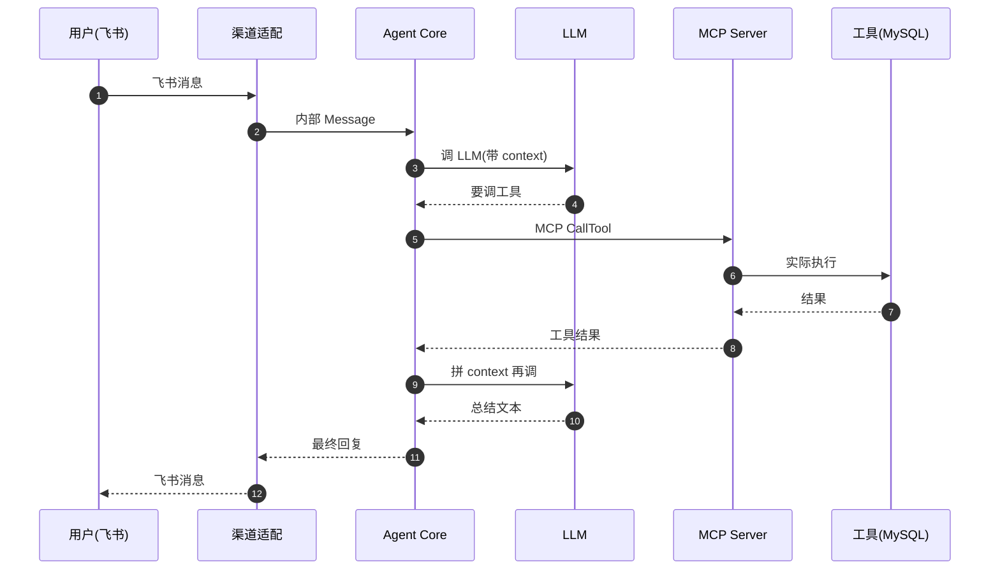

# 1Panel AI Agent 模块 — 人话版

> 30 分钟搞懂 1Panel v2 怎么在自己服务器上跑 AI Agent。
> 详细代码注解在同目录 `README.md`（75 行 stub + 17 文件清单 / ~10000 行 Go）。
> 这份文档是入口 —— 先看这个，再决定要不要啃那份。
>
> 🎨 **可视化版**：同目录 `visual-atlas.html`（浏览器里看，4 张 Mermaid 真实图 + 8 个 Agent 组件图 + 6 步 MCP 协议时序）
> 📋 **研究 commit**：`7915230`（dev-v2）
> ⚠️ **状态**：stub + 人话版，详细注解待做（MCP server 是核心，建议先看那 1006 行）

---

## 0. 这份文档回答 5 个问题

1. **1Panel v2 的"AI Agent"到底是什么？跟 ChatGPT 有什么区别？**
2. **怎么让 LLM 调 1Panel 自己的工具（防火墙 / 数据库 / 文件）？**
3. **MCP 协议是什么？1Panel 怎么当 MCP server？**
4. **用户能"装"什么 AI Agent？openai / claude / 本地 ollama？**
5. **对 Sirius Cloud 有什么借鉴价值？怎么抄？**

---

## 1. 一句话总结

**1Panel v2 把"AI Agent"做成一个"LLM + Skills 工具箱 + 多渠道输入"的组合，在你服务器上跑。**

具体：~10000 行 Go（18 service 文件 + 2 API 文件）+ 集成 [Hermes Agent 框架](https://github.com/) + 实现 [MCP 协议 server](https://modelcontextprotocol.io) + 4 套渠道适配（IM / API / Web UI / CLI）。**v2 50% 的代码量在这。**

藏了 **8 个值得抄的设计**（重点是 MCP server） + **3 个反模式**（重点是强依赖 Hermes），下面一一拆。

---

## 2. 1Panel 凭什么"能跑 AI Agent"

### 2.1 先想象 3 种用户

| 用户 | 场景 | 1Panel 怎么服务 |
|---|---|---|
| **A. 我有 OpenAI key** | 想在 1Panel 上搭个 ChatOps："@bot 查 MySQL 慢查询" | 1Panel 调 OpenAI API + 暴露 DB 工具给 LLM |
| **B. 我有自建 ollama** | 想完全本地跑，不泄漏数据 | 1Panel 接 ollama 端点 + 暴露工具 |
| **C. 我有 Hermes** | 我已经在用 Hermes，想集成到 1Panel | 1Panel 内嵌 Hermes runtime + 双向同步 |

**3 种用户 × 4 套渠道（IM / API / Web / CLI）× N 套工具（MySQL/防火墙/...）= 12N 组合。** 你要写 12N 套代码吗？

### 2.2 1Panel 的解法：**3 层抽象**

```mermaid
flowchart TB
    subgraph 渠道层 "渠道层（4 套适配）"
        IM[IM 飞书/钉钉]
        API[HTTP API]
        Web[Web UI]
        CLI[CLI]
    end
    subgraph 编排层 "编排层（Agent runtime）"
        Core[Agent Core<br/>1635 行]
        Ctx[Context 管理<br/>1518 行]
    end
    subgraph 工具层 "工具层（Skills + MCP）"
        Skills[Skills 插件<br/>863 行]
        MCP[MCP Server<br/>1006 行]
    end
    LLM[LLM<br/>OpenAI/Claude/ollama]
    渠道层 --> 编排层
    编排层 --> 工具层
    编排层 <--> LLM
    工具层 --> 真实[真实工具<br/>MySQL/防火墙/...]
```

**渠道层**：所有"外部输入"统一转成"内部消息"格式。**编排层**：agent 内部状态机（接收消息 → 拼 context → 调 LLM → 调工具 → 返回）。**工具层**：所有"内部工具"统一通过 MCP 协议暴露给 LLM。

调用方（不管是 IM 还是 API）只跟编排层打交道，**不知道也不关心** LLM 是 OpenAI 还是 ollama。

### 2.3 类比：**像乐高**

```
普通积木：每个牌子的积木不能混搭        ❌
乐高：     有统一接口（凸点 + 凹槽）     ✅

1Panel 普通：每个渠道写一套 LLM 调用     ❌
1Panel 乐高：用 Agent Core + 渠道适配器    ✅
```

### 2.4 4 个关键概念

```go
// agent/app/model/agent.go（推测结构）
type Agent struct {
    ID         string
    Name       string
    Provider   string   // openai | claude | ollama | hermes
    Model      string   // gpt-4 / claude-3-opus / llama3
    APIKey     string   // 加密存储
    BaseURL    string   // ollama 自定义端点
    Skills     []Skill  // 这个 Agent 能调的工具
    Channels   []Channel // 这个 Agent 接入的渠道
}

type Skill struct {
    Name        string   // "query_mysql_slow_log"
    Description string   // 给 LLM 看的工具描述
    Parameters  JSON    // 工具参数 schema
    Handler     func()  // 实际执行函数
}

type Channel struct {
    Type   string   // "feishu" / "dingtalk" / "api" / "web"
    Config JSON     // 各渠道的配置（webhook URL 等）
}

type Message struct {
    Role    string  // "user" / "assistant" / "tool"
    Content string
    ToolCall *ToolCall
}
```

**Agent / Skill / Channel / Message** 四个核心模型，把"AI Agent 平台"的所有复杂度都收进去。

---

## 3. 一个真实场景走查：用户用飞书问 1Panel Bot

想象你在飞书里给 1Panel Bot 发消息：

```
[你] @1Panel 查一下 10.10.10.100 的 MySQL 慢查询，最近 1 小时
```

### 3.1 Bot 收到消息后 12 步

**1. 渠道适配**（`agents_channels.go`）

```go
// 把飞书消息转成内部 Message 格式
msg := Message{
    Role:    "user",
    Content: "查一下 10.10.10.100 的 MySQL 慢查询",
    Source:  "feishu",
    UserID:  "u_123",
}
```

**2. Agent 路由**（`agents.go`）

```go
// 找到要用的 Agent（用户在 1Panel Web UI 里配置过"飞书→哪个 Agent"）
agent := routeToAgent(msg.Source, msg.UserID)
```

**3. 拼 context**（`agents_utils.go`）

```go
ctx := buildContext(agent, msg)
// 包含：系统提示 + 历史消息 + 工具列表 + 当前消息
```

**4. 调 LLM**（`ai.go`）

```go
resp := callLLM(agent.Provider, agent.Model, ctx)
// LLM 决定要调 "query_mysql_slow_log" 工具
```

**5. MCP 工具调用**（`mcp_server.go`）

```go
result := mcp.CallTool("query_mysql_slow_log", {
    "host":   "10.10.10.100",
    "window": "1h",
})
```

**6. 工具执行**（实际 handler）

```go
// 1Panel 内部去 10.10.10.100 跑 mysql slow log 查询
slowLogs := mysql.QuerySlowLog("10.10.10.100", "1h")
```

**7-9. 把结果回给 LLM → LLM 总结 → 拼成飞书消息回复**

**10. 渠道发送**（`agents_channels.go`）

```go
feishu.Reply(msg.UserID, formattedAnswer)
```

**11. 持久化历史**（`agents_utils.go`）

```go
saveMessage(agent.ID, msg, resp)
```

**12. 触发 webhook / 通知 / 日志**

整个 12 步走完，用户看到飞书里 Bot 回了 3 行慢查询摘要 + 1 个 deep link 到 1Panel Web UI。

### 3.2 全程时序



---

## 4. 8 个值得抄的设计

### 4.1 ⭐⭐⭐⭐⭐ **MCP Server 端实现**（`mcp_server.go` 1006 行）

**MCP 协议**（Model Context Protocol）是 Anthropic 2024 年 11 月开源的"LLM 调工具协议"。1Panel 自己实现了一个 server 端。

```go
// mcp_server.go（推测结构）
type MCPServer struct {
    tools   map[string]Tool
    session *Session
}

func (s *MCPServer) RegisterTool(name string, tool Tool) {
    s.tools[name] = tool
}

func (s *MCPServer) HandleRequest(req MCPRequest) MCPResponse {
    switch req.Method {
    case "tools/list":
        return s.listTools()
    case "tools/call":
        return s.callTool(req.Params)
    }
}
```

**为什么必抄**：未来所有 LLM 应用都会用 MCP 暴露工具。1Panel 这 1006 行是真实生产代码。

**怎么抄**：
```python
# 你的 Python 实现（伪代码）
class MCPServer:
    def __init__(self):
        self.tools = {}
    def register(self, name, description, parameters, handler):
        self.tools[name] = Tool(name, description, parameters, handler)
    def handle(self, request):
        if request.method == "tools/list":
            return {"tools": list(self.tools.values())}
        if request.method == "tools/call":
            return self.tools[request.params["name"]].handler(**request.params["arguments"])
```

### 4.2 ⭐⭐⭐⭐⭐ **Skill 插件系统**（`agents_skills.go` 863 行）

每个 Skill 是 `{name, description, parameters_schema, handler}` 4 元组。注册后 LLM 就能调。

**动态注册 vs 静态注册**：
- 1Panel 用动态注册：用户在 Web UI 上加 Skill → 写到 SQLite → Agent 启动时读
- 优势：不用改代码就能加新工具

### 4.3 ⭐⭐⭐⭐⭐ **Context 压缩**（`agents_utils.go` 1518 行）

跟 LLM 对话最怕"token 超限"。1Panel 的做法：

```go
// 伪代码
func compressContext(msgs []Message, maxTokens int) []Message {
    // 1. 保留 system prompt
    // 2. 保留最近 N 轮对话
    // 3. 中间历史"摘要化"（用 LLM 把 10 轮对话压成 1 段）
    // 4. 工具调用结果如果太大，截断到前 2000 字
}
```

**怎么抄**：每个 LLM 应用都要做。

### 4.4 ⭐⭐⭐⭐⭐ **多渠道适配**（`agents_channels.go` 1580 行）

4 套渠道（IM / API / Web / CLI）转同一内部 `Message` 格式。

```go
type ChannelAdapter interface {
    ParseIncoming(raw []byte) (Message, error)
    FormatOutgoing(msg Message) ([]byte, error)
    Send(msg Message) error
}
```

**怎么抄**：用 interface + 工厂，1 套内部格式 + N 套渠道实现。

### 4.5 ⭐⭐⭐⭐ **LLM Provider 抽象**

```go
type LLMProvider interface {
    Chat(ctx Context) (Response, error)
    StreamChat(ctx Context) (<-chan Chunk, error)
}

// 多个实现：OpenAI / Claude / ollama / Hermes
```

**好处**：换 LLM 不改业务代码。

### 4.6 ⭐⭐⭐⭐ **多 Agent 协作**（`agents_agents.go` 493 行）

Agent A 可以"召唤" Agent B 当工具。

```go
// Agent A 的 Skill 里注册了"consult_expert_agent"
{
    "name": "consult_expert",
    "description": "向专家 Agent 提问",
    "parameters": {"question": "string"},
    "handler": func(params) {
        return callAgent("expert-agent", params.question)
    }
}
```

### 4.7 ⭐⭐⭐⭐ **Hermes 集成**（`agents_hermes*.go` 1700 行）

Hermes 是 1Panel 集成的 AI Agent 框架。这 1700 行是"用 Hermes runtime 跑 1Panel Agent"。

**风险**：强依赖外部项目，独立部署要替换。

### 4.8 ⭐⭐⭐ **MCP 工具描述自动生成**

每个 Skill 的 `description` 是 LLM 看到的"工具说明"。1Panel 提供模板让用户填。

---

## 5. 3 个反模式 / 避坑

### 5.1 ⚠️ **强依赖 Hermes**

`agents_hermes*.go` 6 个文件 / 1700 行，深度绑定 Hermes 的 API、CLI、配置格式。

**避坑**：你的 AI Agent 平台<strong>不要绑死单一 framework</strong>，用 `LLMProvider` interface 隔离。

### 5.2 ⚠️ **没有完整本地 LLM fallback**

整套设计假设 LLM 走云端 API（OpenAI / Claude），本地 ollama 支持是后续加的（`agents_copaw.go` 才 120 行，体验不行）。

**避坑**：如果你要"完全本地"，先想清楚 vLLM / ollama / llama.cpp 的兼容层。

### 5.3 ❌ **10000 行 + 18 文件，单点太多**

模块太大，认知负担重。**不要照抄架构**，先看 MCP server + Skill 注册就够了。

**避坑**：拆成 3-4 个子模块（runtime / skills / channels / context），每个 1000-2000 行。

---

## 6. 跟 Sirius Cloud 的对位

| Sirius Cloud 需求 | 1Panel AI Agent 对应 | 推荐度 |
|---|---|---|
| **L1 AI Ops**（AI 诊断 + 操作） | agents + mcp_server | ⭐⭐⭐⭐⭐ |
| **L2 智能客服**（用户问 DB 问题） | agents_channels + context | ⭐⭐⭐⭐ |
| **L3 运维助手**（"为什么 MySQL 慢了"） | mcp_server 把监控/日志/DB 暴露给 LLM | ⭐⭐⭐⭐⭐ |
| **新功能：自然语言部署** | mcp_server + skills | ⭐⭐⭐⭐ |

### 6.1 必抄清单

1. **MCP Server 端实现** —— 1006 行，看完直接 Python 重写
2. **Skill 插件系统** —— 4 元组设计，30 行能抄完
3. **Context 压缩** —— token 成本优化必备

### 6.2 抄的时候要改

1. **去掉 Hermes 依赖** —— 你的 Python 后端用 LangChain / LlamaIndex 替代
2. **简化渠道** —— Sirius Cloud 前期只做 Web UI + API，不做 IM
3. **工具要严格权限控制** —— 1Panel 的"暴露所有工具"在 DBaaS 场景有风险

---

## 7. 接下来怎么读

### 7.1 30 分钟通道

1. 看完本文档
2. 看 `09-ai-agent/README.md` §5（借鉴价值 6 行 + 避坑 3 条）
3. 直接看 `mcp_server.go` 的 `RegisterTool` + `HandleRequest` 两个函数

### 7.2 2 小时通道

1. 上面 30 分钟
2. `agents_skills.go` Skill 数据结构
3. `agents_utils.go` 的 `buildContext` + `compressContext`
4. `agents_channels.go` 的 `ChannelAdapter` interface
5. 跑通 MCP 协议的一个最小 demo（Anthropic 官方 SDK）

### 7.3 1 天写代码通道

1. 上面所有
2. Python 写一个最小 MCP server（参考 [mcp-python-sdk](https://github.com/modelcontextprotocol/python-sdk)）
3. 把 Sirius Cloud 的 5 个 L1 工具（创建 DB / 备份 / 监控 / 防火墙 / 部署）注册成 MCP tools
4. 跑通"用 Claude API 调 Sirius Cloud 工具"

---

## 8. 写作说明

- **本文档定位**：30 分钟读完的"故事版"
- **`09-ai-agent/README.md` 定位**：17 文件清单 + stub（详细注解待做）
- **`firewall-architecture.md` 定位**：v2 防火墙深度注解（另一个模块的样板）
- **`00-landscape.md` 定位**：13 个模块的全景图

---

**研究 commit**：`7915230`（dev-v2）· **更新**：2026-08-24 · **作者**：1Panel v2 研究员
