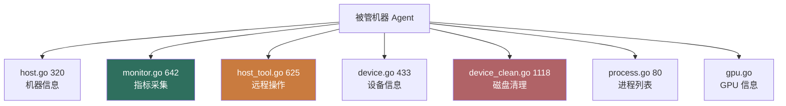
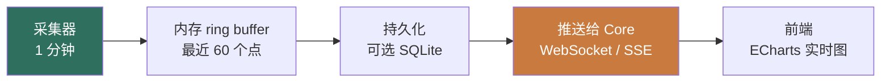

# 1Panel Host & Monitor 模块 — 人话版

> 30 分钟搞懂 1Panel 怎么"自动装 Agent 后就有机器面板"。
> 详细代码注解在同目录 `README.md`（62 行 stub + 16 文件清单 / ~5000 行 Go）。
> 这份文档是入口 —— 先看这个，再决定要不要啃那份。
>
> 🎨 **可视化版**：同目录 `visual-atlas.html`（浏览器里看，4 张 Mermaid 真实图 + 4 层指标采集架构 + 3 个反模式卡片）
> 📋 **研究 commit**：`7915230`（dev-v2）
> ⚠️ **状态**：stub + 人话版，详细注解待做
> ⭐ **借鉴价值 ★★★★**：跟 Sirius Cloud L1 readyz + L3 Obs 需求对位

---

## 0. 这份文档回答 5 个问题

1. **Agent 装上后，Core 怎么知道 CPU/内存/磁盘实时数据？**
2. **指标采集的频率多少？怎么持久化？怎么推给前端？**
3. **远程"重启 / 关机 / 跑命令"在 1Panel 怎么落地？**
4. **大文件扫描（device_clean）怎么实现？**
5. **对 Sirius Cloud L1 readyz + L3 Obs 有什么借鉴价值？**

---

## 1. 一句话总结

**1Panel 把"被管机器状态"做成 3 块：自身信息（host）+ 指标采集（monitor）+ 远程操作（host_tool）。~5000 行 Go。**

藏了 **2 个必抄的设计**（重点是指标采集 + 信息聚合） + **3 个反模式**（重点是远程命令安全），下面拆。

---

## 2. 模块结构



**3 大主力**：
- **host.go**（机器信息）：hostname / OS / 内核 / 启动时间
- **monitor.go**（指标采集）：CPU / 内存 / 磁盘 / 网络
- **host_tool.go**（远程操作）：重启 / 关机 / 改 hostname / 跑命令

---

## 3. 指标采集机制（核心）

### 3.1 4 层采集架构



### 3.2 4 类指标

| 指标 | 采集方式 | 工具 |
|---|---|---|
| **CPU** | `/proc/stat` 读 usage | Go runtime 或 [gopsutil](https://github.com/shirou/gopsutil) |
| **内存** | `/proc/meminfo` | 同上 |
| **磁盘** | `df` 命令 / `syscall.Statfs` | 同上 |
| **网络** | `/proc/net/dev` 算速率 | 同上 |

1Panel 大概率用 [gopsutil](https://github.com/shirou/gopsutil) 库（Go 最常用的系统信息采集库），不用直接读 /proc。

### 3.3 采集伪代码

```go
// monitor.go 642 行核心
func (m *MonitorService) Collect() (*Metrics, error) {
    return &Metrics{
        CPU:        psutil.CPUPercent(time.Second, false),  // 1 秒采样
        Memory:     psutil.VirtualMemory(),
        Disk:       psutil.DiskUsage("/"),
        Network:    psutil.NetIOStats(),
        Timestamp:  time.Now(),
    }, nil
}

// 后台 goroutine 每 1 分钟跑一次
func (m *MonitorService) StartCollecting() {
    ticker := time.NewTicker(1 * time.Minute)
    for range ticker.C {
        metrics, _ := m.Collect()
        m.buffer.Push(metrics)  // 推到 ring buffer
        if m.persistEnabled {
            m.db.Save(metrics)  // 写 SQLite
        }
    }
}
```

**关键参数**：
- 采集频率：1 分钟
- 内存保留：60 个点（最近 1 小时）
- 持久化：可选（用户开）
- 推送：WebSocket / SSE 推前端

---

## 4. 远程操作机制

### 4.1 4 种操作

| 操作 | 伪代码 | 风险 |
|---|---|---|
| **重启** | `systemctl reboot` | 中 |
| **关机** | `systemctl poweroff` | 中 |
| **改 hostname** | `hostnamectl set-hostname xxx` | 低 |
| **跑命令** | `exec.Command(...).Run()` | 🔴 极高 |

### 4.2 "跑命令"的安全设计

```go
// host_tool.go 625 行
func (s *HostToolService) RunCommand(req RunCommandReq) (CommandResult, error) {
    // 1. 严格鉴权
    if !s.rbac.HasPermission(req.UserID, "host:run_command") {
        return errForbidden
    }
    // 2. 黑名单过滤
    if cmd.IsBlacklisted(req.Command) {
        return errBlacklisted
    }
    // 3. 超时控制
    ctx, cancel := context.WithTimeout(context.Background(), 30*time.Second)
    defer cancel()
    // 4. 执行
    out, _ := exec.CommandContext(ctx, "bash", "-c", req.Command).CombinedOutput()
    // 5. 审计日志
    s.audit.Log(req.UserID, "run_command", req.Command, out)
    return CommandResult{Output: string(out)}, nil
}
```

**关键防御**：
- **RBAC 鉴权**（不是所有用户都能跑）
- **黑名单过滤**（rm -rf / / mkfs / dd 这些禁掉）
- **超时控制**（30s 杀进程）
- **审计日志**（谁跑了什么命令，记录）

---

## 5. 大文件扫描（`device_clean.go` 1118 行）

### 5.1 找哪些大文件

```mermaid
flowchart TB
    A[扫描目录] --> B{类型}
    B -->|容器| C[Docker 镜像 / 容器 / volume]
    B -->|应用| D[App Store 缓存]
    B -->|系统| E[/var/log 老日志]
    B -->|临时| F[/tmp 超过 7 天]
    B -->|大文件| G[整个磁盘 top 100 大文件]
    style A fill:#c97b3f,color:#fff
```

### 5.2 白名单保护

```go
// 绝对不能删的
var protectedPaths = []string{
    "/etc",
    "/usr",
    "/var/lib/mysql",  // 用户数据
    "/opt/1panel",     // 1Panel 自己
    "/home",
}
```

**避坑**：永远不要全 `rm -rf`，<strong>先列清单让用户确认</strong>。

---

## 6. 2 个必抄的设计

### 6.1 ⭐⭐⭐⭐⭐ **指标采集 + ring buffer**

**为什么必抄**：Sirius Cloud L1 readyz 需要"机器健康状态"（CPU/内存/磁盘），L3 Obs 需要"历史指标图"。1Panel 这套模式直接抄。

```python
# 你的 Python 简化（用 psutil）
import psutil
from collections import deque
import threading
import time

class MetricsCollector:
    def __init__(self, retention_minutes=60):
        self.buffer = deque(maxlen=retention_minutes)  # ring buffer
        self.running = False

    def start(self):
        self.running = True
        threading.Thread(target=self._loop, daemon=True).start()

    def _loop(self):
        while self.running:
            metrics = {
                "cpu": psutil.cpu_percent(interval=1),
                "memory": psutil.virtual_memory().percent,
                "disk": psutil.disk_usage("/").percent,
                "network": psutil.net_io_counters()._asdict(),
                "timestamp": time.time()
            }
            self.buffer.append(metrics)
            time.sleep(60)  # 1 分钟一次
```

### 6.2 ⭐⭐⭐⭐ **远程命令的 4 重防御**

**必抄**：你 L2 资产管理如果给用户"跑命令"功能，<strong>必须 4 重防御都做</strong>：

```python
def run_command(user_id, command, timeout=30):
    # 1. RBAC
    if not rbac.has_permission(user_id, "host:run_command"):
        return error("无权限")
    # 2. 黑名单
    if is_blacklisted(command):
        return error("命令被禁止")
    # 3. 超时
    try:
        result = subprocess.run(command, shell=True, timeout=timeout, capture_output=True)
    except subprocess.TimeoutExpired:
        return error("超时")
    # 4. 审计日志
    audit_log(user_id, command, result)
    return result
```

---

## 7. 3 个反模式 / 避坑

### 7.1 🔴 **远程命令执行 = 巨大安全风险**

如果 Core 被入侵，攻击者通过 Core → Agent → 跑任意命令 = 整台机器沦陷。

**避坑**：
- 默认<strong>禁用</strong>远程命令
- 必须 RBAC + 多因素认证
- 黑名单 + 白名单同时用
- 所有命令审计 + 告警

### 7.2 ⚠️ **采样间隔 1 分钟（不是 15s）**

1Panel 1 分钟一次采样，<strong>满足不了高频监控需求</strong>（比如要捕捉瞬时 spike）。

**避坑**：Sirius Cloud L3 Obs 用 Prometheus 体系（15s 采样），1Panel 这套只适合基础监控。

### 7.3 ❌ **`device_clean.go` 1118 行过大**

大文件扫描策略复杂（白名单 + 用户确认 + 多种来源），不要照抄算法。

**避坑**：先实现"找 top 100 大文件" + "用户手动删"，<strong>不要做自动删</strong>。

---

## 8. 跟 Sirius Cloud 的对位

| Sirius Cloud 需求 | 1Panel 对应 | 推荐度 |
|---|---|---|
| **L1 Foundation /readyz** | monitor.go 指标采集 | ⭐⭐⭐⭐⭐ |
| **L3 Obs 历史指标** | monitor.go + 持久化 | ⭐⭐⭐⭐ |
| **L1 设备清单** | device.go / disk.go | ⭐⭐⭐⭐ |
| **L2 远程命令** | host_tool.go 4 重防御 | ⭐⭐⭐ |
| **L2 磁盘清理** | device_clean.go | ⭐⭐ |

### 8.1 必抄清单

1. **指标采集 + ring buffer**（1 分钟 / 60 个点）
2. **远程命令 4 重防御**（RBAC + 黑名单 + 超时 + 审计）

### 8.2 抄的时候要改

1. **加 Prometheus 兼容**（L3 高频监控）
2. **远程命令默认禁用**（安全）
3. **磁盘清理不做自动删**（用户手动确认）

---

## 9. 接下来怎么读

### 9.1 30 分钟通道

1. 看完本文档
2. 看 `10-host-monitor/README.md` §1（16 文件清单）
3. 直接看 `monitor.go` 的 `Collect` 函数

### 9.2 2 小时通道

1. 上面 30 分钟
2. `host_tool.go` 的 `RunCommand` 4 重防御
3. `device_clean.go` 的大文件扫描算法

### 9.3 1 天写代码通道

1. 上面所有
2. Python 用 `psutil` 写指标采集器
3. FastAPI `/readyz` 端点返回最新指标
4. WebSocket / SSE 推送实时更新
5. 跑通"采集 → 内存 ring buffer → SSE 推前端"

---

## 10. 写作说明

- **本文档定位**：30 分钟读完的"故事版"
- **`10-host-monitor/README.md` 定位**：16 文件清单 + stub（详细注解待做）
- **`firewall-architecture.md` 定位**：v2 防火墙深度注解
- **`00-landscape.md` 定位**：13 个模块的全景图

---

**研究 commit**：`7915230`（dev-v2）· **更新**：2026-08-24 · **作者**：1Panel v2 研究员
