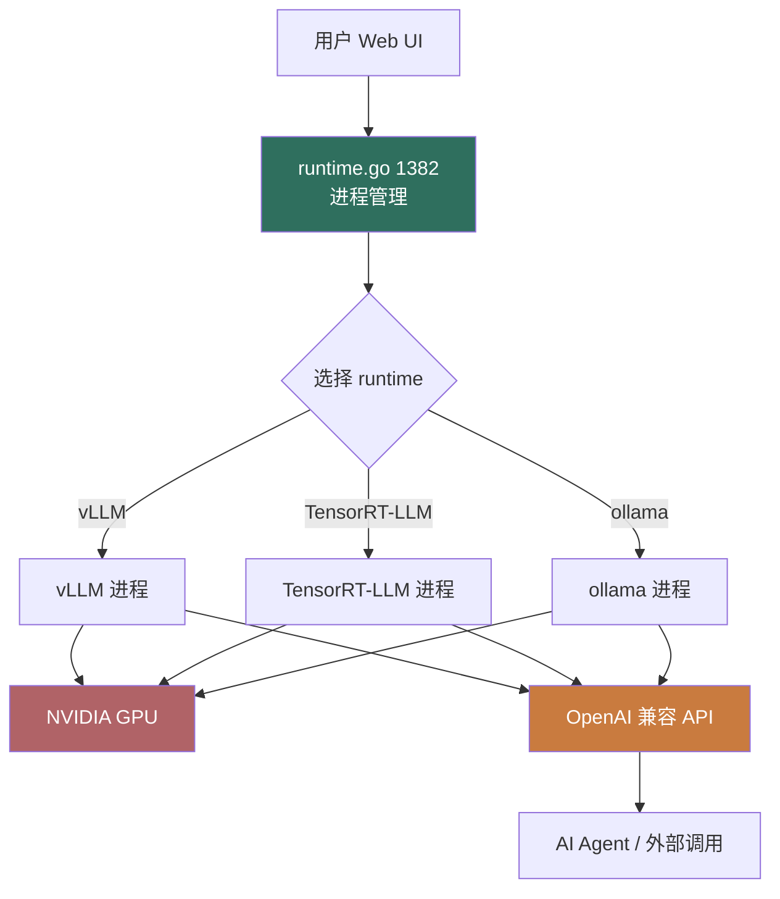

# 1Panel Runtime for AI 模块 — 人话版

> 30 分钟搞懂 1Panel 怎么"管 AI 推理运行时"（vLLM / TensorRT-LLM）。
> 详细代码注解在同目录 `README.md`（56 行 stub + 8 文件清单 / ~4000 行 Go）。
> 这份文档是入口 —— 先看这个，再决定要不要啃那份。
>
> 🎨 **可视化版**：同目录 `visual-atlas.html`（浏览器里看，4 张 Mermaid 真实图 + 3 层 AI 推理架构 + 3 个反模式卡片）
> 📋 **研究 commit**：`7915230`（dev-v2）
> ⚠️ **状态**：stub + 人话版，详细注解待做
> 🚫 **Sirius Cloud 不抄主体**（你 DBaaS 不做 AI 推理），只学"外部进程管理"模式

---

## 0. 这份文档回答 5 个问题

1. **1Panel 怎么"管 AI 模型"？是直接调 API 还是管底层进程？**
2. **vLLM / TensorRT-LLM 怎么启动？怎么分配 GPU？**
3. **runtime 抽象是怎么设计的？**
4. **AI 推理如果 OOM 怎么诊断？**
5. **对 Sirius Cloud 有什么借鉴价值？**

---

## 1. 一句话总结

**1Panel 把"AI 推理"做成"启停 vLLM / TensorRT-LLM 进程 + OpenAI 兼容 API"。~4000 行 Go，强依赖 NVIDIA GPU。**

藏了 **1 个可借鉴的模式**（外部进程管理 + 监控 + API 暴露） + **3 个反模式**（重点是强依赖 GPU），下面拆。

---

## 2. AI 推理 3 层架构



**3 层职责**：
1. **UI 层**：用户选模型 + 启动
2. **runtime 层**（1382 行）：<strong>启停进程 + 分配 GPU + 暴露 API</strong>
3. **推理引擎层**：vLLM / TensorRT-LLM / ollama（外部进程）

---

## 3. 3 个核心能力

### 3.1 启动推理进程

```go
// runtime.go 1382 行核心
func (s *RuntimeService) StartRuntime(model string, gpuIDs []int) (Runtime, error) {
    // 1. 选 runtime 类型
    runtime := s.selectRuntime(model)  // vLLM / TensorRT-LLM / ollama
    // 2. 分配 GPU（避免冲突）
    allocatedGPUs := s.allocateGPUs(gpuIDs, runtime.GPUMemoryRequired)
    // 3. 拉镜像 / 拉模型
    s.dockerPull(runtime.Image)
    s.downloadModel(model)
    // 4. 启动进程
    containerID := s.dockerRun(runtime, model, allocatedGPUs)
    // 5. 等待健康
    if err := s.waitForHealth(containerID, 60*time.Second); err != nil {
        s.dockerStop(containerID)
        return nil, err
    }
    // 6. 写 metadata
    rt := &Runtime{
        ID:           uuid.New(),
        Model:        model,
        ContainerID:  containerID,
        GPUs:         allocatedGPUs,
        OpenAIURL:    fmt.Sprintf("http://%s:8000/v1", containerID),
        Status:       "running",
    }
    s.db.Save(rt)
    return rt, nil
}
```

**关键**：
- 进程跑在容器里（强依赖 Docker）
- 启动后等健康检查
- 暴露 OpenAI 兼容 API 给上层用

### 3.2 GPU 分配

```go
// GPU 是稀缺资源，多个 runtime 不能抢同一块 GPU
type GPUPool struct {
    mu       sync.Mutex
    gpus     map[int]GPUInfo  // gpuID -> {Used, Total}
}

func (p *GPUPool) Allocate(required int) ([]int, error) {
    p.mu.Lock()
    defer p.mu.Unlock()
    var allocated []int
    for i, info := range p.gpus {
        if info.Used+required <= info.Total {
            allocated = append(allocated, i)
            info.Used += required
        }
    }
    return allocated, nil
}
```

### 3.3 故障诊断

```go
// runtime_diagnostics.go 386 行
func (s *DiagnosticsService) Diagnose(runtime Runtime) []Issue {
    var issues []Issue
    // 1. 检查 GPU 内存
    if gpuMemUsed := nvidiaSmi(runtime.GPUs); gpuMemUsed > 0.95 {
        issues = append(issues, Issue{
            Severity: "warn",
            Message:  "GPU 内存使用 > 95%",
        })
    }
    // 2. 检查推理延迟
    if avgLatency := s.measureLatency(runtime); avgLatency > 5*time.Second {
        issues = append(issues, Issue{
            Severity: "warn",
            Message:  "推理延迟过高",
        })
    }
    // 3. 检查 OOM
    if s.hasOOMKill(runtime.ContainerID) {
        issues = append(issues, Issue{
            Severity: "critical",
            Message:  "进程 OOM 被杀",
        })
    }
    return issues
}
```

---

## 4. 1 个可借鉴的模式

### 4.1 ⭐⭐⭐ **外部进程管理 + 健康检查 + API 暴露**

**为什么可借鉴**：跟"启动 MySQL 进程"是同一类问题。Sirius Cloud L2 部署 MySQL 时，需要：
- 启停进程
- 分配资源（CPU/内存/磁盘）
- 暴露连接信息给应用
- 健康检查
- 故障诊断

1Panel 这套 runtime 抽象可以借鉴：

```python
# 你的 Python 简化
class ExternalProcessService:
    def start(self, config: ProcessConfig) -> Process:
        # 1. 分配资源（CPU/内存/端口）
        # 2. 启动进程
        # 3. 等健康检查
        # 4. 写 metadata
        # 5. 暴露连接信息
        ...

    def stop(self, process_id: str) -> None:
        # 优雅停 + 强杀兜底
        ...

    def diagnose(self, process_id: str) -> List[Issue]:
        # 资源使用 / 延迟 / OOM / 端口
        ...
```

---

## 5. 3 个反模式 / 避坑

### 5.1 ❌ **强依赖 NVIDIA GPU + CUDA**

整套 runtime 设计假设有 NVIDIA GPU + 装好 CUDA。普通 DBaaS 服务器**根本没 GPU**。

**避坑**：Sirius Cloud 不做 AI 推理，<strong>整个模块跳过</strong>。

### 5.2 ⚠️ **1382 行 runtime 编排工作量大但服务单一场景**

只服务"AI 推理"一个场景。如果你的场景是"启动 MySQL / Redis / PostgreSQL"，会有类似的抽象但每个 < 500 行。

**避坑**：<strong>不要照抄 1382 行</strong>，抽象你自己的"启动进程 + 监控 + 诊断"模式，每个 runtime 100-300 行。

### 5.3 ❌ **进程跑在 Docker 容器里**

跟 1Panel 其他模块一样，假设 Docker 可用。

**避坑**：你的 Sirius Cloud 不用 Docker。<strong>用 systemd unit 替代</strong>（生产推荐）或裸进程 + PID 文件。

---

## 6. 跟 Sirius Cloud 的对位

| Sirius Cloud 需求 | 1Panel Runtime 对应 | 推荐度 |
|---|---|---|
| **新功能：AI 推理平台** | 整套 | ⭐⭐⭐（如果你要做） |
| **L2 启动 MySQL 进程** | runtime 抽象模式 | ⭐⭐⭐ |
| **L2 资源分配** | GPU 池 / 资源池 | ⭐⭐⭐⭐ |
| **L3 故障诊断** | runtime_diagnostics.go | ⭐⭐⭐ |

### 6.1 可借鉴的 1 个模式

**外部进程管理 + 健康检查 + API 暴露** —— 跟"启动 MySQL 进程"是同一类问题。

### 6.2 不抄的

1. **整个 AI 推理模块**（你 DBaaS 不做 AI）
2. **NVIDIA GPU 强依赖**（你的服务器可能没 GPU）
3. **Docker 容器跑进程**（你不用 Docker）

---

## 7. 接下来怎么读

### 7.1 30 分钟通道

1. 看完本文档
2. 看 `11-runtime-ai/README.md` §1（8 文件清单）
3. 直接看 `runtime.go` 的 `StartRuntime` 函数

### 7.2 2 小时通道（如果你以后做 AI 推理）

1. 上面 30 分钟
2. `tensorrt_llm.go` 集成
3. `runtime_diagnostics.go` 诊断

### 7.3 不建议深读

**Sirius Cloud 不用 AI 推理，整个模块<strong>只看模式</strong>，不读实现**。

---

## 8. 写作说明

- **本文档定位**：30 分钟读完的"故事版"
- **`11-runtime-ai/README.md` 定位**：8 文件清单 + stub（详细注解待做）
- **`firewall-architecture.md` 定位**：v2 防火墙深度注解
- **`00-landscape.md` 定位**：13 个模块的全景图

---

**研究 commit**：`7915230`（dev-v2）· **更新**：2026-08-24 · **作者**：1Panel v2 研究员
