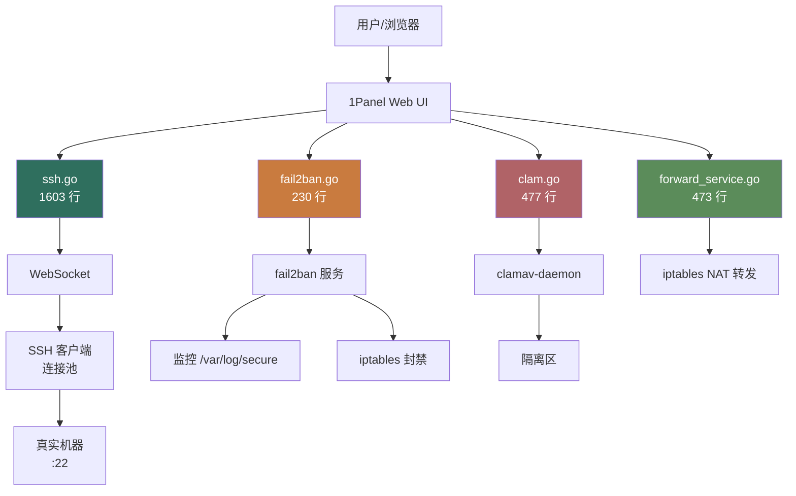
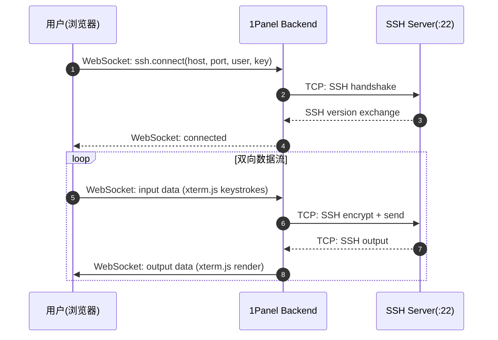
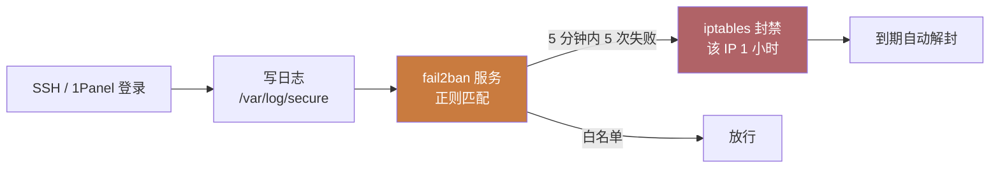

# 1Panel Security 模块 — 人话版

> 30 分钟搞懂 1Panel 怎么管"防火墙以外的安全套件"（SSH / fail2ban / ClamAV / 端口转发）。
> 详细代码注解在同目录 `README.md`（77 行 stub + 13 文件清单 / ~6300 行 Go）。
> 这份文档是入口 —— 先看这个，再决定要不要啃那份。
>
> 🎨 **可视化版**：同目录 `visual-atlas.html`（浏览器里看，4 张 Mermaid 真实图 + 5 个 SSH 内部组件图 + 4 个反模式卡片）
> 📋 **研究 commit**：`7915230`（dev-v2）
> ⚠️ **状态**：stub + 人话版，详细注解待做（**重点**：`ssh.go` 1603 行浏览器 SSH 终端）
> 🔥 **关联已研究**：`firewall-architecture.md`（防火墙 v2 深度注解，3350 行）

---

## 0. 这份文档回答 5 个问题

1. **怎么在浏览器里直接 SSH 进被管机器？WebSocket 怎么转 SSH？**
2. **fail2ban 怎么自动封禁暴力破解 IP？**
3. **ClamAV 病毒扫描怎么集成？上传时实时扫吗？**
4. **端口转发怎么配？跟 iptables NAT 什么关系？**
5. **对 Sirius Cloud L2 资产管理 / 终端访问有什么借鉴价值？**

---

## 1. 一句话总结

**1Panel 把"浏览器 SSH 终端 + 自动防爆破 + 病毒扫描"做成 3 个独立 service，组合成完整的"被管机器安全套件"。**

藏了 **3 个必抄的设计**（重点是 SSH WebSocket 转发） + **4 个反模式**（重点是凭据存储策略），下面一一拆。

---

## 2. 模块全景（不含防火墙）



**4 个子模块独立**：SSH（最大 1603 行）/ fail2ban（230 行）/ ClamAV（477 行）/ 端口转发（473 行）。加起来 ~2800 行（不含防火墙 3350 行）。

---

## 3. 核心：浏览器 SSH 终端（`ssh.go` 1603 行）

### 3.1 为什么浏览器能 SSH？

普通 SSH 协议是 TCP 直连到 22 端口。浏览器只能发 HTTP/WebSocket，**没法直接发 TCP**。所以需要"WebSocket ↔ SSH"双向桥接：



**关键点**：
- 浏览器端用 [xterm.js](https://xtermjs.org/) 渲染终端 + 接收键盘事件
- WebSocket 是全双工通道，可以反向"推"数据给浏览器
- 后端做 WebSocket ↔ TCP 的双向桥

### 3.2 SSH 模块内部结构（推测 4 块）

```go
// ssh.go（推测）
type SSHService struct {
    connPool map[string]*ssh.Client  // 连接池：key = "host:port:user"
    credStore *CredentialStore        // 凭据存储
    knownHosts *KnownHosts            // 已知主机白名单
    sessions map[string]*WebShellSession  // 活跃会话
}

type CredentialStore interface {
    Save(host, user string, key []byte) error  // 加密存
    Get(host, user string) ([]byte, error)     // 解密读
    Delete(host, user string) error
}
```

| 子模块 | 大概行数 | 职责 |
|---|---|---|
| **连接池** | 300-400 | 复用 SSH 连接，避免每次新建 |
| **WebSocket 适配** | 500-600 | 双向桥 + xterm.js 协议解析 |
| **凭据管理** | 400-500 | 公私钥 + 密码加密存盘 |
| **known_hosts** | 200-300 | 防中间人攻击白名单 |

### 3.3 类比：**像快递柜刷脸取件**

```
普通 SSH：每次都要拿钥匙开柜门，钥匙丢了就完了 ❌
快递柜刷脸：第一次录入脸，之后刷脸就行    ✅

1Panel SSH：第一次连输入密码/私钥，之后从连接池取         ✅
           凭据加密存盘，下次直接用
```

---

## 4. fail2ban 集成（`fail2ban.go` 230 行）

### 4.1 工作原理



**1Panel 怎么集成**：
- 启动 fail2ban 服务（systemctl start fail2ban）
- 写配置文件 `/etc/fail2ban/jail.local`
- 配置监控 SSH + 1Panel 自身登录日志
- 5 次失败 → 封 1 小时（可配）

### 4.2 配置示例

```ini
# /etc/fail2ban/jail.local
[sshd]
enabled  = true
port     = ssh
filter   = sshd
logpath  = /var/log/secure
maxretry = 5
bantime  = 3600
findtime = 600

[1panel]
enabled  = true
port     = http,https
filter   = 1panel
logpath  = /opt/1panel/log/1panel.log
maxretry = 5
bantime  = 3600
```

---

## 5. ClamAV 集成（`clam.go` 477 行）

### 5.1 两种使用模式

**A. 上传时实时扫描**

```go
func (s *ClamService) ScanUpload(file io.Reader) (bool, error) {
    // 1. 上传到临时文件
    tmpFile := saveTmp(file)
    defer os.Remove(tmpFile)
    // 2. 调 clamdscan
    out, err := exec.Command("clamdscan", "--no-summary", tmpFile).CombinedOutput()
    // 3. 解析结果
    if strings.Contains(string(out), "FOUND") {
        return false, fmt.Errorf("infected: %s", out)
    }
    return true, nil
}
```

**B. 定时全盘扫描**

```go
func (s *ClamService) FullScan() (ScanResult, error) {
    // 1. 启动后台扫描任务
    // 2. 进度推到前端（SSE 或 WebSocket）
    // 3. 扫描完返回结果（感染文件列表）
    // 4. 用户选择"隔离"或"删除"
}
```

### 5.2 隔离区

```go
// 隔离区 = 一个特殊目录 + 权限 000
const QuarantineDir = "/opt/1panel/clamav/quarantine"

func (s *ClamService) Quarantine(file string) error {
    // 1. 移动到隔离区
    // 2. 改权限 000
    // 3. 记日志
    return os.Rename(file, filepath.Join(QuarantineDir, filepath.Base(file)))
}
```

---

## 6. 端口转发（`forward_service.go` 473 行）

跟 iptables NAT 配合，把外部端口转到内部服务：

```go
type Forward struct {
    Protocol  string  // "tcp" / "udp"
    ListenIP  string  // "0.0.0.0"
    ListenPort uint
    TargetIP   string  // "127.0.0.1"
    TargetPort uint
}
```

实际是用 iptables：

```bash
iptables -t nat -A PREROUTING -p tcp --dport 8080 -j DNAT --to-destination 127.0.0.1:80
```

跟防火墙模块用同一套 iptables 操作 API（详见 `firewall-architecture.md`）。

---

## 7. 3 个必抄的设计

### 7.1 ⭐⭐⭐⭐⭐ **WebSocket ↔ SSH 双向桥**（`ssh.go` 核心）

**为什么必抄**：1Panel 这 1603 行是生产级实现，直接抄能省 1-2 周。

**怎么抄（Python 简化版）**：

```python
import asyncio
import paramiko  # SSH 库
from fastapi import WebSocket

async def ssh_bridge(ws: WebSocket, host: str, user: str, key: str):
    await ws.accept()
    # 1. 建 SSH 连接
    client = paramiko.SSHClient()
    client.set_missing_host_key_policy(paramiko.AutoAddPolicy())
    client.connect(host, username=user, pkey=key)
    # 2. 开 shell
    chan = client.invoke_shell(term='xterm-256color')
    # 3. 双向转发
    async def ws_to_ssh():
        async for msg in ws.iter_text():
            chan.send(msg)
    async def ssh_to_ws():
        loop = asyncio.get_event_loop()
        while True:
            data = await loop.run_in_executor(None, chan.recv, 1024)
            if not data: break
            await ws.send_text(data.decode('utf-8', errors='replace'))
    await asyncio.gather(ws_to_ssh(), ssh_to_ws())
```

### 7.2 ⭐⭐⭐⭐ **凭据加密存储**

1Panel 怎么存 SSH 私钥和密码是<strong>安全核心</strong>，需要看代码确认（推测用 AES-GCM + 机器级 master key）。

**避坑**：**不要明文存盘**（即使在 SQLite 里），不要用可逆 Base64 编码。

### 7.3 ⭐⭐⭐⭐ **fail2ban jail.local 模板化**

1Panel 生成 `jail.local` 用模板，新加监控项只改模板不改代码。

**怎么抄**：用 Jinja2 / Go template 渲染配置，跟 03-website 的 nginx.conf 渲染模式一样。

---

## 8. 4 个反模式 / 避坑

### 8.1 ⚠️ **凭据存储策略待确认**

1Panel 说是加密，但具体怎么加密、master key 在哪、能不能恢复，需要看 `ssh.go` 的 `CredentialStore` 实现。

**避坑**：你的 Sirius Cloud 凭据管理用 HashiCorp Vault 或 AWS Secrets Manager，<strong>不要自己实现</strong>。

### 8.2 ⚠️ **WebSocket 鉴权如果不做，攻击者可以蹭**

WebSocket 一旦建立，就可以发 SSH 命令。如果鉴权只在 HTTP 层（JWT 在 query string），容易被截取或滥用。

**避坑**：WebSocket 握手时严格校验 JWT + IP 白名单 + 短时 token。

### 8.3 ⚠️ **ClamAV 启动慢（~10 秒）+ 吃内存（~1GB）**

`clamav-daemon` 服务启动慢，且常驻 ~1GB 内存。

**避坑**：按需启动（用 `clamscan` 命令行模式而非 `clamdscan` 服务模式），或者用云病毒扫描 API（[VirusTotal](https://www.virustotal.com)）。

### 8.4 ❌ **fail2ban 配置分散在 3 个文件**

`fail2ban.go` 230 行 + `jail.local` 模板 + systemd 服务文件，分散管理。

**避坑**：所有 fail2ban 相关配置收 1 个 `JailConfig` struct。

---

## 9. 跟 Sirius Cloud 的对位

| Sirius Cloud 需求 | 1Panel Security 对应 | 推荐度 |
|---|---|---|
| **L2 资产管理 - 终端** | ssh.go 1603 行 | ⭐⭐⭐⭐⭐ |
| **L1 自动防爆破** | fail2ban.go + jail.local | ⭐⭐⭐⭐ |
| **L2 文件上传病毒扫描** | clam.go ScanUpload | ⭐⭐⭐⭐ |
| **L2 端口转发** | forward_service.go | ⭐⭐⭐ |
| **新功能：凭据保险柜** | SSH CredentialStore 设计 | ⭐⭐⭐⭐ |

### 9.1 必抄清单

1. **WebSocket ↔ SSH 桥**（1603 行直接抄）
2. **凭据加密存储**（设计模式抄，实现用 Vault 替代）
3. **fail2ban 集成**（避免重复造轮子）

### 9.2 抄的时候要改

1. **不要明文存凭据**（用 Vault）
2. **WebSocket 严格鉴权**（不要只看 query string JWT）
3. **ClamAV 按需启动**（不用常驻 daemon）

---

## 10. 接下来怎么读

### 10.1 30 分钟通道

1. 看完本文档
2. 看 `12-security/README.md` §2（SSH 模块 4 块结构推测）
3. 直接看 `ssh.go` 的 `SSHService` struct 定义

### 10.2 2 小时通道

1. 上面 30 分钟
2. `ssh.go` 的 WebSocket handler（`HandleWS` / `Bridge` 函数）
3. `fail2ban.go` 的 jail.local 模板生成
4. `clam.go` 的 ScanUpload 函数

### 10.3 1 天写代码通道

1. 上面所有
2. Python 用 `paramiko` + FastAPI WebSocket 写一个最小 SSH 桥（200 行）
3. 集成 fail2ban 模板渲染
4. 集成 clamscan 做上传扫描
5. 用 Vault 存 SSH 凭据

---

## 11. 写作说明

- **本文档定位**：30 分钟读完的"故事版"
- **`12-security/README.md` 定位**：13 文件清单 + stub（详细注解待做）
- **`firewall-architecture.md` 定位**：v2 防火墙深度注解（**已研究**）
- **`00-landscape.md` 定位**：13 个模块的全景图

---

**研究 commit**：`7915230`（dev-v2）· **更新**：2026-08-24 · **作者**：1Panel v2 研究员
